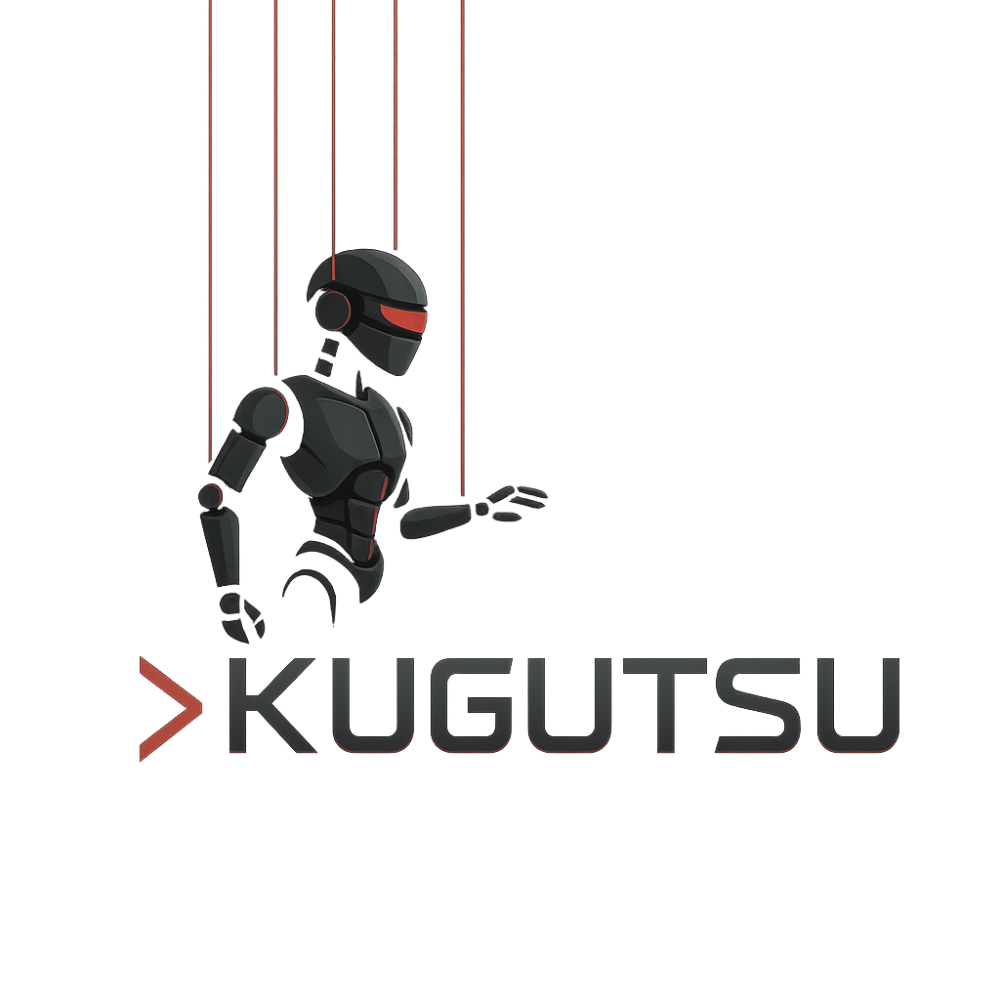

# Kugutsu 🎭

AI-powered parallel development system that orchestrates multiple AI engineers to work simultaneously on different tasks.

## Requirements

- Node.js 18+
- Git 2.7+
- Claude Code (authenticated via Anthropic Console or API Key)

## Quick Start

```bash
# 1. Set up Claude Code (if not already done)
# Follow: https://docs.anthropic.com/en/docs/claude-code/quickstart

# 2. Install kugutsu
npm install -g @titabash/kugutsu

# 3. Navigate to your project
cd your-project

# 4. Run kugutsu
kugutsu "Add user authentication"
```

## Installation

```bash
npm install -g @titabash/kugutsu
```

## Usage

```bash
# Basic usage
kugutsu "Your development request"

# Examples
kugutsu "Add error handling to all API endpoints"
kugutsu "Fix TypeScript errors" --max-engineers 2
kugutsu "Refactor user service" --cleanup
```

## Options

```bash
--max-engineers <num>     # Maximum concurrent engineers (default: 3)
--max-turns <num>        # Maximum turns per task (default: 20)
--cleanup               # Clean up worktrees after completion
--no-electron          # Disable Electron UI
--visual-ui            # Use terminal visual UI
```

## License

MIT
