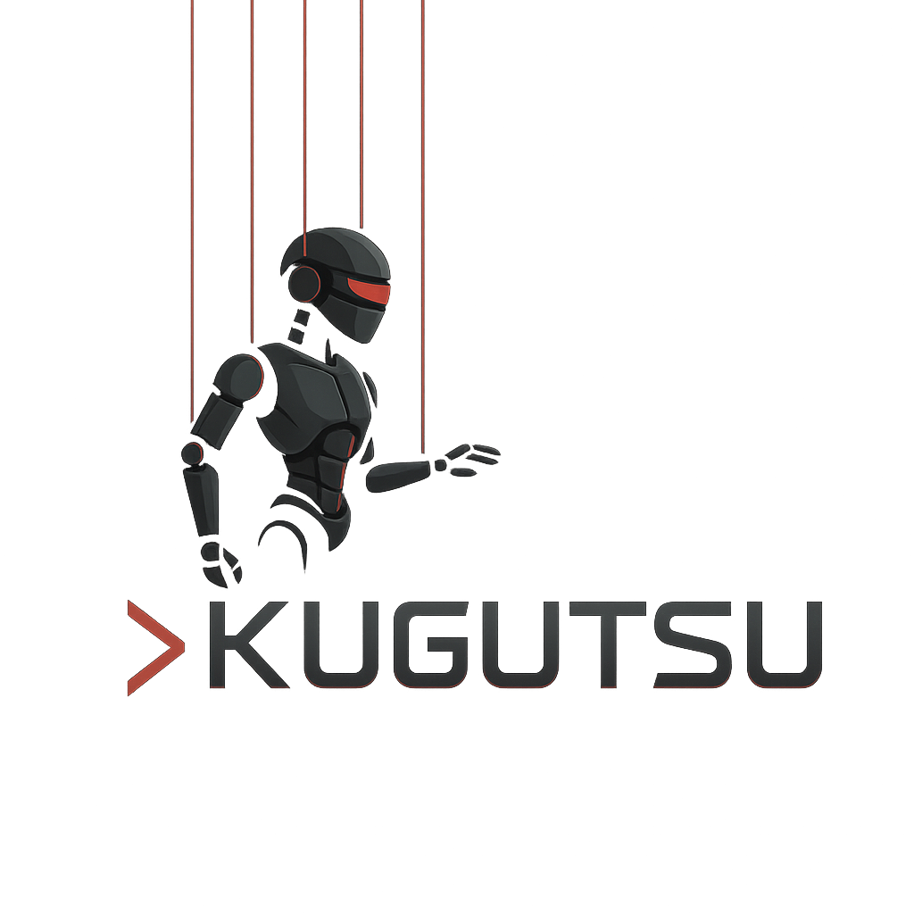

# Kugutsu 🎭

AI-powered parallel development system that orchestrates multiple AI engineers to work simultaneously on different tasks.

## Requirements

- Node.js 18+
- Git 2.7+
- Claude Code (authenticated via Anthropic Console or API Key)

## Quick Start

```bash
# 1. Set up Claude Code (if not already done)
# Follow: https://docs.anthropic.com/en/docs/claude-code/quickstart

# 2. Install kugutsu
npm install -g @titabash/kugutsu

# 3. Navigate to your project
cd your-project

# 4. Run kugutsu
kugutsu "Add user authentication"
```

## Installation

```bash
# 1. Install the package
npm install -g @titabash/kugutsu
```

## Usage

```bash
# Basic usage
kugutsu "Your development request"

# Examples
kugutsu "Add error handling to all API endpoints"
kugutsu "Fix TypeScript errors" --max-engineers 2
kugutsu "Refactor user service" --cleanup
```

## Options

```bash
--max-engineers <num>     # Maximum concurrent engineers (default: 3)
--max-turns <num>        # Maximum turns per task (default: 20)
--cleanup               # Clean up worktrees after completion
--no-electron          # Disable Electron UI
--visual-ui            # Use terminal visual UI
```

## Features

### 📋 Scrum Development Workflow (v2.1+)

Kugutsu v2.1 introduces a comprehensive Scrum development workflow with design-first approach:

#### Story Mapping & Design Phase

Before sprint execution, Kugutsu creates comprehensive project artifacts:

- **Story Mapping**:
  - Persona definition with goals and pain points
  - Epic breakdown with user stories
  - User story format: "As a [persona], I want to [action], so that [benefit]"
  - Acceptance criteria for each story
  - Priority and story points estimation

- **Design Documents**:
  - Overall system architecture and design philosophy
  - UI/UX wireframes and screen definitions
  - Database ER diagrams and schema
  - API specifications (REST/GraphQL endpoints)

- **Design Review Process**:
  - Tech Lead reviews all design documents
  - Story Mapping validation by Product Owner
  - Iterative refinement until approved
  - Ensures alignment before implementation starts

#### Electron UI Viewers

The Electron UI provides specialized viewers for Scrum artifacts:

- **StoryMappingViewer**:
  - Persona card with user information
  - Accordion layout for epics and stories
  - Acceptance criteria with checkmarks
  - Priority and story points badges

- **DependencyGraphViewer**:
  - Critical path highlighting (red ring)
  - Parallel execution group visualization
  - Detailed dependency information
  - MiniMap for large graphs

- **DesignDocsViewer**:
  - Tabbed interface for all design sections
  - Markdown rendering for text documents
  - JSON viewer for structured data
  - Scroll support for long documents

#### Workflow Integration

```bash
# Scrum workflow automatically triggers for complex projects
kugutsu "Build a task management application"

# Step 1: Story Mapping
# → AI creates persona, epics, and user stories
# → ProductOwner reviews and refines
# → StoryMappingViewer displays in Electron UI

# Step 2: Design Phase
# → TechLead creates overall architecture
# → UI/UX wireframes generated
# → Database schema designed
# → API specifications defined
# → DesignDocsViewer shows all documents

# Step 3: Design Review
# → TechLead reviews technical design
# → ProductOwner validates story mapping
# → Iterative refinement until approved

# Step 4: Sprint Planning & Execution
# → Tasks broken down from approved stories
# → Sprints planned (8-16h each)
# → Parallel development begins
# → DependencyGraphViewer shows progress
```

### 🚀 Sprint-Driven Development (v2.0+)

Kugutsu now features sprint-driven development for managing long-running projects:

- **Automatic Sprint Planning**: Tasks are automatically grouped into 8-16 hour sprints
- **E2E Deployable Units**: Each sprint delivers a deployable feature
- **Continuation Mode**: Resume work on existing projects seamlessly
- **Global Task Queue**: All tasks are persisted across sessions
- **Data Persistence**: Project state is saved in `.kugutsu/` directory

#### Continuation Mode

When you return to a project, Kugutsu automatically detects if you're continuing previous work:

```bash
# First session - creates new project
cd my-project
kugutsu "Implement user authentication system"

# Later session - automatically continues the project
kugutsu "Continue implementing authentication"
# or simply
kugutsu "続き"  # Japanese for "continue"
```

**AI-Driven Detection**: Continuation mode is automatically detected using AI analysis of:
- Your request text
- Existing tasks in `.kugutsu/tasks/global-queue.json`
- Active and completed sprints
- Project metadata

**Priority Calculation**: Tasks are automatically prioritized based on:
- Base priority (0-100)
- Request recency (newer requests get higher priority)
- Dependency completion (tasks with completed dependencies are prioritized)

#### How It Works

1. **CheckMode**: Detects new vs. continuation mode using AI
2. **Task Breakdown**: Analyzes requirements and creates granular tasks
3. **Sprint Planning**: Groups tasks into deployable sprints (8-16h each)
4. **Parallel Execution**: Multiple AI engineers work on sprint tasks
5. **Sprint Review**: Verifies completeness and deployability
6. **Next Sprint**: Automatically plans the next sprint if tasks remain

#### Advanced Usage Examples

**Multi-Sprint Workflow**:
```bash
# Day 1: Start a large project
cd my-app
kugutsu "Build a complete e-commerce system with user auth, product catalog, and checkout"
# → Creates Sprint 1 with 8-16 hours of tasks (e.g., user authentication)
# → After Sprint 1 completes, automatically plans Sprint 2

# Day 2: Continue the project
kugutsu "続き"  # or "continue"
# → Resumes with Sprint 2 tasks (e.g., product catalog)
# → Detects existing project and continues from where it left off

# Day 3: Add new requirements
kugutsu "Add payment gateway integration and order tracking"
# → AI analyzes existing tasks and sprints
# → Creates new high-priority tasks
# → Integrates them into current or next sprint
```

**Working with Multiple Projects**:
```bash
# Project A: Start authentication work
cd project-a
kugutsu "Implement OAuth2 authentication"

# Project B: Start API work (different project)
cd ../project-b
kugutsu "Create REST API endpoints for user management"

# Back to Project A: Continue authentication
cd ../project-a
kugutsu "続き"
# → AI detects you're in project-a context
# → Continues with remaining authentication tasks
```

**Sprint-Specific Options**:
```bash
# Control sprint scope with max-engineers
kugutsu "Large refactoring task" --max-engineers 5
# → More engineers = larger sprint capacity

# Control task complexity with max-turns
kugutsu "Complex algorithm implementation" --max-turns 30
# → More turns = engineers can work longer on difficult tasks

# Clean up after sprint completion
kugutsu "Bug fixes" --cleanup
# → Removes git worktrees after successful merge
```

#### Data Persistence

Project data is stored in `.kugutsu/` directory:

```
.kugutsu/
├── tasks/
│   └── global-queue.json       # All tasks across projects
├── sprints/
│   ├── active-sprint.json      # Current sprint
│   └── sprint-history.json     # Completed sprints
└── projects/
    └── {project-id}/
        └── project.json        # Project metadata
```

### 🎭 Parallel Development

- Multiple AI engineers work simultaneously on independent tasks
- Automatic conflict detection and resolution
- Git worktree isolation for clean parallel execution
- Intelligent task dependency management

### 🔍 Intelligent Code Review

- Automated code review by AI tech leads
- Multi-pass review until quality standards are met
- Architecture and best practices validation

### 🔀 Smart Merge Management

- Sequential merging with conflict detection
- Original engineer handles their own conflicts
- Context-preserved conflict resolution

## Troubleshooting

### Sprint-Driven Development Issues

**Q: Continuation mode not detected**
```bash
# Solution: Explicitly reference existing tasks or project
kugutsu "Continue working on the authentication system"
# or check existing tasks:
cat .kugutsu/tasks/global-queue.json
```

**Q: Tasks have incorrect priority**
```bash
# Priority is calculated automatically based on:
# - Base priority (from task type)
# - Recency (newer requests prioritized)
# - Dependencies (tasks with completed deps prioritized)

# To see current priorities, check:
cat .kugutsu/tasks/global-queue.json | jq '.tasks[] | {id, title, dynamicPriority}'
```

**Q: Sprint not completing or getting stuck**
```bash
# Check active sprint status:
cat .kugutsu/sprints/active-sprint.json

# Check for blockers:
cat .kugutsu/sprints/active-sprint.json | jq '.metadata.blockers'

# If stuck, you can clear and restart:
rm -rf .kugutsu/sprints/active-sprint.json
kugutsu "続き"  # Restart from global queue
```

**Q: Multiple projects interfering with each other**
```bash
# Each project should have its own directory and .kugutsu/ folder
# Ensure you're in the correct project directory:
pwd
ls .kugutsu/projects/  # Shows all projects in this repo

# Projects are isolated by projectId in global-queue.json
```

### General Issues

**Q: Git worktree conflicts**
```bash
# Clean up all worktrees manually:
git worktree list
git worktree remove <path>

# Or use cleanup flag:
kugutsu "Your request" --cleanup
```

**Q: Out of disk space**
```bash
# Worktrees can consume significant disk space
# Clean up old worktrees:
kugutsu "Your request" --cleanup

# Or manually:
rm -rf worktrees/
git worktree prune
```

**Q: API rate limits or timeouts**
```bash
# Reduce concurrent engineers:
kugutsu "Your request" --max-engineers 1

# Reduce turns per task:
kugutsu "Your request" --max-turns 10
```

**Q: Data corruption in `.kugutsu/` directory**
```bash
# Backup current state:
cp -r .kugutsu .kugutsu.backup

# Clear all data and restart:
rm -rf .kugutsu
kugutsu "Start fresh with your requirements"

# Or clear specific project:
rm -rf .kugutsu/projects/<project-id>
```

### Getting Help

- Report issues: https://github.com/anthropics/kugutsu/issues
- Documentation: See `docs/` directory for detailed workflows
- Logs: Check terminal output or Electron UI for detailed error messages

## License

MIT
