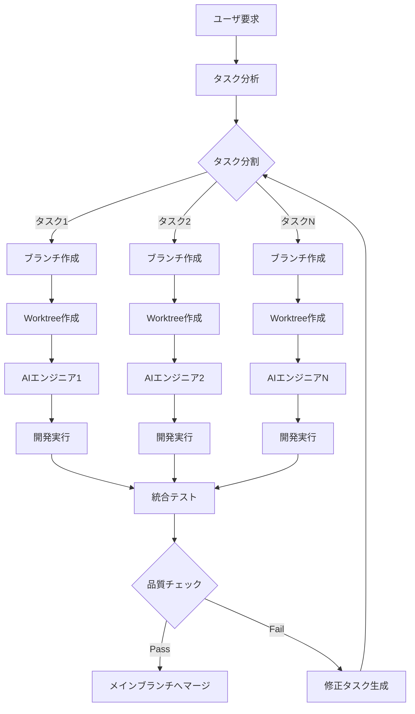

# AI並列開発システム設計書

## 1. システム概要

### 1.1 目的
Claude Code SDKとgit worktreeを活用し、複数のAIエンジニアが並列で開発タスクを実行できるシステムを構築する。これにより、大規模な開発プロジェクトを効率的に進めることが可能となる。

### 1.2 主要な特徴
- **並列タスク実行**: 複数のAIエンジニアが独立したworktreeで同時作業
- **タスク自動分割**: ユーザの要求を分析し、適切なサブタスクに分割
- **ブランチ戦略**: 各タスクは独立したブランチで開発
- **統合管理**: タスクの進捗管理と成果物の統合

## 2. システムアーキテクチャ

### 2.1 コンポーネント構成

```
┌─────────────────────────────────────────────────────────────┐
│                     Task Orchestrator                        │
│  ┌─────────────┐  ┌──────────────┐  ┌──────────────────┐  │
│  │Task Analyzer│  │Task Allocator│  │Progress Monitor  │  │
│  └─────────────┘  └──────────────┘  └──────────────────┘  │
└─────────────────────────────────────────────────────────────┘
                              │
        ┌─────────────────────┴──────────────────────┐
        │                                            │
┌───────▼──────┐  ┌────────────────┐  ┌────────────▼────────┐
│ Git Manager  │  │ Claude Manager │  │ Integration Manager │
│              │  │                │  │                     │
│ - Worktree   │  │ - SDK Interface│  │ - Merge Strategy    │
│ - Branch     │  │ - Agent Pool   │  │ - Conflict Resolve  │
│ - Commit     │  │ - Task Queue   │  │ - Test Runner       │
└──────────────┘  └────────────────┘  └─────────────────────┘
        │                  │                     │
        └──────────────────┴─────────────────────┘
                           │
    ┌──────────────────────┴───────────────────────────┐
    │                                                   │
┌───▼────┐  ┌─────────┐  ┌─────────┐  ┌─────────┐  ┌──▼─────┐
│Worker 1│  │Worker 2│  │Worker 3│  │Worker 4│  │Worker N│
│        │  │        │  │        │  │        │  │        │
│Worktree│  │Worktree│  │Worktree│  │Worktree│  │Worktree│
└────────┘  └────────┘  └────────┘  └────────┘  └────────┘
```

### 2.2 データフロー

1. **タスク受付**: ユーザからの開発要求を受け取る
2. **タスク分析**: 要求を解析し、独立した開発タスクに分割
3. **タスク割当**: 各タスクにブランチとworktreeを割り当て
4. **並列実行**: 各AIエンジニアが独立して作業を実行
5. **進捗監視**: リアルタイムでタスクの進捗を追跡
6. **成果物統合**: 完了したタスクをメインブランチに統合

## 3. 主要コンポーネント詳細

### 3.1 Task Orchestrator
**責務**: システム全体の調整と管理

#### Task Analyzer
- ユーザ要求の解析
- タスク依存関係の分析
- タスク優先度の決定
- 必要リソースの見積もり

#### Task Allocator
- AIエンジニアへのタスク割当
- リソースの最適配分
- 負荷分散の実現

#### Progress Monitor
- タスク進捗のリアルタイム追跡
- ボトルネックの検出
- 完了予測時間の算出

### 3.2 Git Manager
**責務**: Gitリポジトリの操作と管理

- **Worktree管理**: 各タスク用のworktreeの作成・削除
- **ブランチ戦略**: feature/task-{id}形式でブランチ作成
- **コミット管理**: 各AIエンジニアのコミットを追跡

### 3.3 Claude Manager
**責務**: Claude Code SDKとの連携

- **エージェントプール**: 複数のClaude Code SDKインスタンスの管理
- **タスクキュー**: タスクの順序管理と実行
- **コンテキスト管理**: 各エージェントのコンテキストとオプション設定
- **ツール権限管理**: Read, Write, Bashツールの使用制御
- **ワーキングディレクトリ管理**: 各worktreeでの作業環境設定

### 3.4 Integration Manager
**責務**: 成果物の統合と品質保証

- **マージ戦略**: 自動マージと競合解決
- **テスト実行**: 統合前の自動テスト
- **品質チェック**: コード品質の検証

## 4. ワークフロー

### 4.1 基本的なワークフロー



### 4.2 タスク実行プロセス

1. **タスク受信**
   ```python
   task = {
       "id": "task-001",
       "type": "feature",
       "description": "ユーザ認証機能の実装",
       "priority": "high",
       "dependencies": []
   }
   ```

2. **Worktree作成**
   ```bash
   # 新しいブランチと共にworktreeを作成
   git worktree add -b feature/task-001 ../worktrees/task-001 main
   ```

3. **AIエンジニア起動**
   ```python
   import anyio
   from claude_code_sdk import query, ClaudeCodeOptions
   
   async def execute_task(task_id: str, worktree_path: str, task_description: str):
       # Claude Code SDKのオプション設定
       options = ClaudeCodeOptions(
           system_prompt=f"あなたは経験豊富なソフトウェアエンジニアです。タスクID: {task_id}",
           max_turns=10,
           allowed_tools=["Read", "Write", "Bash", "Glob", "Grep"],
           permission_mode='acceptEdits',
           working_directory=worktree_path
       )
       
       # タスク実行用のプロンプト
       prompt = f"""
       作業ディレクトリ: {worktree_path}
       タスク: {task_description}
       
       以下の手順で開発を進めてください：
       1. 既存のコードベースを確認
       2. 必要な実装を行う
       3. テストを作成・実行
       4. 変更をコミット
       """
       
       # Claude Code SDKを使用してタスクを実行
       async for message in query(prompt=prompt, options=options):
           print(f"[Task-{task_id}] {message}")
   
   # タスクの実行
   anyio.run(execute_task, "001", "../worktrees/task-001", task['description'])
   ```

4. **開発実行**
   - コード生成
   - テスト作成
   - ドキュメント作成

5. **成果物コミット**
   ```bash
   git add .
   git commit -m "feat: implement user authentication #task-001"
   ```

## 5. 実装計画

### 5.1 フェーズ1: 基盤構築
- Task Orchestratorの基本実装
- Git Manager（worktree操作）
- 単一AIエンジニアでの動作確認

### 5.2 フェーズ2: 並列化実装
- Claude Managerの実装
- 複数エージェントの並列実行
- タスクキューの実装

### 5.3 フェーズ3: 統合機能
- Integration Managerの実装
- 自動マージ機能
- 競合解決メカニズム

### 5.4 フェーズ4: 高度な機能
- 依存関係を持つタスクの処理
- 動的なリソース配分
- 学習型タスク分割

## 6. 技術スタック

### 6.1 必要なライブラリ
- **claude-code-sdk**: Claude CodeのPython SDK（`uv add claude-code-sdk`）
- **GitPython**: Gitリポジトリ操作（`uv add GitPython`）
- **Typer**: CLIインターフェース（`uv add typer`）
- **Rich**: 進捗表示とUI（`uv add rich`）
- **anyio**: 非同期処理（`uv add anyio`）
- **pydantic**: データモデル定義（`uv add pydantic`）
- **subprocess**: Git worktreeコマンド実行（標準ライブラリ）

### 6.2 前提条件
- **Python 3.10+**: Claude Code SDKの要件
- **Node.js**: Claude Code CLIの実行に必要
- **Claude Code CLI**: `npm install -g @anthropic-ai/claude-code`
- **uv**: パッケージマネージャー
- **git 2.0+**: worktree機能の使用


## 7. セキュリティとベストプラクティス

### 7.1 セキュリティ考慮事項
- APIキーの安全な管理
- worktreeの適切な隔離
- 権限管理とアクセス制御

### 7.2 ベストプラクティス
- タスクサイズの適切な分割
- 定期的なメインブランチとの同期
- 包括的なテストカバレッジ
- 明確なコミットメッセージ

## 8. 制約と制限事項

### 8.1 技術的制約

**Git Worktree関連**
- 実験的機能のため、一部制限がある
- サブモジュールサポートが不完全
- 同一ブランチを複数worktreeでチェックアウト不可
- worktreeパス管理の注意が必要

**Claude Code SDK関連**
- Node.jsとClaude Code CLIが必要
- Python 3.10+の要件
- 非同期処理の必須使用
- ツール権限の適切な設定が必要
- ワーキングディレクトリの管理が重要

**システムリソース**
- 同時実行可能なAIエンジニア数の上限
- worktreeによるディスク使用量の増加
- メモリ使用量の管理

### 8.2 運用上の考慮事項
- ディスク容量の管理
- 長時間実行タスクの監視
- エラーリカバリメカニズム

## 9. 今後の拡張性

### 9.1 スケーラビリティ
- 分散システムへの対応
- クラウド環境での実行
- 複数リポジトリの同時処理

### 9.2 機能拡張
- 他のAIモデルとの統合
- ビジュアルなタスク管理UI
- 実行履歴の分析とレポート

## 10. Claude Code SDK並列実行の実装例

### 10.1 複数エージェントの並列実行

```python
import anyio
import asyncio
from claude_code_sdk import query, ClaudeCodeOptions
from pathlib import Path
from typing import List, Dict

class ParallelClaudeManager:
    def __init__(self, base_repo_path: str, worktree_base_path: str):
        self.base_repo_path = Path(base_repo_path)
        self.worktree_base_path = Path(worktree_base_path)
    
    async def execute_task(self, task: Dict, worktree_path: str) -> List[str]:
        """単一タスクを実行"""
        options = ClaudeCodeOptions(
            system_prompt=f"あなたは{task['type']}担当のエンジニアです。",
            max_turns=task.get('max_turns', 10),
            allowed_tools=["Read", "Write", "Bash", "Glob", "Grep", "Edit"],
            permission_mode='acceptEdits',
            working_directory=worktree_path
        )
        
        messages = []
        try:
            async for message in query(prompt=task['description'], options=options):
                messages.append(f"[{task['id']}] {message}")
                print(f"[{task['id']}] {message}")
        except Exception as e:
            messages.append(f"[{task['id']}] ERROR: {str(e)}")
        
        return messages
    
    async def execute_parallel_tasks(self, tasks: List[Dict]) -> Dict[str, List[str]]:
        """複数タスクを並列実行"""
        async def run_single_task(task):
            worktree_path = str(self.worktree_base_path / f"task-{task['id']}")
            return task['id'], await self.execute_task(task, worktree_path)
        
        # 並列実行
        results = {}
        async with anyio.create_task_group() as tg:
            for task in tasks:
                tg.start_soon(run_single_task, task)
        
        return results

# 使用例
async def main():
    tasks = [
        {
            "id": "001",
            "type": "backend",
            "description": "ユーザ認証APIを実装してください",
            "max_turns": 15
        },
        {
            "id": "002", 
            "type": "frontend",
            "description": "ログイン画面を作成してください",
            "max_turns": 10
        },
        {
            "id": "003",
            "type": "test",
            "description": "認証機能のテストを作成してください",
            "max_turns": 8
        }
    ]
    
    manager = ParallelClaudeManager(".", "./worktrees")
    results = await manager.execute_parallel_tasks(tasks)
    
    for task_id, messages in results.items():
        print(f"\n=== Task {task_id} Results ===")
        for message in messages:
            print(message)

if __name__ == "__main__":
    anyio.run(main)
```

### 10.2 Git Worktree管理の統合

```python
import subprocess
import anyio
from pathlib import Path
from claude_code_sdk import ClaudeCodeOptions

class IntegratedTaskManager:
    def __init__(self, base_repo_path: str, worktree_base_path: str):
        self.base_repo_path = Path(base_repo_path)
        self.worktree_base_path = Path(worktree_base_path)
    
    def create_worktree(self, task_id: str, base_branch: str = "main") -> str:
        """タスク用のworktreeを作成"""
        branch_name = f"feature/task-{task_id}"
        worktree_path = self.worktree_base_path / f"task-{task_id}"
        
        if worktree_path.exists():
            self.remove_worktree(task_id)
        
        cmd = [
            "git", "worktree", "add", 
            "-b", branch_name,
            str(worktree_path),
            base_branch
        ]
        
        result = subprocess.run(
            cmd, 
            cwd=self.base_repo_path,
            capture_output=True,
            text=True
        )
        
        if result.returncode != 0:
            raise Exception(f"Worktree作成エラー: {result.stderr}")
        
        return str(worktree_path)
    
    def remove_worktree(self, task_id: str):
        """worktreeを削除"""
        worktree_path = self.worktree_base_path / f"task-{task_id}"
        
        if worktree_path.exists():
            subprocess.run([
                "git", "worktree", "remove", 
                str(worktree_path)
            ], cwd=self.base_repo_path)
    
    async def run_task_with_worktree(self, task: Dict) -> List[str]:
        """Worktreeを作成してタスクを実行"""
        task_id = task['id']
        
        try:
            # Worktreeを作成
            worktree_path = self.create_worktree(task_id)
            
            # Claude Code SDKでタスクを実行
            options = ClaudeCodeOptions(
                system_prompt="あなたは経験豊富なソフトウェアエンジニアです。",
                max_turns=task.get('max_turns', 10),
                allowed_tools=["Read", "Write", "Bash", "Glob", "Grep", "Edit"],
                permission_mode='acceptEdits',
                working_directory=worktree_path
            )
            
            messages = []
            async for message in query(prompt=task['description'], options=options):
                messages.append(message)
            
            return messages
            
        except Exception as e:
            return [f"ERROR: {str(e)}"]
        finally:
            # タスク完了後にworktreeをクリーンアップ（オプション）
            # self.remove_worktree(task_id)
            pass
```

### 10.3 並列実行時の注意点

1. **ブランチの重複回避**: 各worktreeは独立したブランチを使用
2. **リソース管理**: 同時実行数の制限とメモリ使用量の監視
3. **エラーハンドリング**: worktree作成・削除の失敗に対する適切な処理
4. **クリーンアップ**: タスク完了後の自動的なworktree削除
5. **Node.js環境**: Claude Code CLIが各worktreeで正常に動作することを確認
6. **非同期処理**: anyioを使用した適切な並列実行管理

## 11. まとめ

このAI並列開発システムは、git worktreeとClaude Code SDK for Pythonを組み合わせることで、複雑な開発タスクを効率的に並列処理するための包括的なソリューションを提供します。

**主要な利点:**
- 複数のAIエンジニアが独立したworktreeで同時作業
- Claude Code SDKによる高度なツール使用（Read, Write, Bash等）
- 非同期処理によるスケーラブルな並列実行
- 適切なエラーハンドリングとリソース管理

調査結果を基に、実際のClaude Code SDK APIとgit worktreeコマンドを正確に使用し、制限事項を考慮した実装を行うことで、従来の開発プロセスを大幅に改善し、開発速度と品質の向上を実現します。