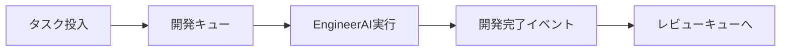
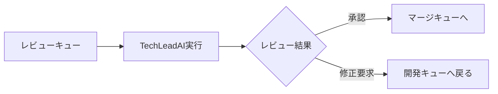
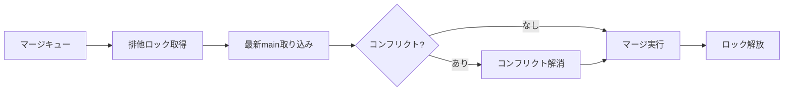

# 並列開発・レビューアーキテクチャ設計書

## 概要

現在の実装では、グループ内の全タスクが完了してからレビューを開始しているため、開発スピードが低下している。本設計書では、タスクが完了次第即座にレビューを開始し、開発とレビューを並列で実行する新しいアーキテクチャを提案する。

## 現在の問題点

1. **グループ単位の直列処理**
   - グループ内の最も遅いタスクがボトルネックになる
   - 早期に完了したタスクも他タスクの完了を待つ必要がある

2. **リソースの無駄遣い**
   - レビュワーが待機状態になる時間が長い
   - 開発者が修正待ちの時間が長い

## 新アーキテクチャの設計

### 1. イベント駆動型パイプライン

```typescript
interface TaskEvent {
  type: 'DEVELOPMENT_COMPLETED' | 'REVIEW_COMPLETED' | 'MERGE_READY';
  taskId: string;
  timestamp: Date;
  payload: any;
}

class TaskEventEmitter extends EventEmitter {
  emitDevelopmentCompleted(task: Task, result: EngineerResult): void;
  emitReviewCompleted(task: Task, reviewResult: ReviewResult): void;
  emitMergeReady(task: Task): void;
}
```

### 2. 並列実行パイプライン

```typescript
class ParallelPipeline {
  private developmentQueue: TaskQueue;
  private reviewQueue: TaskQueue;
  private mergeQueue: TaskQueue;
  
  async start(): Promise<void> {
    // 3つのパイプラインを並列起動
    await Promise.all([
      this.runDevelopmentPipeline(),
      this.runReviewPipeline(),
      this.runMergePipeline()
    ]);
  }
}
```

### 3. キューシステム

```typescript
class TaskQueue<T> {
  private items: T[] = [];
  private processing = new Set<string>();
  private maxConcurrent: number;
  
  async enqueue(item: T): Promise<void>;
  async dequeue(): Promise<T | null>;
  async processNext(processor: (item: T) => Promise<void>): Promise<void>;
}
```

### 4. マージキューと排他制御

```typescript
class MergeQueue {
  private queue: Task[] = [];
  private isProcessing = false;
  private mutex = new Mutex();
  
  async enqueueMerge(task: Task): Promise<void> {
    this.queue.push(task);
    this.processNext();
  }
  
  private async processNext(): Promise<void> {
    await this.mutex.acquire();
    try {
      if (this.isProcessing || this.queue.length === 0) return;
      
      this.isProcessing = true;
      const task = this.queue.shift()!;
      
      // 1. 最新のメインブランチを取り込む
      await this.pullLatestMain(task);
      
      // 2. コンフリクトがあれば解消
      if (await this.hasConflicts(task)) {
        await this.resolveConflicts(task);
      }
      
      // 3. マージ実行
      await this.executeMerge(task);
      
      this.isProcessing = false;
      this.processNext(); // 次のタスクを処理
    } finally {
      this.mutex.release();
    }
  }
}
```

## 実装フロー

### 1. 開発フェーズ


### 2. レビューフェーズ


### 3. マージフェーズ


## 利点

1. **高速化**
   - タスク完了次第即座にレビュー開始
   - 待ち時間の最小化

2. **リソース効率**
   - エンジニアAIとレビュワーAIが並列動作
   - CPU/メモリの効率的な利用

3. **スケーラビリティ**
   - エンジニア数とレビュワー数を独立して調整可能
   - ボトルネックに応じた最適化が可能

4. **安全性**
   - マージは排他制御により安全に順次実行
   - コンフリクト解消フローの確実な実行

## 設定可能なパラメータ

```typescript
interface PipelineConfig {
  maxConcurrentEngineers: number;    // 並列開発数
  maxConcurrentReviewers: number;    // 並列レビュー数
  maxRetries: number;                // リトライ回数
  conflictResolutionTimeout: number; // コンフリクト解消タイムアウト
}
```

## 実装の優先順位

1. **Phase 1**: イベントシステムとキューの基本実装
2. **Phase 2**: 並列パイプラインの実装
3. **Phase 3**: マージキューと排他制御
4. **Phase 4**: 監視とログ機能の強化

## 実装済みの注意事項

- ✅ Gitの操作は`MergeQueue`のMutex保護下で実行済み
- ✅ エラーハンドリングとリトライロジックを実装済み
- ✅ Electron UIでの進捗状況の可視化とログ出力を実装済み
- ✅ コンフリクト解消時は元のEngineerAIがコンテキストを維持して処理
- ✅ 優先度キューでコンフリクト解消タスクを優先処理