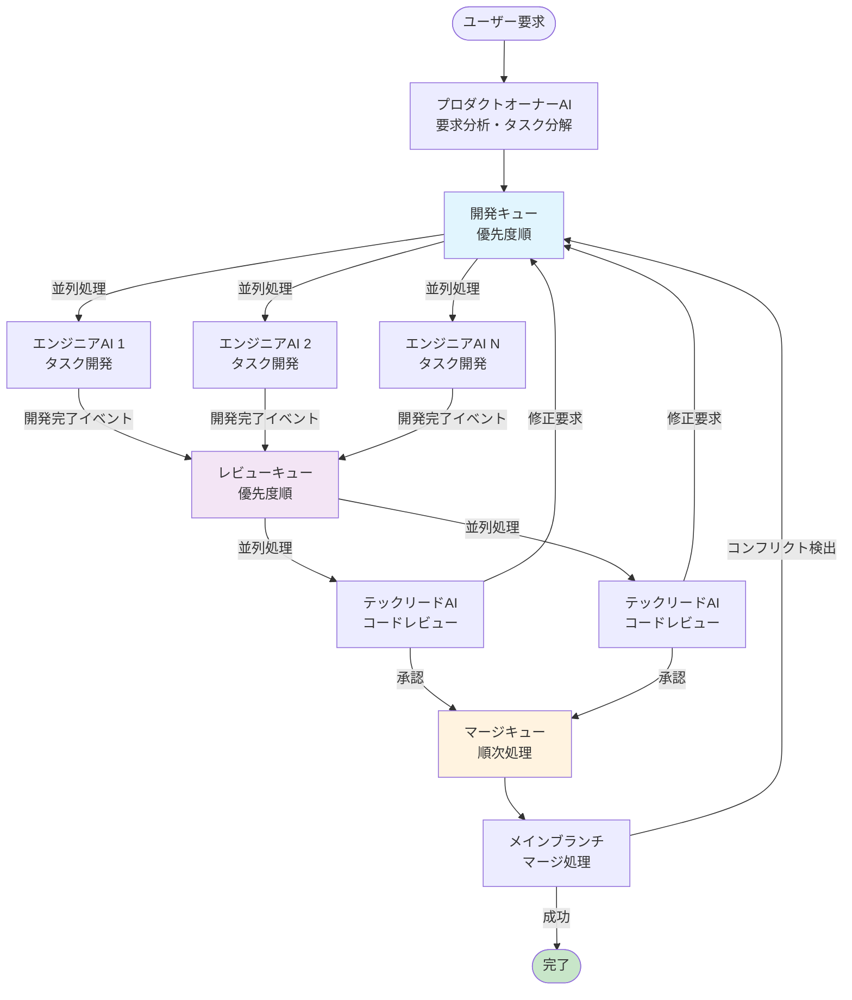

# 並列開発ワークフロー

## 概要

このドキュメントでは、AI並列開発システムの完全なワークフローを説明します。システムは3つの主要な処理パイプライン（開発、レビュー、マージ）を並列で動作させることで、効率的な開発プロセスを実現しています。

## アーキテクチャ図



## 詳細なワークフロー

### 1. 要求分析フェーズ
- **プロダクトオーナーAI**がユーザー要求を分析
- タスクの分解と依存関係の解決
- 各タスクに優先度を設定

### 2. 開発パイプライン
- **開発キュー**: 優先度順でタスクを管理
- **並列実行**: 複数のエンジニアAIが同時に異なるタスクを処理
- **Gitワークツリー**: 各タスクを独立したワークスペースで開発
- **セッション保持**: エンジニアAIのコンテキストを修正作業のために保持

### 3. レビューパイプライン
- **レビューキュー**: 開発完了したタスクを優先度順で管理
- **並列レビュー**: 複数のテックリードAIが同時にレビューを実行
- **修正要求**: 問題がある場合は開発キューに戻す
- **レビュー承認**: 問題がない場合はマージキューに送る

### 4. マージパイプライン
- **マージキュー**: 順次処理でメインブランチの整合性を保持
- **排他制御**: Mutexによるマージ操作の安全性確保
- **コンフリクト検出**: マージ前に最新のメインブランチを取り込み
- **コンフリクト解消**: 検出時は元のエンジニアAIが開発キューで解消

## キューシステムの特徴

### 開発キュー
- **優先度**: high (50点) > medium (0点) > low (-50点)
- **並列度**: 設定可能な最大同時実行数
- **リトライ**: 失敗時は最大3回まで自動リトライ

### レビューキュー
- **優先度**: タスクの優先度を引き継ぎ
- **並列度**: 設定可能な最大同時レビュー数
- **履歴管理**: レビュー結果の完全な履歴を保持

### マージキュー
- **順次処理**: メインブランチの安全性を保証
- **排他制御**: 複数のマージが同時実行されることを防止
- **自動クリーンアップ**: マージ後のブランチとワークツリーを自動削除

## イベント駆動アーキテクチャ

システムは以下のイベントで連携します：

- `DEVELOPMENT_COMPLETED`: 開発完了 → レビューキューへ
- `REVIEW_COMPLETED`: レビュー完了 → 
  - 修正要求の場合: 開発キューへ戻す
  - 承認の場合: マージキューへ
- `MERGE_READY`: マージ準備完了 → マージキューで処理
- `MERGE_CONFLICT_DETECTED`: コンフリクト検出 → 開発キューで解消
- `MERGE_COMPLETED`: マージ完了 → タスク終了
- `TASK_FAILED`: タスク失敗 → エラー処理

## 並列性とパフォーマンス

### 真の並列処理
- 開発、レビュー、マージの各段階が独立して並列実行
- 一つのタスクが完了すると即座に次の段階に進む
- 全タスクの完了を待つ必要がない

### スケーラビリティ
- エンジニアAI数: 設定で調整可能
- レビューAI数: 設定で調整可能
- キューサイズ: 無制限（メモリ許容範囲内）

### 安全性
- Gitワークツリーによる作業領域の完全分離
- Mutexによるマージ操作の排他制御
- エラー時の自動ロールバック機能

## 設定パラメータ

```typescript
interface SystemConfig {
  maxConcurrentEngineers: number;  // 同時実行エンジニア数
  maxTurnsPerTask: number;         // タスクあたりの最大ターン数
  baseRepoPath: string;            // メインリポジトリパス
  worktreeBasePath: string;        // ワークツリーベースパス
  baseBranch: string;              // メインブランチ名
}
```

## 関連ファイル

- **ParallelPipelineManager.ts**: メインオーケストレーター
- **TaskQueue.ts**: 汎用優先度キュー実装
- **ReviewQueue.ts**: レビュー専用キュー
- **MergeQueue.ts**: マージ専用キュー（排他制御付き）
- **TaskEventEmitter.ts**: イベント駆動システム
- **GitWorktreeManager.ts**: Gitワークツリー管理

このワークフローにより、従来のシーケンシャルな開発プロセスと比較して大幅な高速化を実現しています。