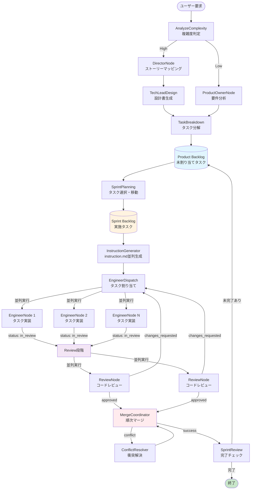
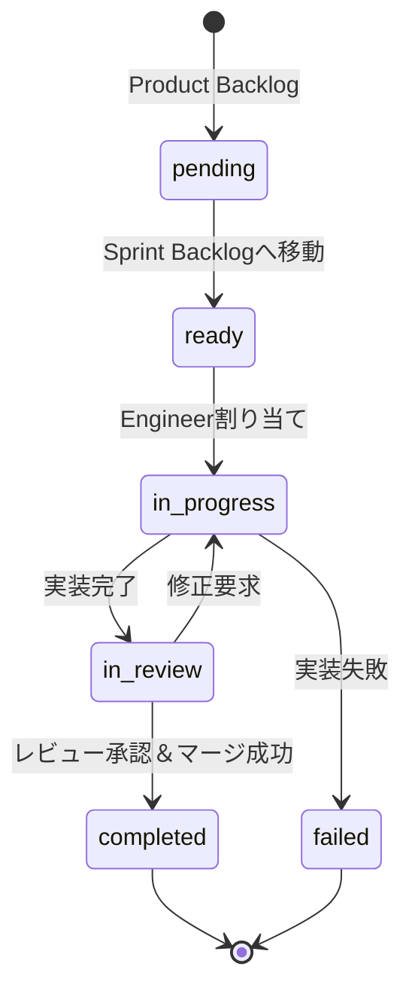

# 並列開発ワークフロー

**バージョン**: 2.0
**最終更新**: 2025-01-09
**ステータス**: 公式リファレンス

> **関連ドキュメント**: 本書は[AI_SCRUM_WORKFLOW_SPECIFICATION.md](./AI_SCRUM_WORKFLOW_SPECIFICATION.md)の並列実行アーキテクチャ詳細版です。

## 概要

このドキュメントでは、AI並列開発システムの並列実行パイプラインを説明します。システムはLangGraphベースの統一Scrumワークフローの中で、3つの主要な処理段階（開発、レビュー、マージ）を並列で動作させることで、効率的な開発プロセスを実現しています。

## アーキテクチャ図


```mermaid
graph TB
    Start([ユーザー要求]) --> Complexity[AnalyzeComplexity<br/>複雑度判定]

    Complexity --> |High| Director[DirectorNode<br/>ストーリーマッピング]
    Complexity --> |Low| PO[ProductOwnerNode<br/>要件分析]

    Director --> TechLead[TechLeadDesign<br/>設計書生成]
    TechLead --> TaskBreakdown[TaskBreakdown<br/>タスク分解]
    PO --> TaskBreakdown

    TaskBreakdown --> ProductBacklog[(Product Backlog<br/>未割り当てタスク)]

    ProductBacklog --> SprintPlanning[SprintPlanning<br/>タスク選択・移動]

    SprintPlanning --> SprintBacklog[(Sprint Backlog<br/>実施タスク)]

    SprintBacklog --> InstructionGen[InstructionGenerator<br/>instruction.md並列生成]
    InstructionGen --> Dispatch[EngineerDispatch<br/>タスク割り当て]

    Dispatch --> |並列実行| Eng1[EngineerNode 1<br/>タスク実装]
    Dispatch --> |並列実行| Eng2[EngineerNode 2<br/>タスク実装]
    Dispatch --> |並列実行| Eng3[EngineerNode N<br/>タスク実装]

    Eng1 --> |status: in_review| ReviewStage[Review段階]
    Eng2 --> |status: in_review| ReviewStage
    Eng3 --> |status: in_review| ReviewStage

    ReviewStage --> |並列実行| Rev1[ReviewNode<br/>コードレビュー]
    ReviewStage --> |並列実行| Rev2[ReviewNode<br/>コードレビュー]

    Rev1 --> |changes_requested| Dispatch
    Rev2 --> |changes_requested| Dispatch

    Rev1 --> |approved| MergeCoord[MergeCoordinator<br/>順次マージ]
    Rev2 --> |approved| MergeCoord

    MergeCoord --> |conflict| ConflictRes[ConflictResolver<br/>衝突解決]
    ConflictRes --> MergeCoord

    MergeCoord --> |success| SprintReview[SprintReview<br/>完了チェック]

    SprintReview --> |未完了あり| ProductBacklog
    SprintReview --> |完了| Complete([終了])

    style ProductBacklog fill:#e1f5fe
    style SprintBacklog fill:#fff3e0
    style ReviewStage fill:#f3e5f5
    style MergeCoord fill:#ffebee
    style Complete fill:#c8e6c9
```

## 詳細なワークフロー

### 1. 複雑度判定フェーズ

**AnalyzeComplexityNode**がユーザー要求をAI分析し、以下のいずれかに分岐：

- **High複雑度**: DirectorNode → TechLeadDesignNode → TaskBreakdownNode
- **Low複雑度**: ProductOwnerNode → TaskBreakdownNode

詳細は[AI_SCRUM_WORKFLOW_SPECIFICATION.md セクション5](./AI_SCRUM_WORKFLOW_SPECIFICATION.md#5-データフロー)を参照。

### 2. タスク管理フェーズ

#### Product Backlog生成

**TaskBreakdownNode**が設計書から実装可能なタスクに分解：
- タスクの依存関係を分析
- 優先度を設定
- `.kugutsu/product-backlog/backlog.json`に保存

#### Sprint Planning

**SprintPlanningNode**がProduct BacklogからSprint Backlogへタスクを移動：

```
Product Backlog (未割り当て)
    ↓ タスク選択（優先度・依存関係考慮）
Sprint Backlog (実施予定)
```

タスク選択基準：
- 優先度（priority）
- 依存関係（dependencies）
- 見積もりポイント合計が8-16時間相当

### 3. Instruction生成パイプライン（並列実行）

#### InstructionGeneratorNode（並列実行）

**InstructionGeneratorWrapper**（ParallelDevGraph.ts）により、スプリントスコープのタスクについて並列でinstruction.md生成：

```typescript
// 並列生成の実装
const sprintTasks = state.globalTasks.filter(
  task => state.activeSprint.taskIds.includes(task.id)
);

const results = await Promise.allSettled(
  sprintTasks.map(task => generateInstructionForTask(state, task))
);
```

各InstructionGeneratorNodeの動作：
1. タスク情報を読み込み
2. 高複雑度パス: ストーリーマッピング・設計書を参照
3. 低複雑度パス: ユーザーリクエスト・タスク定義を参照
4. AIがタスク指示書（instruction.md）を生成
5. `.kugutsu/sprints/sprint-{N}/tasks/{taskId}/instruction.md`に保存

### 4. 開発パイプライン（並列実行）

#### EngineerDispatch

Sprint Backlogから実行可能なタスクを選択し、状態を`in_progress`に更新。

#### EngineerNode（並列実行）

**EngineerWrapper**（ParallelDevGraph.ts）により、複数タスクを並列実行：

```typescript
// 並列実行の実装
const inProgressTasks = state.tasks.filter(t => t.status === 'in_progress');

const taskResults = await Promise.allSettled(
  inProgressTasks.map(task => engineerNode(state, task.id))
);
```

各EngineerNodeの動作：
1. `.kugutsu/sprints/sprint-{N}/tasks/{taskId}/instruction.md`を読み込み
2. 設計書（storyMapping, designDocs）を参照
3. TDD（テスト駆動開発）で実装
4. Git commit（pushは禁止）
5. タスク状態を`in_review`に更新

#### Gitワークツリー分離

各タスクは独立したworktreeで実装：

```
worktrees/
├── task-001/  # ブランチ: feature/task-001
├── task-002/  # ブランチ: feature/task-002
└── task-003/  # ブランチ: feature/task-003
```

### 5. レビューパイプライン（並列実行）

#### ReviewNode（並列実行）

**ReviewWrapper**（ParallelDevGraph.ts）により、複数タスクを並列レビュー：

```typescript
// 並列レビューの実装
const reviewTasks = state.tasks.filter(t =>
  t.status === 'in_review' &&
  !state.reviews.some(r => r.taskId === t.id)
);

const reviewResults = await Promise.allSettled(
  reviewTasks.map(task => reviewNode(state, task.id))
);
```

レビュー観点（優先順位順）：
1. **設計書との整合性** ⭐ 最優先
2. コード品質
3. テストカバレッジ
4. セキュリティ
5. パフォーマンス

レビュー結果：
- **approved**: `status: completed`、マージキューへ
- **changes_requested**: `status: in_progress`、開発キューへ戻る

### 6. マージパイプライン（逐次実行）

#### MergeCoordinatorNode

**Mutex保護**により、mainブランチへのマージを逐次実行：

```typescript
// 疑似コード
await mutex.lock();
try {
  // 1. mainブランチの最新取得
  await git.fetch('origin', 'main');

  // 2. タスクブランチにmainをマージ
  await git.merge('main', taskBranch);

  // 3. コンフリクトチェック
  if (hasConflicts) {
    throw new ConflictError();
  }

  // 4. mainブランチにマージ
  await git.merge(taskBranch, 'main');

} finally {
  await mutex.unlock();
}
```

マージ成功時：
- タスク状態を`completed`に更新
- worktreeとブランチを削除

#### ConflictResolverNode

コンフリクト検出時：
1. タスクを`in_progress`に戻す
2. **元のEngineerNode**（コンテキスト保持）が解決
3. 優先度を`high`に設定（優先処理）

### 7. スプリント完了フェーズ

#### SprintReviewNode

全タスクの状態をチェック：

```typescript
const completedTasks = tasks.filter(t => t.status === 'completed');
const incompleteTasks = tasks.filter(t => t.status !== 'completed');

if (incompleteTasks.length > 0) {
  // 未完了タスクをProduct Backlogへ移動
  await moveTasksToProductBacklog(incompleteTasks);

  // 次のスプリントを開始
  return 'sprint_planning';
} else {
  // 全タスク完了
  return '__end__';
}
```

## イベント駆動アーキテクチャ

LangGraphの状態遷移により、以下のイベントフローを実現：

| イベント | トリガー | 次の処理 |
|---------|---------|---------|
| `DEVELOPMENT_COMPLETED` | EngineerNode完了 | ReviewNode実行 |
| `REVIEW_COMPLETED (approved)` | ReviewNode承認 | MergeCoordinatorNode実行 |
| `REVIEW_COMPLETED (changes_requested)` | ReviewNode却下 | EngineerNode再実行 |
| `MERGE_READY` | Review承認 | MergeCoordinatorNode実行 |
| `MERGE_CONFLICT_DETECTED` | マージ衝突 | ConflictResolverNode実行 |
| `MERGE_COMPLETED` | マージ成功 | 次のタスクまたは終了 |
| `TASK_FAILED` | タスク失敗 | エラーハンドリング |

## 並列性とパフォーマンス

### 真の並列処理

開発、レビュー、マージの各段階が**独立して並列実行**：

```
時系列:
t0: Task1開発開始、Task2開発開始
t1: Task1開発完了 → Task1レビュー開始
t2: Task2開発完了 → Task2レビュー開始、Task3開発開始
t3: Task1レビュー完了 → Task1マージ開始
t4: Task1マージ完了、Task2レビュー完了 → Task2マージ開始
...
```

**ポイント**: 全タスクの完了を待つ必要がなく、各タスクが独立して進行。

### スケーラビリティ

設定可能なパラメータ：

```typescript
config = {
  maxEngineers: 10,        // 同時実行エンジニア数
  maxTurns: 30,            // タスクあたりの最大ターン数
  baseRepoPath: '.',       // メインリポジトリパス
  worktreeBasePath: './worktrees',  // ワークツリーベースパス
  baseBranch: 'main',      // メインブランチ名
}
```

推奨設定：

| プロジェクト規模 | タスク数 | maxEngineers | 必要リソース |
|----------------|---------|--------------|-------------|
| 小規模 | ~10 | 3-5 | 4GB RAM, 4コア |
| 中規模 | 10-50 | 5-7 | 8GB RAM, 6-8コア |
| 大規模 | 50-100 | 7-10 | 16GB RAM, 8-12コア |

### 安全性

#### Gitワークツリー分離

各タスクは完全に独立したワークスペースで実装：
- ファイル競合の完全回避
- 並列実行の安全性確保

#### Mutex保護

mainブランチへのマージは**排他制御**により順次実行：
- マージ競合の防止
- mainブランチの整合性保証

#### エラー時のロールバック

- タスク失敗時: worktreeとブランチを自動削除
- マージ失敗時: 元の状態に自動復旧

## タスク状態遷移


```mermaid
stateDiagram-v2
    [*] --> pending: Product Backlog
    pending --> ready: Sprint Backlogへ移動
    ready --> in_progress: Engineer割り当て
    in_progress --> in_review: 実装完了
    in_review --> in_progress: 修正要求
    in_review --> completed: レビュー承認＆マージ成功
    in_progress --> failed: 実装失敗
    completed --> [*]
    failed --> [*]
```

## 設定パラメータ詳細

### maxEngineers（同時実行エンジニア数）

- **推奨値**: 3-10
- **最小値**: 1
- **最大値**: 制限なし（ただし、リソース次第）
- **影響**: 並列度が高いほど開発速度向上、但しマージがボトルネックに

### maxTurns（タスクあたりの最大ターン数）

- **推奨値**: 20-30
- **最小値**: 5
- **最大値**: 50
- **影響**: 複雑なタスクほど多くのターンが必要

## 関連ファイル

### LangGraph実装

- **ParallelDevGraph.ts**: ワークフロー定義、EngineerWrapper/ReviewWrapper
- **state.ts**: State定義、Reducer実装
- **nodes/**: 各ノードの実装

### ノード実装

- **AnalyzeComplexityNode.ts**: 複雑度判定
- **ProductOwnerNode.ts**: 要件分析（Low複雑度）
- **DirectorNode.ts**: ストーリーマッピング（High複雑度）
- **TechLeadDesignNode.ts**: 設計書生成（High複雑度）
- **TaskBreakdownNode.ts**: タスク分解
- **SprintPlanningNode.ts**: スプリント計画
- **InstructionGeneratorNode.ts**: instruction.md並列生成
- **EngineerDispatchNode.ts**: タスク割り当て
- **EngineerNode.ts**: タスク実装
- **ReviewNode.ts**: コードレビュー
- **MergeCoordinatorNode.ts**: マージ調整
- **ConflictResolverNode.ts**: コンフリクト解決
- **SprintReviewNode.ts**: スプリント完了チェック

### ユーティリティ

- **GitWorktreeManager.ts**: Gitワークツリー管理
- **DataPersistence.ts**: ファイル永続化
- **RetryManager.ts**: リトライ機構
- **ErrorClassifier.ts**: エラー分類

## パフォーマンス最適化

### 1. 依存関係の最小化

タスク分解時に真の依存関係のみを設定：

```
❌ 悪い例（偽の依存関係）:
Task 1: DB migration
Task 2: Model実装（Task 1に依存）
Task 3: API実装（Task 2に依存）

✅ 良い例（真の依存関係のみ）:
Task 1: ユーザー登録機能（DB + Model + API + Frontend）
Task 2: ログイン機能（独立）
Task 3: ダッシュボード（ログイン機能に依存）
```

### 2. タスク粒度の適正化

各タスクは4-8時間で完了可能な粒度に：

- **小さすぎる**: オーバーヘッド増大
- **大きすぎる**: 並列度低下

### 3. リソース管理

- worktreeの定期的なクリーンアップ
- ログファイルのローテーション
- メモリ使用量の監視

---

このワークフローにより、従来のシーケンシャルな開発プロセスと比較して**大幅な高速化**を実現しています。
