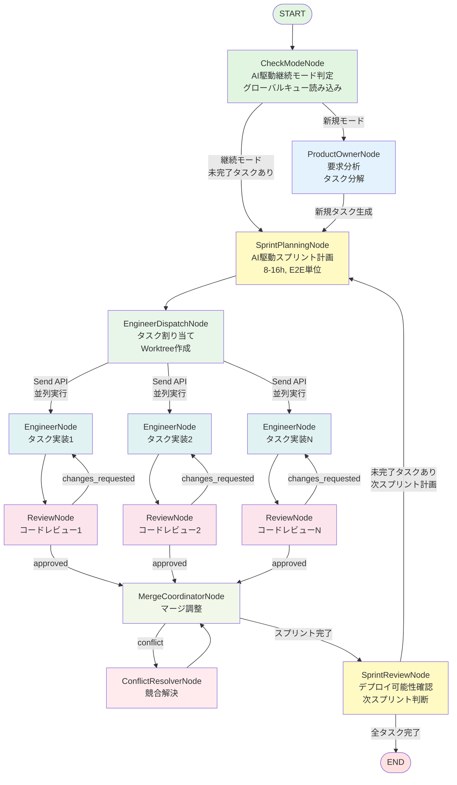
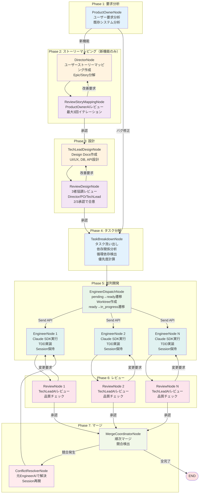
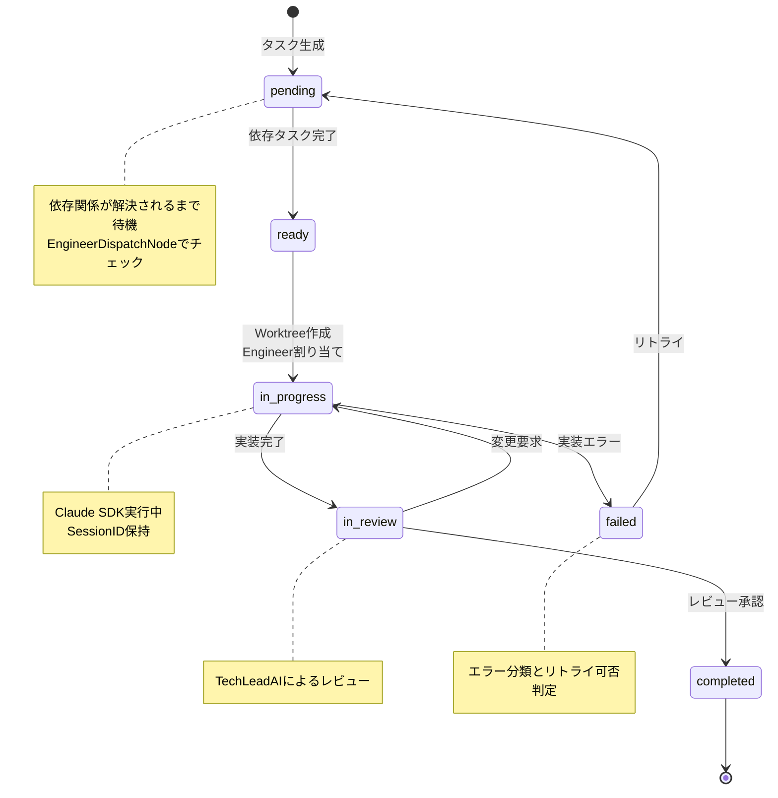
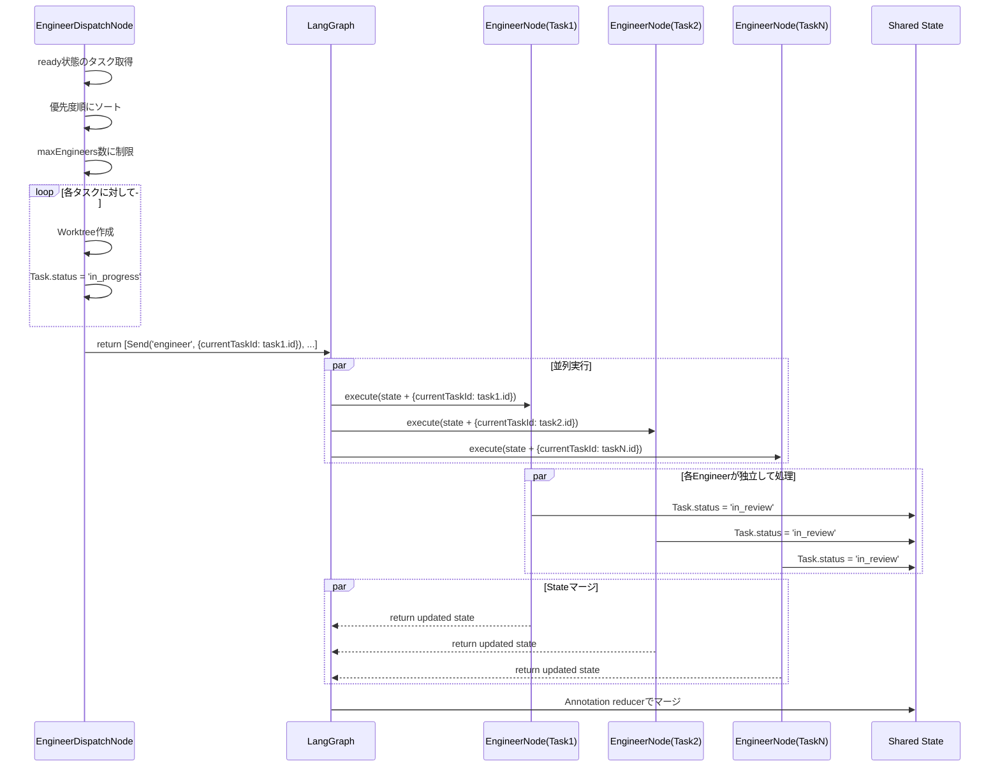
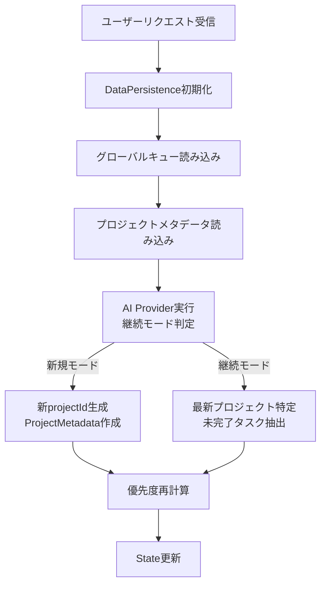
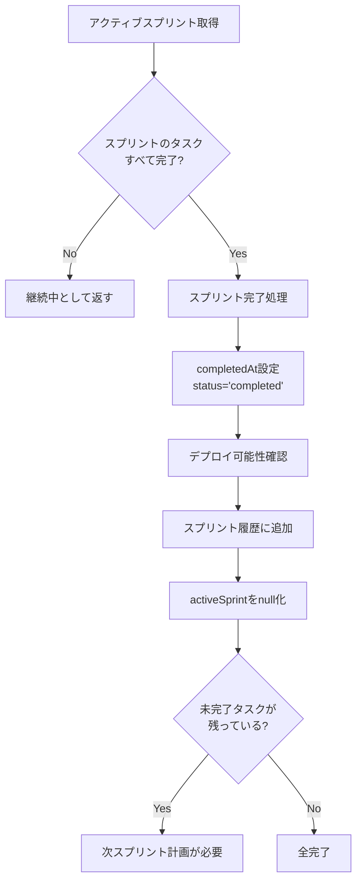

# Kugutsu 2.0 Architecture Design Document

**プロジェクト**: Kugutsu 2.0 - AI Parallel Development System
**バージョン**: 2.0.0
**最終更新**: 2025-11-06
**ステータス**: Draft

## 目次

1. [概要](#概要)
2. [現状分析](#現状分析)
3. [設計目標](#設計目標)
4. [アーキテクチャ概要](#アーキテクチャ概要)
5. [コンポーネント設計](#コンポーネント設計)
6. [データフロー](#データフロー)
7. [技術スタック](#技術スタック)
8. [移行戦略](#移行戦略)

---

## 概要

Kugutsu 2.0は、LangGraphJSをコアとした完全新規アーキテクチャへの刷新を行います。複数のAIプロバイダー（Claude Agent SDK、OpenAI Codex SDK）をサポートし、**スプリント駆動開発**を実現するマルチエージェント並列開発システムを提供します。

### 主要な変更点

- **Claude Code SDK → Claude Agent SDK + OpenAI Codex SDK**
- **イベント駆動アーキテクチャ → LangGraphJS State管理**
- **カスタムオーケストレーション → LangGraphJS標準ワークフロー**
- **統一AIプロバイダーインターフェース導入**
- **🆕 スプリント駆動開発の実現**
  - 複数プロジェクトのグローバルタスク管理
  - AI駆動の継続モード判定
  - 動的優先度計算（直近リクエストを優先）
  - スプリント計画とレビューのループ

### 維持する機能

- ✅ Electron UI（リアルタイムログ表示）
- ✅ Git Worktree による並列開発環境
- ✅ 自動コードレビュー
- ✅ コンフリクト解消

### 新規機能

- 🆕 **スプリント駆動開発**: 8-16時間単位のスプリントでE2Eデプロイ可能な機能を継続的に開発
- 🆕 **グローバルタスク管理**: 複数プロジェクトのタスクを一元管理、動的優先度計算
- 🆕 **AI駆動継続モード判定**: 文字列パターンマッチング不使用、完全AI判断
- 🆕 **スプリントループ**: 全タスク完了まで自動的にスプリント計画→実行→レビューを繰り返し

---

## 現状分析

### 現在のアーキテクチャ

```
User Request
    ↓
ParallelDevelopmentOrchestrator
    ↓
TaskEventEmitter (イベント駆動)
    ↓
[ProductOwnerAI, EngineerAI, TechLeadAI] ← Claude Code SDK (query)
    ↓
GitWorktreeManager
    ↓
ElectronLogAdapter → Electron UI
```

### 課題

1. **SDKの非推奨化**: Claude Code SDK → Claude Agent SDK への移行必要
2. **カスタムイベントシステム**: LangGraphJSの標準機能で代替可能
3. **プロバイダー固定**: 単一AI SDK に依存
4. **複雑な状態管理**: 複数のキューとイベントで分散

---

## 設計目標

### 機能要件

#### コア機能
- [x] Claude Agent SDK と OpenAI Codex SDK の両対応
- [x] グローバル設定によるプロバイダー切り替え
- [x] LangGraphJS による統一ワークフロー管理
- [x] Stateベースのデータフロー
- [x] Electron UIとの統合維持
- [x] Git Worktree機能の完全保持

#### スプリント駆動開発機能（🆕）
- [x] **グローバルタスク管理**: 複数プロジェクトのタスクを`.kugutsu/tasks/global-queue.json`で一元管理
- [x] **動的優先度計算**: `dynamicPriority = basePriority * 0.5 + recencyBonus * 0.3 + dependencyBonus * 0.2`
- [x] **AI駆動継続モード判定**: 文字列パターンマッチング不使用、完全AI判断
- [ ] **スプリント計画**: AI駆動で8-16時間、E2Eデプロイ可能な単位でタスクをグルーピング
- [ ] **スプリントレビュー**: スプリント完了確認、デプロイ可能性チェック、次スプリント判断
- [x] **データ永続化**: グローバルキュー、スプリント情報、プロジェクトメタデータの永続化

### 非機能要件

- **拡張性**: 新しいAIプロバイダーを容易に追加可能
- **保守性**: LangGraphJSのベストプラクティスに準拠
- **可視性**: State変更を全てElectron UIで監視可能
- **信頼性**: エラーハンドリングとリトライ機能
- **🆕 継続性**: 中断したプロジェクトを自動的に再開可能
- **🆕 適応性**: 直近のユーザーリクエストを優先的に処理

---

## アーキテクチャ概要

### レイヤー構成

```
┌─────────────────────────────────────────┐
│         Electron UI Layer               │
│  (リアルタイム監視、ログ表示)              │
└────────────────┬────────────────────────┘
                 │ IPC / WebSocket
┌────────────────▼────────────────────────┐
│      LangGraph Orchestration Layer      │
│  ┌──────────────────────────────────┐   │
│  │   ParallelDevGraph (StateGraph)  │   │
│  │  🆕 スプリント駆動開発ノード      │   │
│  │  ├─ CheckModeNode                │   │
│  │  ├─ SprintPlanningNode           │   │
│  │  ├─ SprintReviewNode             │   │
│  │  コア開発ノード                  │   │
│  │  ├─ ProductOwnerNode             │   │
│  │  ├─ EngineerDispatchNode         │   │
│  │  ├─ [並列] EngineerNode           │   │
│  │  ├─ ReviewNode                   │   │
│  │  ├─ MergeCoordinatorNode         │   │
│  │  └─ ConflictResolverNode         │   │
│  └──────────────────────────────────┘   │
└────────────────┬────────────────────────┘
                 │
┌────────────────▼────────────────────────┐
│        AI Provider Abstraction Layer    │
│  ┌──────────────┐  ┌─────────────────┐ │
│  │ Claude Agent │  │ OpenAI Codex    │ │
│  │ Provider     │  │ Provider        │ │
│  └──────────────┘  └─────────────────┘ │
└────────────────┬────────────────────────┘
                 │
┌────────────────▼────────────────────────┐
│         Infrastructure Layer            │
│  ├─ GitWorktreeManager                  │
│  ├─ FileSystemUtils                     │
│  └─ ConfigurationManager                │
└─────────────────────────────────────────┘
```

---

## コンポーネント設計

### 1. AI Provider Abstraction Layer

#### 1.1 IAIProvider Interface

**ファイル**: `src/providers/IAIProvider.ts`

```typescript
export interface AIMessage {
  type: 'assistant' | 'user' | 'system' | 'result';
  content: any;
  session_id?: string;
}

export interface ExecuteOptions {
  maxTurns?: number;
  cwd?: string;
  allowedTools?: string[];
  permissionMode?: 'default' | 'acceptEdits' | 'bypassPermissions' | 'plan';
  resume?: string; // セッションID
}

export interface IAIProvider {
  /**
   * プロンプトを実行し、メッセージストリームを返す
   */
  execute(
    prompt: string,
    options: ExecuteOptions
  ): AsyncIterator<AIMessage>;

  /**
   * セッションを再開する
   */
  resumeSession(sessionId: string): void;

  /**
   * サポートされているツール一覧を取得
   */
  getSupportedTools(): string[];

  /**
   * プロバイダー名を取得
   */
  getProviderName(): string;
}
```

#### 1.2 ClaudeAgentProvider

**ファイル**: `src/providers/ClaudeAgentProvider.ts`

**依存**: `@anthropic-ai/claude-agent-sdk`

```typescript
import { query, type SDKMessage } from '@anthropic-ai/claude-agent-sdk';

export class ClaudeAgentProvider implements IAIProvider {
  private apiKey: string;
  private model: string;

  async *execute(prompt: string, options: ExecuteOptions): AsyncIterator<AIMessage> {
    for await (const message of query({
      prompt,
      options: {
        model: this.model,
        maxTurns: options.maxTurns,
        cwd: options.cwd,
        permissionMode: options.permissionMode,
        allowedTools: options.allowedTools,
        resume: options.resume,
      }
    })) {
      yield this.convertMessage(message);
    }
  }

  private convertMessage(sdkMessage: SDKMessage): AIMessage {
    // SDKMessage → AIMessage 変換
  }

  // ... 他のメソッド実装
}
```

**参考**: [Claude Agent SDK TypeScript Documentation](https://docs.claude.com/en/api/agent-sdk/typescript)

#### 1.3 OpenAICodexProvider

**ファイル**: `src/providers/OpenAICodexProvider.ts`

**依存**: `@openai/codex-sdk`

```typescript
import { Codex } from '@openai/codex-sdk';

export class OpenAICodexProvider implements IAIProvider {
  private codex: Codex;
  private currentThread: any;

  async *execute(prompt: string, options: ExecuteOptions): AsyncIterator<AIMessage> {
    // スレッド管理
    if (options.resume) {
      this.currentThread = this.codex.resumeThread(options.resume);
    } else {
      this.currentThread = this.codex.startThread();
    }

    // プロンプト実行
    const result = await this.currentThread.run(prompt);

    // 結果をストリーム形式で返す
    yield this.convertResult(result);
  }

  private convertResult(result: any): AIMessage {
    // Codex Result → AIMessage 変換
  }

  // ... 他のメソッド実装
}
```

**参考**: [OpenAI Codex SDK Documentation](https://developers.openai.com/codex/sdk/)

#### 1.4 AIProviderFactory

**ファイル**: `src/providers/AIProviderFactory.ts`

```typescript
export class AIProviderFactory {
  static create(config: AIProviderConfig): IAIProvider {
    switch (config.provider) {
      case 'claude':
        return new ClaudeAgentProvider(config.claude);
      case 'codex':
        return new OpenAICodexProvider(config.codex);
      default:
        throw new Error(`Unknown provider: ${config.provider}`);
    }
  }
}
```

---

### 2. エラーハンドリング戦略

#### 2.1 概要

AIノード実行時の失敗に対応するため、包括的なエラーハンドリング戦略を実装します。

**主要機能**:
- 自動リトライ機構（エクスポネンシャルバックオフ）
- エラー分類（一時的 vs 永続的）
- 詳細なエラーログとトレーシング
- グレースフルデグレデーション

#### 2.2 RetryManager

**ファイル**: `src/utils/RetryManager.ts`

```typescript
export interface RetryOptions {
  maxRetries: number;
  initialDelayMs: number;
  maxDelayMs: number;
  backoffMultiplier: number;
  retryableErrors: string[]; // リトライ対象のエラーパターン
}

export interface RetryResult<T> {
  success: boolean;
  data?: T;
  error?: Error;
  attempts: number;
  totalDurationMs: number;
}

/**
 * エクスポネンシャルバックオフを用いたリトライマネージャー
 */
export class RetryManager {
  private static defaultOptions: RetryOptions = {
    maxRetries: 3,
    initialDelayMs: 1000, // 1秒
    maxDelayMs: 30000, // 30秒
    backoffMultiplier: 2,
    retryableErrors: [
      'ECONNRESET',
      'ETIMEDOUT',
      'ENOTFOUND',
      'rate_limit',
      'timeout',
      'network_error',
      'temporary_error'
    ]
  };

  /**
   * エクスポネンシャルバックオフでリトライを実行
   */
  static async executeWithRetry<T>(
    operation: () => Promise<T>,
    options: Partial<RetryOptions> = {}
  ): Promise<RetryResult<T>> {
    const opts = { ...this.defaultOptions, ...options };
    const startTime = Date.now();
    let lastError: Error | undefined;

    for (let attempt = 0; attempt <= opts.maxRetries; attempt++) {
      try {
        const data = await operation();
        return {
          success: true,
          data,
          attempts: attempt + 1,
          totalDurationMs: Date.now() - startTime
        };
      } catch (error) {
        lastError = error as Error;

        // リトライ可能なエラーかチェック
        const isRetryable = this.isRetryableError(error as Error, opts.retryableErrors);

        // 最後の試行、またはリトライ不可能なエラー
        if (attempt >= opts.maxRetries || !isRetryable) {
          return {
            success: false,
            error: lastError,
            attempts: attempt + 1,
            totalDurationMs: Date.now() - startTime
          };
        }

        // バックオフ遅延を計算
        const delay = Math.min(
          opts.initialDelayMs * Math.pow(opts.backoffMultiplier, attempt),
          opts.maxDelayMs
        );

        console.warn(
          `操作失敗（試行${attempt + 1}/${opts.maxRetries + 1}）: ${lastError.message}。` +
          `${delay}ms後にリトライします...`
        );

        await this.sleep(delay);
      }
    }

    // 到達しないはずだが、型安全性のため
    return {
      success: false,
      error: lastError,
      attempts: opts.maxRetries + 1,
      totalDurationMs: Date.now() - startTime
    };
  }

  /**
   * エラーがリトライ可能か判定
   */
  private static isRetryableError(error: Error, retryablePatterns: string[]): boolean {
    const errorMessage = error.message.toLowerCase();
    const errorCode = (error as any).code?.toLowerCase() || '';

    return retryablePatterns.some(pattern =>
      errorMessage.includes(pattern.toLowerCase()) ||
      errorCode.includes(pattern.toLowerCase())
    );
  }

  /**
   * 非同期スリープ
   */
  private static sleep(ms: number): Promise<void> {
    return new Promise(resolve => setTimeout(resolve, ms));
  }
}
```

**リトライ戦略の詳細**:

| パラメータ | デフォルト値 | 説明 |
|-----------|------------|------|
| `maxRetries` | 3 | 最大リトライ回数（初回試行 + 3回リトライ = 計4回試行） |
| `initialDelayMs` | 1000ms (1秒) | 初回リトライ前の遅延時間 |
| `maxDelayMs` | 30000ms (30秒) | リトライ間隔の上限 |
| `backoffMultiplier` | 2 | バックオフ倍率（指数関数的増加） |

**バックオフ戦略**: エクスポネンシャルバックオフ

リトライ間隔は以下の式で計算されます：

```
delay = min(initialDelayMs × backoffMultiplier^attempt, maxDelayMs)
```

**具体例**（デフォルト設定の場合）:
- 1回目の失敗 → 1秒待機 → 2回目の試行
- 2回目の失敗 → 2秒待機 → 3回目の試行
- 3回目の失敗 → 4秒待機 → 4回目の試行（最終試行）
- 4回目の失敗 → リトライ終了、エラー返却

**リトライ可能エラー**:
- `ECONNRESET`: 接続リセット
- `ETIMEDOUT`: タイムアウト
- `ENOTFOUND`: ホスト名解決失敗
- `rate_limit`: APIレート制限
- `timeout`: 一般的なタイムアウト
- `network_error`: ネットワークエラー
- `temporary_error`: 一時的なエラー

**リトライ不可能エラー**:
- 認証エラー (`AUTHENTICATION_ERROR`)
- 権限エラー (`PERMISSION_DENIED`)
- 無効な入力 (`INVALID_INPUT`)
- 循環依存 (`CYCLIC_DEPENDENCY`)

**使用例**:

```typescript
// デフォルト設定でリトライ
const result = await RetryManager.executeWithRetry(async () => {
  return await aiProvider.execute(prompt, options);
});

// カスタム設定（より積極的なリトライ）
const result = await RetryManager.executeWithRetry(
  async () => await aiProvider.execute(prompt, options),
  {
    maxRetries: 5,
    initialDelayMs: 500,
    maxDelayMs: 60000,
    backoffMultiplier: 1.5
  }
);
```

#### 2.3 エラー分類

```typescript
/**
 * エラータイプ分類
 */
export enum ErrorType {
  // 一時的エラー（リトライ可能）
  NETWORK_ERROR = 'network_error',
  TIMEOUT = 'timeout',
  RATE_LIMIT = 'rate_limit',
  TEMPORARY_PROVIDER_ERROR = 'temporary_provider_error',

  // 永続的エラー（リトライ不可）
  INVALID_INPUT = 'invalid_input',
  AUTHENTICATION_ERROR = 'authentication_error',
  PERMISSION_DENIED = 'permission_denied',
  RESOURCE_NOT_FOUND = 'resource_not_found',
  CYCLIC_DEPENDENCY = 'cyclic_dependency',

  // システムエラー
  UNKNOWN_ERROR = 'unknown_error'
}

export class KugutsuError extends Error {
  constructor(
    message: string,
    public type: ErrorType,
    public retryable: boolean,
    public context?: any
  ) {
    super(message);
    this.name = 'KugutsuError';
  }
}
```

#### 2.4 ノードでの使用例

```typescript
import { RetryManager, KugutsuError, ErrorType } from '../../utils/RetryManager';

export async function exampleNode(
  state: ParallelDevStateType
): Promise<Partial<ParallelDevStateType>> {
  const provider = AIProviderFactory.create(config);

  // リトライ付きでAI操作を実行
  const result = await RetryManager.executeWithRetry(
    async () => {
      return await provider.execute(prompt, options);
    },
    {
      maxRetries: 3,
      initialDelayMs: 2000,
      retryableErrors: ['timeout', 'rate_limit', 'ECONNRESET']
    }
  );

  if (!result.success) {
    // エラーハンドリング
    const errorType = classifyError(result.error);

    throw new KugutsuError(
      `ノード実行失敗: ${result.error?.message}`,
      errorType,
      false, // 既にリトライ済み
      {
        attempts: result.attempts,
        duration: result.totalDurationMs,
        state: {
          taskId: state.tasks[0]?.id,
          nodeSource: 'ExampleNode'
        }
      }
    );
  }

  return {
    logs: [{
      timestamp: new Date(),
      level: 'info',
      source: 'ExampleNode',
      message: `操作成功（${result.attempts}回の試行、${result.totalDurationMs}ms）`
    }]
  };
}

function classifyError(error?: Error): ErrorType {
  if (!error) return ErrorType.UNKNOWN_ERROR;

  const message = error.message.toLowerCase();

  if (message.includes('timeout')) return ErrorType.TIMEOUT;
  if (message.includes('rate limit')) return ErrorType.RATE_LIMIT;
  if (message.includes('network')) return ErrorType.NETWORK_ERROR;
  if (message.includes('authentication')) return ErrorType.AUTHENTICATION_ERROR;
  if (message.includes('循環依存')) return ErrorType.CYCLIC_DEPENDENCY;

  return ErrorType.UNKNOWN_ERROR;
}

/**
 * エラータイプからリトライ可否を判定
 */
function isRetryableError(errorType: ErrorType): boolean {
  const retryableErrors = [
    ErrorType.NETWORK_ERROR,
    ErrorType.TIMEOUT,
    ErrorType.RATE_LIMIT,
    ErrorType.TEMPORARY_PROVIDER_ERROR
  ];

  return retryableErrors.includes(errorType);
}
```

#### 2.5 グラフレベルのエラーハンドリング

```typescript
/**
 * グラフ実行時のエラーハンドリング
 */
export async function executeGraphWithErrorHandling(
  graph: CompiledStateGraph,
  initialState: ParallelDevStateType
): Promise<ParallelDevStateType> {
  try {
    const result = await graph.invoke(initialState);
    return result;
  } catch (error) {
    if (error instanceof KugutsuError) {
      // 分類済みエラー
      console.error(`[${error.type}] ${error.message}`, error.context);

      // エラーをログに記録
      return {
        ...initialState,
        logs: [
          ...initialState.logs,
          {
            timestamp: new Date(),
            level: 'error',
            source: 'GraphExecution',
            message: error.message,
            data: {
              errorType: error.type,
              retryable: error.retryable,
              context: error.context
            }
          }
        ]
      };
    } else {
      // 未分類エラー
      console.error('予期しないエラー:', error);
      throw error;
    }
  }
}
```

---

### 3. LangGraph State Definition

**ファイル**: `src/graph/state.ts`

```typescript
import { Annotation } from '@langchain/langgraph';

export interface Task {
  id: string;
  title: string;
  description: string;
  priority: number;
  dependencies: string[];
  worktreePath?: string;
  branchName?: string;
  /**
   * タスクステータス（6列Kanbanボード）
   * - pending: 依存関係未解決、実行待ち
   * - ready: 依存関係解決済み、実行可能
   * - in_progress: 実装中
   * - in_review: レビュー中
   * - completed: 完了
   * - failed: 失敗
   */
  status: 'pending' | 'ready' | 'in_progress' | 'in_review' | 'completed' | 'failed';
  assignedEngineer?: string;
  sessionId?: string;
  isConflictResolution?: boolean;
}

export interface Review {
  taskId: string;
  reviewer: string;
  status: 'approved' | 'changes_requested' | 'pending';
  comments: string[];
  timestamp: Date;
}

export interface MergeTask {
  taskId: string;
  sourceBranch: string;
  targetBranch: string;
  status: 'pending' | 'in_progress' | 'completed' | 'conflict';
  conflictFiles?: string[];
}

/**
 * グローバルタスク（複数プロジェクト対応）
 *
 * 既存のTaskを拡張し、プロジェクト識別子と動的優先度を追加
 */
export interface GlobalTask extends Task {
  projectId: string;              // プロジェクト識別子（uuid）
  requestTimestamp: Date;         // リクエスト受付時刻
  dynamicPriority: number;        // 動的優先度（0-1000）
  sprint?: string;                // 所属スプリントID
  storyId?: string;               // 関連するユーザーストーリーID
}

/**
 * プロジェクトメタ情報
 */
export interface ProjectMetadata {
  projectId: string;              // プロジェクト識別子
  userRequest: string;            // 元のユーザーリクエスト
  requestTimestamp: Date;         // リクエスト受付時刻
  totalTasks: number;             // 総タスク数
  completedTasks: number;         // 完了タスク数
  needsStoryMapping: boolean;     // ストーリーマッピングが必要か
  storyMappingPath?: string;      // ストーリーマッピングのファイルパス
  designDocsPath?: string;        // 設計書のファイルパス
}

/**
 * スプリント情報
 */
export interface Sprint {
  id: string;                     // sprint-{uuid}
  name: string;                   // "Sprint 1: 認証機能実装"
  goal: string;                   // スプリントゴール
  taskIds: string[];              // 含まれるタスクID
  status: 'planning' | 'active' | 'review' | 'completed';
  startedAt?: Date;               // 開始日時
  completedAt?: Date;             // 完了日時
  deployable: boolean;            // デプロイ可能かどうか
  metadata: {
    estimatedHours: number;       // 見積もり時間
    actualHours?: number;         // 実績時間
    blockers: string[];           // ブロッカー情報
    completedTasksCount: number;  // 完了タスク数
    failedTasksCount: number;     // 失敗タスク数
  };
}

export interface WorktreeInfo {
  path: string;
  branch: string;
  taskId: string;
  createdAt: Date;
}

export interface LogEntry {
  timestamp: Date;
  level: 'info' | 'warn' | 'error' | 'debug';
  source: string; // ノード名
  message: string;
  data?: any;
}

/**
 * LangGraphJS State定義
 *
 * Reducerパターン:
 * - 配列データ: concat reducer
 * - Mapデータ: merge reducer
 * - 単一値: replace (デフォルト)
 */
export const ParallelDevState = Annotation.Root({
  // 開発要求
  userRequest: Annotation<string>,

  // タスク管理
  tasks: Annotation<Task[]>({
    reducer: (state: Task[], update: Task[]) => {
      // 既存タスクを更新し、新規タスクを追加
      const taskMap = new Map(state.map(t => [t.id, t]));
      update.forEach(t => taskMap.set(t.id, t));
      return Array.from(taskMap.values());
    },
    default: () => []
  }),

  completedTasks: Annotation<Task[]>({
    reducer: (state: Task[], update: Task[]) => state.concat(update),
    default: () => []
  }),

  failedTasks: Annotation<Task[]>({
    reducer: (state: Task[], update: Task[]) => state.concat(update),
    default: () => []
  }),

  // レビュー管理
  reviews: Annotation<Review[]>({
    reducer: (state: Review[], update: Review[]) => state.concat(update),
    default: () => []
  }),

  // マージ管理
  mergeQueue: Annotation<MergeTask[]>({
    reducer: (state: MergeTask[], update: MergeTask[]) => {
      const mergeMap = new Map(state.map(m => [m.taskId, m]));
      update.forEach(m => mergeMap.set(m.taskId, m));
      return Array.from(mergeMap.values());
    },
    default: () => []
  }),

  // Worktree管理
  worktrees: Annotation<Map<string, WorktreeInfo>>({
    reducer: (state: Map<string, WorktreeInfo>, update: Map<string, WorktreeInfo>) => {
      return new Map([...state, ...update]);
    },
    default: () => new Map()
  }),

  // ログ・UI連携
  logs: Annotation<LogEntry[]>({
    reducer: (state: LogEntry[], update: LogEntry[]) => {
      // 最新1000件のみ保持
      const combined = state.concat(update);
      return combined.slice(-1000);
    },
    default: () => []
  }),

  // 設定
  config: Annotation<{
    maxEngineers: number;
    maxTurns: number;
    baseBranch: string;
    baseRepoPath: string;
    worktreeBasePath: string;
  }>,

  // スクラム開発プロセス用フィールド
  needsStoryMapping: Annotation<boolean>({ default: () => false }),

  // State肥大化対策: storyMappingは保存せず、ファイルパスのみ保持
  storyMappingPath: Annotation<string | null>({ default: () => null }),
  storyMappingApproved: Annotation<boolean>({ default: () => false }),
  storyMappingReviewIterations: Annotation<number>({ default: () => 0 }),
  storyMappingReviewComments: Annotation<ReviewComment[]>({
    reducer: (state: ReviewComment[], update: ReviewComment[]) => state.concat(update),
    default: () => []
  }),

  // State肥大化対策: designDocsは保存せず、ファイルパスのみ保持
  designDocsPath: Annotation<string | null>({ default: () => null }),
  designApproved: Annotation<boolean>({ default: () => false }),
  designReviewIterations: Annotation<number>({ default: () => 0 }),
  designReviewComments: Annotation<ReviewComment[]>({
    reducer: (state: ReviewComment[], update: ReviewComment[]) => state.concat(update),
    default: () => []
  }),

  dependencyGraph: Annotation<DependencyGraph | null>({ default: () => null }),
  systemAnalysis: Annotation<string | null>({ default: () => null }),

  // レビュー制御設定
  maxReviewIterations: Annotation<number>({ default: () => 3 }), // 最大レビュー回数（全レビュータイプで共有: ストーリーマッピング、設計書）
  maxTaskBreakdownRetries: Annotation<number>({ default: () => 3 }), // タスク分解時の循環依存修正リトライ回数

  // ワークフロー全体の無限ループ防止
  totalWorkflowIterations: Annotation<number>({ default: () => 0 }), // 現在の全体イテレーション回数
  maxTotalWorkflowIterations: Annotation<number>({ default: () => 10 }), // 最大全体イテレーション回数（director→review→tech_lead→reviewのループ全体）

  // 並列実行制御
  currentTaskId: Annotation<string | null>({ default: () => null }), // Send APIで並列実行時の現在タスクID

  // スプリント駆動開発フィールド
  globalTasks: Annotation<GlobalTask[]>({
    reducer: (state: GlobalTask[], update: GlobalTask[]) => {
      // 既存タスクを更新し、新規タスクを追加
      const taskMap = new Map(state.map(t => [t.id, t]));
      update.forEach(t => taskMap.set(t.id, t));
      return Array.from(taskMap.values());
    },
    default: () => []
  }),

  projects: Annotation<Map<string, ProjectMetadata>>({
    reducer: (state: Map<string, ProjectMetadata>, update: Map<string, ProjectMetadata>) => {
      return new Map([...state, ...update]);
    },
    default: () => new Map()
  }),

  sprints: Annotation<Sprint[]>({
    reducer: (state: Sprint[], update: Sprint[]) => {
      // 既存スプリントを更新し、新規スプリントを追加
      const sprintMap = new Map(state.map(s => [s.id, s]));
      update.forEach(s => sprintMap.set(s.id, s));
      return Array.from(sprintMap.values());
    },
    default: () => []
  }),

  activeSprint: Annotation<Sprint | null>({ default: () => null }),

  completedSprintIds: Annotation<string[]>({
    reducer: (state: string[], update: string[]) => state.concat(update),
    default: () => []
  }),

  currentUserRequest: Annotation<string | null>({ default: () => null }),

  continuationMode: Annotation<boolean>({ default: () => false }),

  currentProjectId: Annotation<string | null>({ default: () => null })
});

export type ParallelDevStateType = typeof ParallelDevState.State;

/**
 * スクラム開発プロセス用の型定義
 */
export interface StoryMapping {
  persona: {
    name: string;
    role: string;
    goal: string;
    painPoints?: string[];
  };
  epics: Epic[];
}

export interface Epic {
  id: string;
  title: string;
  description: string;
  priority: number;
  stories: UserStory[];
}

export interface UserStory {
  id: string;
  title: string;
  asA: string;
  iWantTo: string;
  soThat: string;
  acceptanceCriteria: string[];
  priority: number;
  estimatedPoints: number;
}

/**
 * 設計ドキュメントのファイル参照
 * State肥大化を防ぐため、コンテンツ自体ではなくファイルパスのみを保持
 */
export interface DesignDocsReference {
  projectPath: string; // .kugutsu/projects/{projectId}/design
  overallPath: string; // design-docs.md
  uiux: {
    wireframesPath: string; // uiux/wireframes.md
    screensPath: string; // uiux/screens.json
  };
  database: {
    erDiagramPath: string; // database/er-diagram.md
    schemaPath: string; // database/schema.json
  };
  interfaces: {
    apiSpecPath: string; // interfaces/api-spec.md
    openapiPath: string; // interfaces/api-spec.json
  };
}

/**
 * 設計ドキュメントの実体（必要時にファイルから読み込み）
 */
export interface DesignDocs {
  overall: string; // Markdown
  uiux: {
    wireframes: string; // Markdown + Mermaid
    screens: any; // JSON - TODO: 型定義を追加
  };
  database: {
    erDiagram: string; // Markdown + Mermaid
    schema: any; // JSON - TODO: 型定義を追加
  };
  interfaces: {
    apiSpec: string; // Markdown
    openapi: any; // OpenAPI JSON - TODO: 型定義を追加
  };
}

export interface DependencyGraph {
  graph: {
    nodes: Array<{ id: string; layer: number }>;
    edges: Array<{ from: string; to: string }>;
  };
  executionPlan: Array<{
    layer: number;
    parallelTasks: string[];
    description: string;
  }>;
}

export interface ReviewComment {
  reviewer?: string;
  storyId?: string;
  section?: string;
  severity: 'critical' | 'major' | 'minor';
  message: string;
}
```

**参考**: [LangGraphJS State and Reducers](https://langchain-ai.github.io/langgraphjs/concepts/low_level/)

---

### 3. Graph Nodes

#### 3.1 DirectorNode

**ファイル**: `src/graph/nodes/DirectorNode.ts`

**責務**:
- ユーザーストーリーマッピングの作成
- 設計レビュー
- 品質保証

```typescript
import { ParallelDevStateType } from '../state';
import { AIProviderFactory } from '../../providers/AIProviderFactory';

export async function directorNode(
  state: ParallelDevStateType
): Promise<Partial<ParallelDevStateType>> {
  // 全体ワークフローイテレーション制限チェック
  const totalIterations = state.totalWorkflowIterations + 1;

  if (totalIterations > state.maxTotalWorkflowIterations) {
    throw new Error(
      `Workflow exceeded maximum iterations (${state.maxTotalWorkflowIterations}). ` +
      `This indicates fundamental issues with requirements or design. ` +
      `Please review user requirements and system constraints.`
    );
  }

  const provider = AIProviderFactory.create(config);

  const prompt = `
    以下のユーザー要求からユーザーストーリーマッピングを作成してください:
    ${state.userRequest}

    既存のシステム構成:
    ${state.systemAnalysis}

    作成ガイドライン:
    - ユーザーの要求を必要十分満たす（過剰な機能は不要）
    - MECE原則に基づいて分解する
    - Mermaid形式とJSON形式の両方で出力する
  `;

  const storyMapping = await generateStoryMapping(provider, prompt);

  // データ永続化（ファイルに保存）
  const storyMappingPath = await dataPersistence.saveStoryMapping(storyMapping.json, storyMapping.markdown);

  return {
    storyMappingPath, // ファイルパスのみをStateに保存
    totalWorkflowIterations: totalIterations, // 全体イテレーションカウンタを更新
    logs: [{
      timestamp: new Date(),
      level: 'info',
      source: 'DirectorNode',
      message: 'ユーザーストーリーマッピングを作成しました',
      data: { storyMappingPath, epicCount: storyMapping.json.epics.length, totalIterations }
    }]
  };
}
```

#### 3.2 ReviewStoryMappingNode

**ファイル**: `src/graph/nodes/ReviewStoryMappingNode.ts`

**責務**:
- ストーリーマッピングの協調レビュー（ProductOwnerAI + DirectorAI）
- 必要十分性、MECE、価値提供の観点でレビュー
- 最大イテレーション制限による無限ループ防止

```typescript
export async function reviewStoryMappingNode(
  state: ParallelDevStateType
): Promise<Partial<ParallelDevStateType>> {
  const provider = AIProviderFactory.create(config);

  // イテレーション回数をインクリメント
  const currentIteration = state.storyMappingReviewIterations + 1;

  // 最大イテレーション数チェック
  if (currentIteration > state.maxReviewIterations) {
    return {
      storyMappingApproved: true, // 強制承認
      storyMappingReviewIterations: currentIteration,
      logs: [{
        timestamp: new Date(),
        level: 'warn',
        source: 'ReviewStoryMappingNode',
        message: `最大レビュー回数（${state.maxReviewIterations}回）に達したため強制承認しました`
      }]
    };
  }

  // ファイルからストーリーマッピングを読み込む（State肥大化対策）
  if (!state.storyMappingPath) {
    throw new Error('storyMappingPath is not set in state');
  }

  const storyMapping = await dataPersistence.loadStoryMapping(state.storyMappingPath);

  // ProductOwnerAI によるレビュー
  const poReview = await reviewByProductOwner(provider, storyMapping, state.userRequest);

  if (poReview.approved) {
    return {
      storyMappingApproved: true,
      storyMappingReviewIterations: currentIteration,
      logs: [{
        timestamp: new Date(),
        level: 'info',
        source: 'ReviewStoryMappingNode',
        message: `ストーリーマッピングが承認されました（${currentIteration}回目のレビュー）`
      }]
    };
  } else {
    // 改善が必要
    const reviewHistory = {
      iteration: currentIteration,
      timestamp: new Date().toISOString(),
      reviewer: 'ProductOwnerAI',
      approved: false,
      comments: poReview.comments,
      suggestions: poReview.suggestions
    };

    await dataPersistence.saveReviewHistory('story-mapping', reviewHistory);

    return {
      storyMappingApproved: false,
      storyMappingReviewIterations: currentIteration,
      storyMappingReviewComments: [reviewHistory],
      logs: [{
        timestamp: new Date(),
        level: 'warn',
        source: 'ReviewStoryMappingNode',
        message: `ストーリーマッピングの改善が必要です（${currentIteration}/${state.maxReviewIterations}回目）`,
        data: { commentCount: poReview.comments.length }
      }]
    };
  }
}
```

#### 3.3 TechLeadDesignNode

**ファイル**: `src/graph/nodes/TechLeadDesignNode.ts`

**責務**:
- 設計書作成（Design Docs、UI/UX、DB、I/O）
- Markdown + Mermaid と JSON の両方で出力

```typescript
export async function techLeadDesignNode(
  state: ParallelDevStateType
): Promise<Partial<ParallelDevStateType>> {
  // 全体ワークフローイテレーション制限チェック
  const totalIterations = state.totalWorkflowIterations + 1;

  if (totalIterations > state.maxTotalWorkflowIterations) {
    throw new Error(
      `Workflow exceeded maximum iterations (${state.maxTotalWorkflowIterations}). ` +
      `This indicates fundamental issues with requirements or design. ` +
      `Please review user requirements and system constraints.`
    );
  }

  const provider = AIProviderFactory.create(config);

  // ファイルからストーリーマッピングを読み込む（State肥大化対策）
  if (!state.storyMappingPath) {
    throw new Error('storyMappingPath is not set in state');
  }

  const storyMapping = await dataPersistence.loadStoryMapping(state.storyMappingPath);

  const prompt = `
    以下のユーザーストーリーマッピングから設計書を作成してください:
    ${JSON.stringify(storyMapping)}

    既存のシステム構成:
    ${state.systemAnalysis}

    作成する設計書:
    1. Design Docs (全体設計)
    2. UI/UX設計 (Mermaid画面遷移図含む)
    3. DB設計 (MermaidER図 + JSON)
    4. I/O設計 (API仕様 + OpenAPI JSON)

    参照: DESIGN_DOCUMENT_SPECIFICATION.md のテンプレートに従う
  `;

  const designDocs = await generateDesignDocs(provider, prompt);

  // データ永続化（ファイルに保存）
  const designDocsPath = await dataPersistence.saveDesignDocs(designDocs);

  return {
    designDocsPath, // ファイルパスのみをStateに保存
    totalWorkflowIterations: totalIterations, // 全体イテレーションカウンタを更新
    logs: [{
      timestamp: new Date(),
      level: 'info',
      source: 'TechLeadDesignNode',
      message: '設計書を作成しました',
      data: { designDocsPath, totalIterations }
    }]
  };
}
```

#### 3.4 ReviewDesignNode

**ファイル**: `src/graph/nodes/ReviewDesignNode.ts`

**責務**:
- 設計書の3者協調レビュー（DirectorAI + ProductOwnerAI + TechLeadAI）
- 段階的レビュープロセス（初期レビュー → 議論 → 合意形成）
- 最大イテレーション制限による無限ループ防止

```typescript
interface CollaborativeReviewResult {
  phase: 'initial_review' | 'discussion' | 'consensus';
  reviewers: Array<{
    role: 'DirectorAI' | 'ProductOwnerAI' | 'TechLeadAI';
    approved: boolean;
    comments: ReviewComment[];
  }>;
  consensusReached: boolean;
}

export async function reviewDesignNode(
  state: ParallelDevStateType
): Promise<Partial<ParallelDevStateType>> {
  const provider = AIProviderFactory.create(config);
  const currentIteration = state.designReviewIterations + 1;

  // 最大イテレーション数チェック
  if (currentIteration > state.maxReviewIterations) {
    return {
      designApproved: true, // 強制承認
      designReviewIterations: currentIteration,
      logs: [{
        timestamp: new Date(),
        level: 'warn',
        source: 'ReviewDesignNode',
        message: `最大レビュー回数（${state.maxReviewIterations}回）に達したため強制承認しました`
      }]
    };
  }

  // ファイルから設計書を読み込む（State肥大化対策）
  if (!state.designDocsPath) {
    throw new Error('designDocsPath is not set in state');
  }

  const designDocs = await dataPersistence.loadDesignDocs(state.designDocsPath);

  // ファイルからストーリーマッピングを読み込む（State肥大化対策）
  if (!state.storyMappingPath) {
    throw new Error('storyMappingPath is not set in state');
  }

  const storyMapping = await dataPersistence.loadStoryMapping(state.storyMappingPath);

  // 3者協調レビュー（並列実行）
  const [directorReview, poReview, tlReview] = await Promise.all([
    reviewByDirector(provider, designDocs, storyMapping),
    reviewByProductOwner(provider, designDocs, storyMapping),
    reviewByTechLead(provider, designDocs)
  ]);

  // 多数決による合意形成（2/3承認で合意）
  const approvalCount = [directorReview, poReview, tlReview].filter(r => r.approved).length;
  const consensusThreshold = 2; // 3人中2人が承認で合意とみなす
  const consensusReached = approvalCount >= consensusThreshold;

  if (consensusReached) {
    return {
      designApproved: true,
      designReviewIterations: currentIteration,
      logs: [{
        timestamp: new Date(),
        level: 'info',
        source: 'ReviewDesignNode',
        message: `設計書が承認されました（${approvalCount}/3人承認、${currentIteration}回目）`
      }]
    };
  } else {
    // 統合コメント
    const allComments = [
      ...directorReview.comments.map(c => ({ ...c, reviewer: 'DirectorAI' })),
      ...poReview.comments.map(c => ({ ...c, reviewer: 'ProductOwnerAI' })),
      ...tlReview.comments.map(c => ({ ...c, reviewer: 'TechLeadAI' }))
    ];

    await dataPersistence.saveReviewHistory('design', {
      iteration: currentIteration,
      timestamp: new Date().toISOString(),
      reviewers: [
        { role: 'DirectorAI', approved: directorReview.approved },
        { role: 'ProductOwnerAI', approved: poReview.approved },
        { role: 'TechLeadAI', approved: tlReview.approved }
      ],
      comments: allComments
    });

    return {
      designApproved: false,
      designReviewIterations: currentIteration,
      designReviewComments: allComments,
      logs: [{
        timestamp: new Date(),
        level: 'warn',
        source: 'ReviewDesignNode',
        message: `設計書の改善が必要です（${approvalCount}/3人承認、${currentIteration}/${state.maxReviewIterations}回目）`,
        data: { commentCount: allComments.length }
      }]
    };
  }
}
```

#### 3.5 TaskBreakdownNode

**ファイル**: `src/graph/nodes/TaskBreakdownNode.ts`

**責務**:
- タスク洗い出し
- 依存関係分析
- 循環依存検出
- 実行プラン作成

```typescript
/**
 * タスク優先度計算アルゴリズム
 *
 * 複数の要素を考慮した重み付けスコアリング:
 * - ストーリー優先度（40%）: 元のユーザーストーリーの重要度
 * - 依存関係レイヤー（30%）: 低レイヤー（依存される側）ほど高優先度
 * - 見積時間（20%）: 短いタスクを先に実行してスループット向上
 * - クリティカルパス（10%）: 並列化のボトルネックになるタスク
 */
function calculateTaskPriority(
  task: Task,
  storyMapping: StoryMapping,
  dependencyGraph: DependencyGraph
): number {
  // 1. ストーリー優先度スコア (0-100)
  const story = findStoryById(storyMapping, task.storyId);
  const storyPriorityScore = story?.priority || 50; // デフォルト50

  // 2. 依存関係レイヤースコア (0-100)
  const taskNode = dependencyGraph.graph.nodes.find(n => n.id === task.id);
  const maxLayer = Math.max(...dependencyGraph.graph.nodes.map(n => n.layer), 1);
  // 低レイヤーほど高スコア（反転）
  const layerScore = taskNode
    ? ((maxLayer - taskNode.layer) / maxLayer) * 100
    : 50;

  // 3. 見積時間スコア (0-100)
  // 短いタスクほど高スコア（反転、最大24時間と仮定）
  const maxHours = 24;
  const estimatedHours = task.estimatedHours || 8; // デフォルト8時間
  const timeScore = ((maxHours - Math.min(estimatedHours, maxHours)) / maxHours) * 100;

  // 4. クリティカルパススコア (0-100)
  // このタスクが依存される回数（多いほど高スコア）
  const dependentCount = dependencyGraph.graph.edges.filter(e => e.to === task.id).length;
  const maxDependents = Math.max(
    ...dependencyGraph.graph.nodes.map(
      n => dependencyGraph.graph.edges.filter(e => e.to === n.id).length
    ),
    1
  );
  const criticalPathScore = (dependentCount / maxDependents) * 100;

  // 重み付け合計
  const weights = {
    story: 0.40,
    layer: 0.30,
    time: 0.20,
    criticalPath: 0.10
  };

  const totalScore =
    storyPriorityScore * weights.story +
    layerScore * weights.layer +
    timeScore * weights.time +
    criticalPathScore * weights.criticalPath;

  return Math.round(totalScore);
}

/**
 * ストーリーIDから該当するストーリーを検索
 */
function findStoryById(storyMapping: StoryMapping, storyId?: string): UserStory | undefined {
  if (!storyId) return undefined;

  for (const epic of storyMapping.epics) {
    const story = epic.stories.find(s => s.id === storyId);
    if (story) return story;
  }
  return undefined;
}

/**
 * 循環依存検出アルゴリズム（深さ優先探索）
 */
function detectCyclicDependency(graph: DependencyGraph): { hasCycle: boolean; cycle?: string[] } {
  const visited = new Set<string>();
  const recStack = new Set<string>();
  const nodeMap = new Map(graph.graph.nodes.map(n => [n.id, n]));

  function dfs(nodeId: string, path: string[]): { hasCycle: boolean; cycle?: string[] } {
    visited.add(nodeId);
    recStack.add(nodeId);

    // 現在のパスに現在のノードを追加（不変な新しい配列を作成）
    const currentPath = [...path, nodeId];

    // 依存先エッジを取得
    const edges = graph.graph.edges.filter(e => e.from === nodeId);

    for (const edge of edges) {
      const nextNodeId = edge.to;

      // 未訪問なら再帰的に探索
      if (!visited.has(nextNodeId)) {
        const result = dfs(nextNodeId, currentPath);
        if (result.hasCycle) {
          return result;
        }
      }
      // 再帰スタックに存在する場合は循環依存検出
      else if (recStack.has(nextNodeId)) {
        // サイクルのパスを抽出
        const cycleStartIndex = currentPath.indexOf(nextNodeId);
        const cycle = [...currentPath.slice(cycleStartIndex), nextNodeId];
        return { hasCycle: true, cycle };
      }
    }

    recStack.delete(nodeId);
    return { hasCycle: false };
  }

  // 全ノードを探索（非連結グラフに対応）
  for (const node of graph.graph.nodes) {
    if (!visited.has(node.id)) {
      const result = dfs(node.id, []);
      if (result.hasCycle) {
        return result;
      }
    }
  }

  return { hasCycle: false };
}

export async function taskBreakdownNode(
  state: ParallelDevStateType
): Promise<Partial<ParallelDevStateType>> {
  const provider = AIProviderFactory.create(config);
  const maxRetries = state.maxTaskBreakdownRetries || 3; // 循環依存修正の最大リトライ回数

  // ファイルから設計書とストーリーマッピングを読み込む（State肥大化対策）
  if (!state.designDocsPath) {
    throw new Error('designDocsPath is not set in state');
  }
  if (!state.storyMappingPath) {
    throw new Error('storyMappingPath is not set in state');
  }

  const designDocs = await dataPersistence.loadDesignDocs(state.designDocsPath);
  const storyMapping = await dataPersistence.loadStoryMapping(state.storyMappingPath);

  let attempt = 0;
  let tasks: Task[] = [];
  let dependencyGraph: DependencyGraph | null = null;
  let lastCycleDetection: { hasCycle: boolean; cycle?: string[] } | null = null;

  while (attempt < maxRetries) {
    attempt++;

    const prompt = `
      以下の設計書からタスクを洗い出し、依存関係を分析してください:
      ${JSON.stringify(designDocs)}

      タスク分解ガイドライン:
      - 1タスクは1-3日で完了できる粒度
      - 依存関係を明確にする（例: DB設計 → モデル実装 → API実装）
      - 優先度を設定する（低レイヤー・依存される側が高優先度）
      - **循環依存は絶対に作らないこと（DAGであること）**

      ${attempt > 1 && lastCycleDetection?.cycle ? `
      ⚠️ 前回の試行で循環依存が検出されました。以下の依存関係を修正してください。

      **検出されたサイクル**:
      ${lastCycleDetection.cycle.join(' → ')}

      **解消方法**:
      1. サイクル内のタスクの依存関係を見直してください
      2. 以下のいずれかの依存関係を削除または変更してください:
         ${lastCycleDetection.cycle.map((id, i, arr) =>
           i < arr.length - 1 ? `- ${id} → ${arr[i + 1]}` : ''
         ).filter(Boolean).join('\n')}
      3. タスクを細分化して依存関係を単純化することも検討してください

      **前回のタスクリスト** (参考):
      ${JSON.stringify(tasks, null, 2)}
      ` : ''}

      出力: task-list.json, dependencies.json の形式
    `;

    const result = await breakdownTasks(provider, prompt);
    tasks = result.tasks;
    dependencyGraph = result.dependencyGraph;

    // 循環依存チェック
    const cycleDetection = detectCyclicDependency(dependencyGraph);

    if (!cycleDetection.hasCycle) {
      // 優先度計算（循環依存なしが確認できた後）
      const tasksWithPriority = tasks.map(task => ({
        ...task,
        priority: calculateTaskPriority(task, storyMapping, dependencyGraph)
      }));

      // 優先度順にソート（高優先度が先）
      tasksWithPriority.sort((a, b) => b.priority - a.priority);

      // データ永続化
      await dataPersistence.saveTaskList(tasksWithPriority);
      await dataPersistence.saveDependencyGraph(dependencyGraph);

      return {
        tasks: tasksWithPriority,
        dependencyGraph,
        logs: [{
          timestamp: new Date(),
          level: 'info',
          source: 'TaskBreakdownNode',
          message: `${tasksWithPriority.length}個のタスクを洗い出しました（循環依存なし、優先度計算完了）`,
          data: {
            taskCount: tasksWithPriority.length,
            layers: dependencyGraph.executionPlan.length,
            attempts: attempt,
            priorityRange: {
              min: Math.min(...tasksWithPriority.map(t => t.priority)),
              max: Math.max(...tasksWithPriority.map(t => t.priority))
            }
          }
        }]
      };
    } else {
      // 循環依存検出
      lastCycleDetection = cycleDetection; // 次のリトライで使用するため保存

      if (attempt >= maxRetries) {
        // 最大リトライ回数到達 → エラー
        throw new Error(
          `循環依存を解消できませんでした（${maxRetries}回試行）。` +
          `サイクル: ${cycleDetection.cycle?.join(' → ')}`
        );
      }

      // リトライ
      console.warn(`循環依存検出（試行${attempt}/${maxRetries}）: ${cycleDetection.cycle?.join(' → ')}`);
    }
  }

  // 到達しないはずだが、型安全性のため
  throw new Error('タスク分解に失敗しました');
}
```

#### 3.6 ProductOwnerNode

**ファイル**: `src/graph/nodes/ProductOwnerNode.ts`

**責務**:
- ユーザー要求を分析
- 技術スタック検出
- タスク分解
- 依存関係分析

```typescript
import { ParallelDevStateType } from '../state';
import { AIProviderFactory } from '../../providers/AIProviderFactory';

export async function productOwnerNode(
  state: ParallelDevStateType
): Promise<Partial<ParallelDevStateType>> {
  const provider = AIProviderFactory.create(config);

  // 1. 技術スタック分析
  const techStackPrompt = `
    プロジェクトの技術スタックを分析してください。
    リポジトリ: ${state.config.baseRepoPath}
  `;

  const techStackResult = await analyzeTechStack(provider, techStackPrompt);

  // 2. 要件分析
  const requirementsPrompt = `
    以下の開発要求をMECE原則に基づいて分析してください:
    ${state.userRequest}

    技術スタック: ${JSON.stringify(techStackResult)}
  `;

  const requirements = await analyzeRequirements(provider, requirementsPrompt);

  // 3. タスク生成
  const taskGenPrompt = `
    要件を独立して並列実行可能なタスクに分割してください:
    ${JSON.stringify(requirements)}
  `;

  const tasks = await generateTasks(provider, taskGenPrompt);

  // State更新
  return {
    tasks,
    logs: [{
      timestamp: new Date(),
      level: 'info',
      source: 'ProductOwnerNode',
      message: `${tasks.length}個のタスクを生成しました`,
      data: { taskCount: tasks.length }
    }]
  };
}
```

#### 3.2 EngineerDispatchNode

**ファイル**: `src/graph/nodes/EngineerDispatchNode.ts`

**責務**:
- タスクをworktreeに割り当て
- 並列実行可能なタスクをフィルタリング
- 依存関係チェック

```typescript
export async function engineerDispatchNode(
  state: ParallelDevStateType
): Promise<Partial<ParallelDevStateType>> {
  const { tasks, completedTasks, config } = state;

  // 1. 依存関係が解決されたタスクを ready に移行
  const completedIds = new Set(completedTasks.map(t => t.id));
  const tasksToMarkReady = tasks.filter(task => {
    if (task.status !== 'pending') return false;
    return task.dependencies.every(depId => completedIds.has(depId));
  });

  // pending → ready への遷移（TaskStateMachine使用）
  const readyTasks: Task[] = tasksToMarkReady.map(task =>
    TaskStateMachine.transition(task, 'ready')
  );

  // 2. ready ステータスのタスクから実行可能なタスクを取得
  const allReadyTasks = tasks.filter(t => t.status === 'ready').concat(readyTasks);

  // 3. 優先度順にソート（高優先度が先）
  allReadyTasks.sort((a, b) => b.priority - a.priority);

  // 4. 最大エンジニア数に制限
  const tasksToExecute = allReadyTasks.slice(0, config.maxEngineers);

  // 4. Worktree作成と in_progress への移行
  const updatedTasks: Task[] = [];
  const newWorktrees = new Map<string, WorktreeInfo>();

  for (const task of tasksToExecute) {
    const branchName = `task/${task.id}`;
    const worktreePath = await gitWorktreeManager.createWorktree(
      config.baseRepoPath,
      config.baseBranch,
      branchName,
      config.worktreeBasePath
    );

    // ready → in_progress への遷移（TaskStateMachine使用）
    const taskWithWorktree = {
      ...task,
      worktreePath,
      branchName
    };
    const updatedTask = TaskStateMachine.transition(taskWithWorktree, 'in_progress');
    updatedTasks.push(updatedTask);

    newWorktrees.set(task.id, {
      path: worktreePath,
      branch: branchName,
      taskId: task.id,
      createdAt: new Date()
    });
  }

  // ready に移行したタスクも含めて返す
  const allUpdatedTasks = [...readyTasks.filter(t => !updatedTasks.find(u => u.id === t.id)), ...updatedTasks];

  return {
    tasks: allUpdatedTasks,
    worktrees: newWorktrees,
    logs: [{
      timestamp: new Date(),
      level: 'info',
      source: 'EngineerDispatchNode',
      message: `${readyTasks.length}個のタスクをreadyに移行、${updatedTasks.length}個をディスパッチしました`
    }]
  };
}
```

#### 3.3 EngineerNode

**ファイル**: `src/graph/nodes/EngineerNode.ts`

**責務**:
- コード実装
- セッション管理
- エラーハンドリング

**並列実行の仕組み**:

LangGraphJSの`Send` APIを使用して、複数のEngineerNodeを並列実行します。

```typescript
import { Send } from '@langchain/langgraph';

// EngineerDispatchNodeから並列実行を開始
workflow.addConditionalEdges(
  'engineer_dispatch',
  (state: ParallelDevStateType) => {
    const inProgressTasks = state.tasks.filter(t => t.status === 'in_progress');

    if (inProgressTasks.length === 0) {
      return END;
    }

    // 各タスクに対してengineerノードを並列実行
    // Send APIを使用して、各タスク専用の状態を送信
    return inProgressTasks.map(task =>
      new Send('engineer', {
        ...state,
        currentTaskId: task.id // 現在処理中のタスクIDを含める
      })
    );
  }
);
```

**EngineerNode実装**:

```typescript
export async function engineerNode(
  state: ParallelDevStateType
): Promise<Partial<ParallelDevStateType>> {
  // Send APIから渡されたcurrentTaskIdを取得
  const taskId = state.currentTaskId;
  if (!taskId) {
    throw new Error('currentTaskId is not set in state');
  }
  const task = state.tasks.find(t => t.id === taskId);
  if (!task || !task.worktreePath) {
    throw new Error(`Task ${taskId} not found or not initialized`);
  }

  const provider = AIProviderFactory.create(config);

  const prompt = `
    以下のタスクを実装してください:

    タスク: ${task.title}
    詳細: ${task.description}

    作業ディレクトリ: ${task.worktreePath}

    要件:
    - テスト駆動開発で進める
    - 適切なコミットメッセージを作成する
    - エラーハンドリングを実装する
  `;

  const messages: AIMessage[] = [];

  try {
    for await (const message of provider.execute(prompt, {
      maxTurns: state.config.maxTurns,
      cwd: task.worktreePath,
      permissionMode: 'acceptEdits',
      allowedTools: ['Read', 'Write', 'Edit', 'Bash', 'Glob', 'Grep'],
      resume: task.sessionId
    })) {
      messages.push(message);

      // セッションID保存
      if (message.session_id) {
        task.sessionId = message.session_id;
      }
    }

    // タスク完了 → in_review に移行（TaskStateMachine使用）
    const updatedTask = TaskStateMachine.transition(task, 'in_review');

    return {
      tasks: [updatedTask],
      logs: [{
        timestamp: new Date(),
        level: 'info',
        source: 'EngineerNode',
        message: `タスク ${task.id} の実装が完了し、レビュー待ちになりました`,
        data: { taskId: task.id, messageCount: messages.length }
      }]
    };

  } catch (error) {
    // エラー分類とリトライ可否の判定
    const errorType = classifyError(error);
    const retryable = isRetryableError(errorType);

    // タスク失敗 → failed に移行（TaskStateMachine使用）
    const failedTask = TaskStateMachine.transition(task, 'failed');

    return {
      tasks: [failedTask],
      failedTasks: [failedTask],
      logs: [{
        timestamp: new Date(),
        level: 'error',
        source: 'EngineerNode',
        message: `タスク ${task.id} が失敗しました: ${error.message}`,
        data: {
          taskId: task.id,
          error: error.message,
          errorType,
          retryable
        }
      }]
    };
  }
}
```

#### 3.4 ReviewNode

**ファイル**: `src/graph/nodes/ReviewNode.ts`

```typescript
export async function reviewNode(
  state: ParallelDevStateType,
  taskId: string
): Promise<Partial<ParallelDevStateType>> {
  const task = state.tasks.find(t => t.id === taskId);
  if (!task) throw new Error(`Task ${taskId} not found`);

  const provider = AIProviderFactory.create(config);

  const prompt = `
    以下のコードレビューを実施してください:

    タスク: ${task.title}
    ブランチ: ${task.branchName}
    作業ディレクトリ: ${task.worktreePath}

    レビュー観点:
    - コード品質
    - テストカバレッジ
    - セキュリティ
    - パフォーマンス
    - ドキュメント
  `;

  const reviewComments: string[] = [];

  for await (const message of provider.execute(prompt, {
    maxTurns: 10,
    cwd: task.worktreePath,
    allowedTools: ['Read', 'Grep', 'Glob', 'Bash']
  })) {
    if (message.type === 'assistant' && message.content) {
      reviewComments.push(message.content);
    }
  }

  // レビュー結果を判定
  const hasIssues = reviewComments.some(c =>
    c.toLowerCase().includes('issue') ||
    c.toLowerCase().includes('problem')
  );

  const review: Review = {
    taskId: task.id,
    reviewer: 'TechLeadAI',
    status: hasIssues ? 'changes_requested' : 'approved',
    comments: reviewComments,
    timestamp: new Date()
  };

  // ステータス更新（TaskStateMachine使用）
  const updatedTask = hasIssues
    ? TaskStateMachine.transition(task, 'in_progress') // 変更要求なら in_progress に戻す
    : TaskStateMachine.transition(task, 'completed'); // 承認なら completed

  return {
    tasks: [updatedTask],
    reviews: [review],
    completedTasks: hasIssues ? [] : [updatedTask], // 承認された場合のみ completedTasks に追加
    logs: [{
      timestamp: new Date(),
      level: hasIssues ? 'warn' : 'info',
      source: 'ReviewNode',
      message: `タスク ${task.id} のレビュー完了: ${review.status}${hasIssues ? '（修正が必要）' : ''}`,
      data: { taskId: task.id, reviewStatus: review.status }
    }]
  };
}
```

#### 3.5 MergeCoordinatorNode

**ファイル**: `src/graph/nodes/MergeCoordinatorNode.ts`

```typescript
export async function mergeCoordinatorNode(
  state: ParallelDevStateType
): Promise<Partial<ParallelDevStateType>> {
  const { reviews, tasks, config, mergeQueue } = state;

  // 承認されたタスクを特定
  const approvedReviews = reviews.filter(r => r.status === 'approved');
  const tasksToMerge = tasks.filter(t =>
    t.status === 'completed' &&
    approvedReviews.some(r => r.taskId === t.id) &&
    !mergeQueue.some(m => m.taskId === t.id)
  );

  // マージキューに追加
  const newMergeTasks: MergeTask[] = tasksToMerge.map(task => ({
    taskId: task.id,
    sourceBranch: task.branchName!,
    targetBranch: config.baseBranch,
    status: 'pending'
  }));

  // マージ実行（順次処理）
  const updatedMergeTasks: MergeTask[] = [];
  const logs: LogEntry[] = [];

  for (const mergeTask of newMergeTasks) {
    try {
      await gitWorktreeManager.mergeBranch(
        config.baseRepoPath,
        mergeTask.sourceBranch,
        mergeTask.targetBranch
      );

      updatedMergeTasks.push({
        ...mergeTask,
        status: 'completed'
      });

      logs.push({
        timestamp: new Date(),
        level: 'info',
        source: 'MergeCoordinatorNode',
        message: `タスク ${mergeTask.taskId} のマージ成功`
      });

    } catch (error) {
      if (error.message.includes('conflict')) {
        // コンフリクト検出
        const conflictFiles = await gitWorktreeManager.getConflictFiles(
          config.baseRepoPath
        );

        updatedMergeTasks.push({
          ...mergeTask,
          status: 'conflict',
          conflictFiles
        });

        logs.push({
          timestamp: new Date(),
          level: 'warn',
          source: 'MergeCoordinatorNode',
          message: `タスク ${mergeTask.taskId} でコンフリクト検出`,
          data: { conflictFiles }
        });
      } else {
        throw error;
      }
    }
  }

  return {
    mergeQueue: updatedMergeTasks,
    logs
  };
}
```

#### 3.6 ConflictResolverNode

**ファイル**: `src/graph/nodes/ConflictResolverNode.ts`

```typescript
export async function conflictResolverNode(
  state: ParallelDevStateType
): Promise<Partial<ParallelDevStateType>> {
  const { mergeQueue, tasks } = state;

  // コンフリクトが発生しているマージタスクを取得
  const conflictMergeTasks = mergeQueue.filter(m => m.status === 'conflict');

  if (conflictMergeTasks.length === 0) {
    return {}; // コンフリクトなし
  }

  const provider = AIProviderFactory.create(config);
  const resolvedTasks: Task[] = [];
  const updatedMergeTasks: MergeTask[] = [];
  const logs: LogEntry[] = [];

  for (const mergeTask of conflictMergeTasks) {
    const originalTask = tasks.find(t => t.id === mergeTask.taskId);
    if (!originalTask) continue;

    const prompt = `
      以下のマージコンフリクトを解消してください:

      タスク: ${originalTask.title}
      ブランチ: ${mergeTask.sourceBranch}
      コンフリクトファイル: ${mergeTask.conflictFiles?.join(', ')}

      作業ディレクトリ: ${originalTask.worktreePath}

      要件:
      - 両方の変更内容を理解する
      - 適切に統合する
      - テストが通ることを確認する
    `;

    try {
      for await (const message of provider.execute(prompt, {
        maxTurns: 20,
        cwd: originalTask.worktreePath,
        permissionMode: 'acceptEdits',
        allowedTools: ['Read', 'Write', 'Edit', 'Bash', 'Grep'],
        resume: originalTask.sessionId // 元のセッションを継続
      })) {
        // コンフリクト解消処理
      }

      // 再度マージ試行
      await gitWorktreeManager.mergeBranch(
        state.config.baseRepoPath,
        mergeTask.sourceBranch,
        state.config.baseBranch
      );

      updatedMergeTasks.push({
        ...mergeTask,
        status: 'completed'
      });

      logs.push({
        timestamp: new Date(),
        level: 'info',
        source: 'ConflictResolverNode',
        message: `タスク ${mergeTask.taskId} のコンフリクト解消成功`
      });

    } catch (error) {
      logs.push({
        timestamp: new Date(),
        level: 'error',
        source: 'ConflictResolverNode',
        message: `タスク ${mergeTask.taskId} のコンフリクト解消失敗: ${error.message}`
      });
    }
  }

  return {
    mergeQueue: updatedMergeTasks,
    logs
  };
}
```

---

### 4. Task State Machine

**ファイル**: `src/utils/TaskStateMachine.ts`

**責務**: タスクステータスの状態遷移管理とバリデーション

**詳細仕様**: `spec/TASK_STATE_MACHINE.md` を参照

```typescript
import { TaskStateMachine, InvalidStateTransitionError } from '../../utils/TaskStateMachine';

// 使用例: EngineerDispatchNodeで
const tasksToMarkReady = tasks.filter(task =>
  TaskStateMachine.canMoveToReady(task, tasks)
);

const readyTasks = tasksToMarkReady.map(task =>
  TaskStateMachine.transition(task, 'ready')
);

// 使用例: 無効な遷移の検出
try {
  const updatedTask = TaskStateMachine.transition(task, 'completed');
} catch (error) {
  if (error instanceof InvalidStateTransitionError) {
    // エラーハンドリング
  }
}
```

**状態遷移図**:
- `pending` → `ready`: 依存関係解決時
- `ready` → `in_progress`: worktree作成＆割り当て時
- `in_progress` → `in_review`: 実装完了時
- `in_progress` → `failed`: 実装エラー時
- `in_review` → `in_progress`: 変更要求時
- `in_review` → `completed`: レビュー承認時
- `failed` → `pending`: リトライ時

---

### 5. LangGraph Node構成図

以下は、Kugutsu v2.0のLangGraphノード構成とフローを示した図です。

#### 5.1 スプリント駆動開発全体フロー図



**主要な変更点**:
- **CheckModeNode**: AI駆動で継続モードを判定（文字列パターンマッチング不使用）
- **SprintPlanningNode**: タスクをスプリントに分割（8-16時間、E2Eデプロイ可能単位）
- **SprintReviewNode**: スプリント完了後の評価と次スプリント判断
- **スプリントループ**: 全タスク完了まで継続的にスプリントを実行

#### 5.2 スクラム開発フロー詳細図



#### 5.3 タスクステータス遷移図（TaskStateMachine）



#### 5.4 並列実行パターン（Send API）



#### 5.5 レビューループ制御図

```mermaid
graph TB
    subgraph "ストーリーマッピングレビューループ"
        SM1[DirectorNode<br/>iteration=0]
        SM2[ReviewStoryMappingNode<br/>iteration++]
        SM3{approved?}
        SM4{iteration > max?}

        SM1 --> SM2
        SM2 --> SM3
        SM3 -->|No| SM4
        SM4 -->|No| SM1
        SM4 -->|Yes| SM5[強制承認<br/>警告ログ]
        SM3 -->|Yes| NEXT1[次フェーズへ]
        SM5 --> NEXT1
    end

    subgraph "設計レビューループ"
        D1[TechLeadDesignNode<br/>iteration=0]
        D2[ReviewDesignNode<br/>iteration++]
        D3{2/3承認?}
        D4{iteration > max?}

        D1 --> D2
        D2 --> D3
        D3 -->|No| D4
        D4 -->|No| D1
        D4 -->|Yes| D5[強制承認<br/>警告ログ]
        D3 -->|Yes| NEXT2[次フェーズへ]
        D5 --> NEXT2
    end

    subgraph "全体ワークフローループ制御"
        W1[totalWorkflowIterations++]
        W2{total > 10?}
        W3[CRITICAL ERROR<br/>ワークフロー停止]

        W1 --> W2
        W2 -->|Yes| W3
        W2 -->|No| W4[継続]
    end

    style SM5 fill:#ffebee
    style D5 fill:#ffebee
    style W3 fill:#f44336,color:#fff
```



#### 5.6 スプリント駆動開発ノード詳細仕様

##### 5.6.1 CheckModeNode

**ファイル**: `src/graph/nodes/CheckModeNode.ts`

**責務**:
- ユーザーリクエストを**AI駆動で分析**し、継続モードか新規モードかを判定
- グローバルタスクキューとプロジェクトメタデータを読み込み
- 継続モードの場合、未完了タスクの優先度を再計算

**入力 State**:
```typescript
{
  userRequest: string;
  config: ParallelDevConfig;
}
```

**出力 State**:
```typescript
{
  continuationMode: boolean;
  currentUserRequest: string;
  currentProjectId: string;
  globalTasks: GlobalTask[];
  projects: Map<string, ProjectMetadata>;
  logs: LogEntry[];
}
```

**処理フロー**:


**AI判定プロンプト例**:
```typescript
const continuationDetectionPrompt = `
# ユーザーリクエストの意図分析

以下のユーザーリクエストを分析し、継続モードか新規モードかを判定してください。

## ユーザーリクエスト
${userRequest}

## 既存プロジェクト情報
- 既存プロジェクト数: ${projects.size}
- 未完了タスク数: ${incompleteTasks.length}
- 最新プロジェクト: ${latestProject?.userRequest || 'なし'}

## 判定基準
**継続モード**:
- 既存プロジェクトの続きを依頼している
- 「続き」「残り」「追加で」などの文脈から既存作業の継続を示唆
- 既存の未完了タスクに関連する作業

**新規モード**:
- 全く新しい機能や要求
- 既存プロジェクトと無関係
- 新規プロジェクトの開始を明示

## 出力形式
JSON形式で以下を出力:
\`\`\`json
{
  "isContinuation": true/false,
  "reasoning": "判定理由の説明"
}
\`\`\`
`;
```

**重要**: 継続モード判定に**文字列パターンマッチング（正規表現など）を使用しない**。必ずAIに判断させる。

**ルーティング**:
```typescript
export function checkModeRouter(state: ParallelDevStateType): string {
  if (state.continuationMode) {
    return 'sprint_planning'; // 継続モード
  } else {
    return 'product_owner'; // 新規モード
  }
}
```

---

##### 5.6.2 SprintPlanningNode

**ファイル**: `src/graph/nodes/SprintPlanningNode.ts`

**責務**:
- 未割り当てタスクをAI駆動でスプリントに分割
- 8-16時間の作業量、E2Eデプロイ可能な単位でグルーピング
- 依存関係を考慮した順序付け

**入力 State**:
```typescript
{
  globalTasks: GlobalTask[];
  projects: Map<string, ProjectMetadata>;
  currentProjectId: string;
  config: ParallelDevConfig;
}
```

**出力 State**:
```typescript
{
  activeSprint: Sprint;
  sprints: Sprint[];
  globalTasks: GlobalTask[]; // sprintId割り当て済み
  logs: LogEntry[];
}
```

**制約条件**:
- 各スプリント: 8-16時間の作業量
- E2Eでテスト・デプロイ可能な機能単位
- 依存関係を考慮（依存元を先に配置）
- 1回の計画で1スプリントのみ作成

**AI計画プロンプト例**:
```typescript
const sprintPlanningPrompt = `
# Sprint Planning

タスクをスプリントに分割してください。

## 制約条件
- 各スプリントは8-16時間の作業量
- E2Eでテスト・デプロイ可能な機能単位でグルーピング
- 依存関係を考慮し、依存元のタスクを先に配置
- スプリントゴールを明確に定義

## 未割り当てタスク
${JSON.stringify(unassignedTasks, null, 2)}

## 出力形式
JSON形式で以下の構造で出力してください：
\`\`\`json
{
  "sprints": [
    {
      "name": "Sprint 1: 機能名",
      "goal": "スプリントゴール",
      "taskIds": ["task-id-1", "task-id-2"],
      "estimatedHours": 12,
      "deployable": true
    }
  ]
}
\`\`\`

**注意**: 最初のスプリントのみを計画してください（1スプリントのみ）
`;
```

**ルーティング**:
```typescript
export function sprintPlanningRouter(state: ParallelDevStateType): string {
  if (state.activeSprint && state.activeSprint.status === 'active') {
    return 'engineer_dispatch'; // スプリント実行
  } else {
    return 'END'; // スプリントなし
  }
}
```

---

##### 5.6.3 SprintReviewNode

**ファイル**: `src/graph/nodes/SprintReviewNode.ts`

**責務**:
- スプリント完了確認
- デプロイ可能性のチェック
- 次スプリントの必要性判断
- スプリント履歴への記録

**入力 State**:
```typescript
{
  activeSprint: Sprint;
  globalTasks: GlobalTask[];
  completedTasks: Task[];
  failedTasks: Task[];
  config: ParallelDevConfig;
}
```

**出力 State**:
```typescript
{
  activeSprint: Sprint | null; // 完了したらnull
  sprints: Sprint[]; // 更新済み
  completedSprintIds: string[];
  logs: LogEntry[];
}
```

**処理フロー**:


**デプロイ可能性チェック例**:
```typescript
const deployabilityCheck = {
  allTestsPassed: true,
  buildSucceeded: true,
  noBlockingIssues: true,
  e2eTestable: true
};
sprint.deployable = Object.values(deployabilityCheck).every(v => v);
```

**ルーティング**:
```typescript
export function sprintReviewRouter(state: ParallelDevStateType): string {
  const incompleteTasks = state.globalTasks.filter(
    t => t.status !== 'completed' && t.status !== 'failed'
  );

  if (incompleteTasks.length > 0) {
    return 'sprint_planning'; // 次スプリント計画
  } else {
    return 'END'; // 全完了
  }
}
```

---

### 6. Graph Construction

**ファイル**: `src/graph/ParallelDevGraph.ts`

```typescript
import { StateGraph, END, START } from '@langchain/langgraph';
import { ParallelDevState, ParallelDevStateType } from './state';
import { checkModeNode, checkModeRouter } from './nodes/CheckModeNode';
import { productOwnerNode } from './nodes/ProductOwnerNode';
import { sprintPlanningNode, sprintPlanningRouter } from './nodes/SprintPlanningNode';
import { engineerDispatchNode } from './nodes/EngineerDispatchNode';
import { engineerNode } from './nodes/EngineerNode';
import { reviewNode } from './nodes/ReviewNode';
import { mergeCoordinatorNode } from './nodes/MergeCoordinatorNode';
import { conflictResolverNode } from './nodes/ConflictResolverNode';
import { sprintReviewNode, sprintReviewRouter } from './nodes/SprintReviewNode';

/**
 * スプリント駆動開発ワークフローグラフ（Kugutsu v2.0）
 */
export function createSprintDrivenGraph() {
  const workflow = new StateGraph(ParallelDevState);

  // ノード追加
  workflow.addNode('check_mode', checkModeNode);
  workflow.addNode('product_owner', productOwnerNode);
  workflow.addNode('sprint_planning', sprintPlanningNode);
  workflow.addNode('engineer_dispatch', engineerDispatchNode);
  workflow.addNode('engineer', engineerNode);
  workflow.addNode('review', reviewNode);
  workflow.addNode('merge_coordinator', mergeCoordinatorNode);
  workflow.addNode('conflict_resolver', conflictResolverNode);
  workflow.addNode('sprint_review', sprintReviewNode);

  // エントリポイント
  workflow.addEdge(START, 'check_mode');

  // CheckMode → ProductOwner (新規) または SprintPlanning (継続)
  workflow.addConditionalEdges(
    'check_mode',
    checkModeRouter,
    {
      product_owner: 'product_owner',
      sprint_planning: 'sprint_planning'
    }
  );

  // ProductOwner → SprintPlanning (新規タスク生成後)
  workflow.addEdge('product_owner', 'sprint_planning');

  // SprintPlanning → EngineerDispatch または END
  workflow.addConditionalEdges(
    'sprint_planning',
    sprintPlanningRouter,
    {
      engineer_dispatch: 'engineer_dispatch',
      [END]: END
    }
  );

  // EngineerDispatch → Engineer (並列) または SprintReview
  workflow.addConditionalEdges(
    'engineer_dispatch',
    (state: ParallelDevStateType) => {
      const inProgressTasks = state.globalTasks.filter(
        t => t.status === 'in_progress' && t.sprint === state.activeSprint?.id
      );
      return inProgressTasks.length > 0 ? 'engineer' : 'sprint_review';
    },
    {
      engineer: 'engineer',
      sprint_review: 'sprint_review'
    }
  );

  // Engineer → Review
  workflow.addEdge('engineer', 'review');

  // Review → Engineer (変更要求) または MergeCoordinator (承認)
  workflow.addConditionalEdges(
    'review',
    (state: ParallelDevStateType) => {
      // レビュー結果に基づいてルーティング（簡略版）
      return 'merge_coordinator';
    },
    {
      engineer: 'engineer',
      merge_coordinator: 'merge_coordinator'
    }
  );

  // MergeCoordinator → ConflictResolver または EngineerDispatch または SprintReview
  workflow.addConditionalEdges(
    'merge_coordinator',
    (state: ParallelDevStateType) => {
      const conflicts = state.mergeQueue.filter(m => m.status === 'conflict');
      if (conflicts.length > 0) {
        return 'conflict_resolver';
      }

      const sprintTasks = state.globalTasks.filter(
        t => t.sprint === state.activeSprint?.id
      );
      const pendingSprintTasks = sprintTasks.filter(t => t.status === 'pending');

      if (pendingSprintTasks.length > 0) {
        return 'engineer_dispatch';
      } else {
        return 'sprint_review';
      }
    },
    {
      conflict_resolver: 'conflict_resolver',
      engineer_dispatch: 'engineer_dispatch',
      sprint_review: 'sprint_review'
    }
  );

  // ConflictResolver → MergeCoordinator (再試行)
  workflow.addEdge('conflict_resolver', 'merge_coordinator');

  // SprintReview → SprintPlanning (次スプリント) または END (全完了)
  workflow.addConditionalEdges(
    'sprint_review',
    sprintReviewRouter,
    {
      sprint_planning: 'sprint_planning',
      [END]: END
    }
  );

  return workflow;
}
```

**主要な変更点**:
1. **CheckModeNode**: 継続モードか新規モードかをAI判定
2. **SprintPlanningNode**: タスクをスプリントに分割（8-16h、E2E単位）
3. **SprintReviewNode**: スプリント完了確認と次スプリント判断
4. **スプリントループ**: 全タスク完了まで継続的にスプリントを実行
5. **グローバルタスク管理**: `globalTasks`を使用して複数プロジェクト対応

**参考**: [LangGraphJS StateGraph Documentation](https://langchain-ai.github.io/langgraphjs/reference/classes/langgraph.StateGraph.html)

---

## データフロー

### State更新の流れ（スプリント駆動開発）

```
1. CheckModeNode
   Input: { userRequest, config }
   Output: {
     continuationMode: boolean,
     currentProjectId: string,
     currentUserRequest: string,
     globalTasks: GlobalTask[],
     projects: Map<string, ProjectMetadata>,
     logs: [...]
   }
   Reducer: globalTasksをmerge、projectsをmerge、logsにconcat
   説明: AI判定で継続/新規モードを決定、グローバルキューとプロジェクトメタデータを読み込み

2a. ProductOwnerNode (新規モード時)
   Input: { currentUserRequest, currentProjectId, globalTasks, projects, config }
   Output: {
     globalTasks: [new tasks with projectId],
     projects: [updated metadata],
     logs: [...]
   }
   Reducer: globalTasksをmerge、projectsをmerge、logsにconcat
   説明: 新規プロジェクトのタスク分解、依存関係解析、優先度設定

2b. SprintPlanningNode (継続モード時 or ProductOwner後)
   Input: { globalTasks, projects, config }
   Output: {
     activeSprint: Sprint,
     globalTasks: [updated with sprint assignments],
     logs: [...]
   }
   Reducer: activeSprintを設定、globalTasksをmerge、logsにconcat
   説明: AI駆動で8-16時間のスプリントを計画、E2Eデプロイ可能な単位でタスクをグルーピング

3. EngineerDispatchNode
   Input: { activeSprint, globalTasks, config }
   Output: {
     tasks: [sprint tasks],
     worktrees: Map(...),
     logs: [...]
   }
   Reducer: tasksを更新（statusなど）、worktreesをmerge、logsにconcat
   説明: アクティブスプリントのタスクをworktreeに割り当て

4. EngineerNode (並列)
   Input: { tasks, config }
   Output: {
     tasks: [completed],
     completedTasks: [...],
     globalTasks: [updated status],
     logs: [...]
   }
   Reducer: tasksを更新、completedTasksにconcat、globalTasksをmerge、logsにconcat
   説明: タスク実装、完了後にglobalTasksも更新

5. ReviewNode (並列)
   Input: { tasks, completedTasks }
   Output: {
     reviews: [...],
     logs: [...]
   }
   Reducer: reviewsにconcat、logsにconcat
   説明: コードレビュー実行

6. MergeCoordinatorNode
   Input: { reviews, tasks, mergeQueue, config }
   Output: {
     mergeQueue: [...],
     logs: [...]
   }
   Reducer: mergeQueueを更新、logsにconcat
   説明: マージ順序決定、競合検出

7. ConflictResolverNode
   Input: { mergeQueue, tasks, config }
   Output: {
     mergeQueue: [resolved],
     logs: [...]
   }
   Reducer: mergeQueueを更新、logsにconcat
   説明: マージ競合解消

8. SprintReviewNode
   Input: { activeSprint, globalTasks, projects, config }
   Output: {
     sprints: [completed sprint],
     completedSprintIds: [sprint.id],
     activeSprint: null,
     projects: [updated metadata],
     logs: [...]
   }
   Reducer: sprintsにconcat、completedSprintIdsにconcat、activeSprintをnull、projectsをmerge、logsにconcat
   説明: スプリント完了確認、デプロイ可能性チェック、次スプリント判断
   Router: 未完了タスクがあれば 'sprint_planning' へ、なければ 'END'
```

### データフローの特徴

- **🆕 グローバルタスク管理**: `globalTasks`フィールドで複数プロジェクトのタスクを一元管理
- **🆕 動的優先度**: 各ノードでタスク状態変更時に優先度を再計算
- **🆕 スプリントループ**: SprintReviewNode → SprintPlanningNode のループで継続的開発
- **🆕 プロジェクトメタデータ**: `projects` Mapで各プロジェクトの進捗を追跡

### 並列実行の仕組み

LangGraphJSの`addConditionalEdges`を使用して、Engineer NodeとReview Nodeを並列実行します：

```typescript
// 複数のタスクを並列実行
workflow.addConditionalEdges(
  'engineer_dispatch',
  (state) => {
    const inProgressTasks = state.tasks.filter(t => t.status === 'in_progress');
    return inProgressTasks.map(t => ({ nodeId: 'engineer', taskId: t.id }));
  }
);
```

---

## 技術スタック

### 依存パッケージ

#### Backend / Main Process
```json
{
  "dependencies": {
    "@anthropic-ai/claude-agent-sdk": "^1.0.0",
    "@openai/codex-sdk": "^1.0.0",
    "@langchain/langgraph": "^0.2.0",
    "electron": "^32.0.0",
    "typescript": "^5.6.0"
  }
}
```

#### Frontend / Renderer Process
```json
{
  "dependencies": {
    "react": "^19.2.0",
    "@xyflow/react": "^12.3.4",
    "@tanstack/react-query": "^5.70.0",
    "zustand": "^5.0.3"
  },
  "devDependencies": {
    "vite": "^7.1.12",
    "electron-vite": "^2.x",
    "@vitejs/plugin-react": "^4.x",
    "tailwindcss": "^4.x"
  }
}
```

**⚠️ 重要**: Vite 7はNode.js 18のサポートを終了しています。**Node.js 20.19以上または22.12以上が必須**です。

### 開発ツール

- TypeScript 5.6+
- **Node.js 20.19+ または 22.12+** （⚠️ Vite 7の要件: Node.js 18サポート終了）
- Electron 32+
- Vite 7.1.12 (フロントエンドビルドツール)

---

## 移行戦略

### フェーズ1: 基盤構築 (1-2週間)

1. ✅ パッケージインストール
2. ✅ AIプロバイダーインターフェース実装
3. ✅ State定義
4. ✅ 基本的なGraphノード実装

### フェーズ2: コア機能実装 (2-3週間)

5. ✅ 全ノードの実装
6. ✅ Graph構築とエッジ定義
7. ✅ GitWorktreeManager統合
8. ✅ エラーハンドリング

### フェーズ3: UI統合 (1-2週間)

9. ✅ Electron UIアダプター作成
10. ✅ State変更のストリーミング
11. ✅ ログ表示システム統合

### フェーズ4: テスト・最適化 (1-2週間)

12. ✅ 統合テスト
13. ✅ パフォーマンス最適化
14. ✅ ドキュメント更新

### フェーズ5: 移行完了

15. ✅ 既存コード削除
16. ✅ リリース

### フェーズ6: スプリント駆動開発（Phase 7実装フェーズ） (3-4週間)

17. [x] **基礎実装**: 型定義、State拡張、PriorityCalculator、DataPersistence実装（完了）
18. [x] **CheckModeNode実装**: AI駆動の継続モード判定（完了）
19. [ ] **SprintPlanningNode実装**: AI駆動のスプリント計画（実装済み、テスト未完了）
20. [ ] **SprintReviewNode実装**: スプリント完了確認とループ制御
21. [ ] **Graph統合**: createSprintDrivenGraph作成、エントリーポイント更新
22. [ ] **テスト**: 単体テスト、統合テスト、E2Eテスト
23. [ ] **ドキュメント**: README更新、サンプルプロジェクト作成

**進捗**: 20タスク中8タスク完了（40%）、残り約30時間

---

## リスクと対策

| リスク | 影響度 | 対策 |
|--------|--------|------|
| LangGraphJS学習曲線 | 中 | 公式ドキュメント・サンプル活用 |
| AIプロバイダーAPI変更 | 高 | インターフェース層で吸収 |
| 並列実行の複雑性 | 中 | LangGraphJSの機能に依存 |
| Electron統合の互換性 | 低 | ストリーミングAPIで対応 |
| **🆕 AI判定の精度** | 中 | 継続モード判定プロンプトの改善、フォールバック処理 |
| **🆕 スプリント計画の妥当性** | 中 | 見積もり精度の検証、人間によるレビュー機能 |
| **🆕 グローバルキューの競合** | 低 | ファイルロック機構、Atomicな読み書き |
| **🆕 プロジェクト間の依存関係** | 中 | 依存関係グラフの可視化、循環依存検出 |

---

## 参考資料

- [Claude Agent SDK Documentation](https://docs.claude.com/en/api/agent-sdk/overview)
- [OpenAI Codex SDK Documentation](https://developers.openai.com/codex/sdk/)
- [LangGraphJS Documentation](https://langchain-ai.github.io/langgraphjs/)
- [LangGraphJS Multi-Agent Concepts](https://langchain-ai.github.io/langgraphjs/concepts/multi_agent/)
