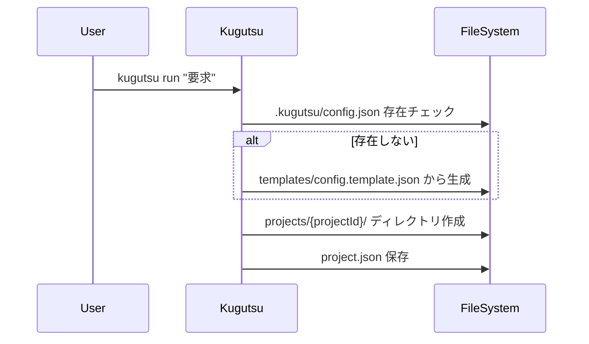
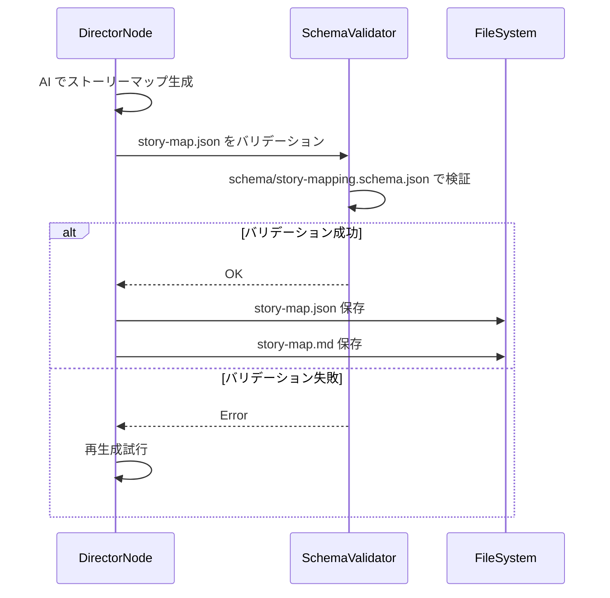
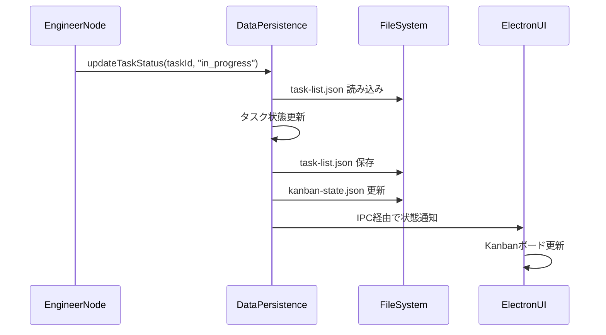
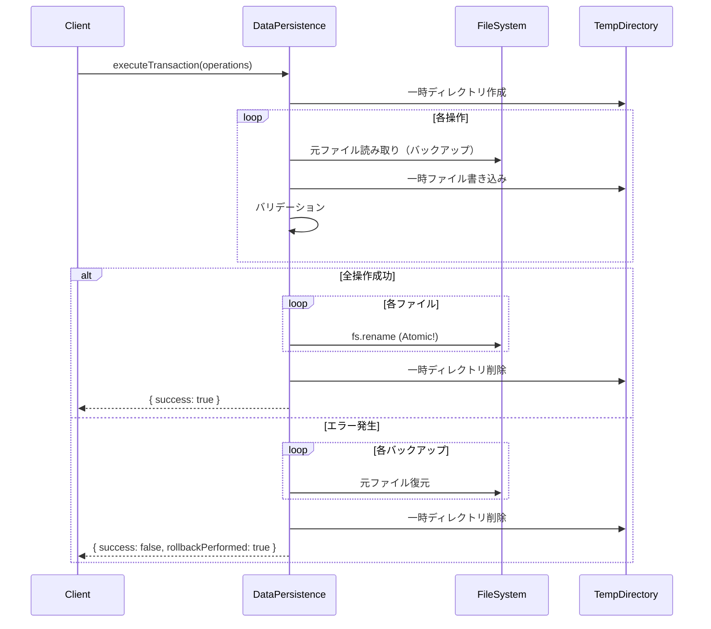
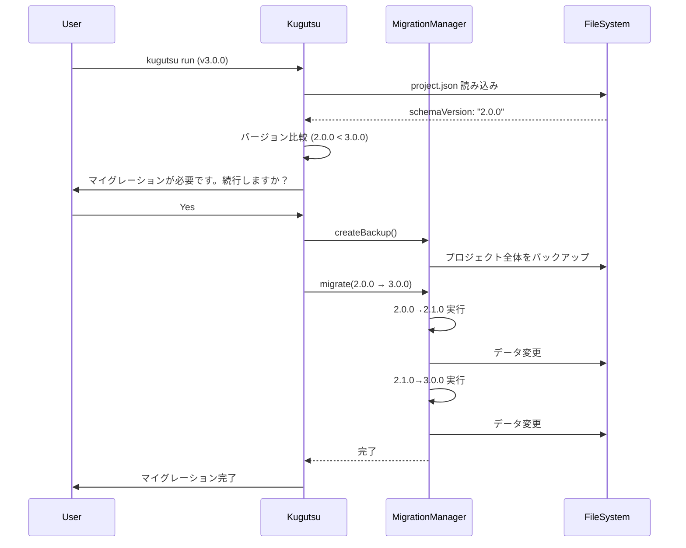

# Data Persistence Specification

**プロジェクト**: Kugutsu 2.0 - AI Parallel Development System
**バージョン**: 1.0.0
**最終更新**: 2025-11-06
**対象**: データ永続化とファイルシステム設計
**ステータス**: Draft

---

## 1. 概要

本仕様書は、Kugutsu 2.0のデータ永続化戦略、ファイルシステム構造、JSONスキーマ定義、データフローを定義します。

### 1.1 設計原則

1. **テキストベース永続化**: SQLiteではなく、人間が読めるテキストファイル（JSON, Markdown）で保存
2. **スキーマ駆動**: JSONスキーマによるデータバリデーション
3. **プロジェクト分離**: 各プロジェクトのデータは独立して管理
4. **バージョン管理フレンドリー**: Gitで追跡しやすい構造
5. **段階的な保存**: 各工程の成果物を段階的に保存

---

## 2. ディレクトリ構造

### 2.1 Kugutsuシステム側（このリポジトリ）

```
/Users/tknr/Development/kugutsu/
├── src/
│   ├── graph/
│   ├── providers/
│   ├── utils/
│   │   ├── FileSystemManager.ts      # ファイル操作ユーティリティ
│   │   ├── SchemaValidator.ts        # JSONスキーマバリデーター
│   │   └── DataPersistence.ts        # データ永続化マネージャー
│   └── ...
├── schema/                            # JSONスキーマ定義（パッケージに含まれる）
│   ├── story-mapping.schema.json
│   ├── design-docs.schema.json
│   ├── task.schema.json
│   ├── kanban-state.schema.json
│   ├── review.schema.json
│   └── dependency-graph.schema.json
└── templates/
    └── config.template.json           # config.jsonのデフォルト設定
```

### 2.2 ユーザーのプロジェクト側

```
/Users/user/my-project/                # ユーザーのリポジトリ
├── .kugutsu/                          # Kugutsu管理ディレクトリ
│   ├── config.json                    # プロジェクト設定
│   ├── tasks/                         # 🆕 グローバルタスク管理
│   │   └── global-queue.json          # 全プロジェクトのタスクキュー
│   ├── sprints/                       # 🆕 スプリント管理
│   │   ├── active-sprint.json         # アクティブなスプリント
│   │   └── sprint-history.json        # 完了済みスプリント履歴
│   └── projects/                      # プロジェクト実行履歴
│       ├── {projectId-1}/             # プロジェクトID（UUID）
│       │   ├── project.json           # プロジェクトメタ情報
│       │   ├── story-mapping/
│       │   │   ├── story-map.json     # 構造化ストーリーマップ
│       │   │   ├── story-map.md       # Mermaid図含むドキュメント
│       │   │   └── review-history.json # レビュー履歴
│       │   ├── design/
│       │   │   ├── design-docs.md     # 設計ドキュメント全体
│       │   │   ├── uiux/
│       │   │   │   ├── wireframes.md  # Mermaid画面遷移図
│       │   │   │   └── screens.json   # 画面定義JSON
│       │   │   ├── database/
│       │   │   │   ├── er-diagram.md  # MermaidER図
│       │   │   │   └── schema.json    # テーブル定義JSON
│       │   │   ├── interfaces/
│       │   │   │   ├── api-spec.md    # API仕様Markdown
│       │   │   │   └── api-spec.json  # OpenAPI/JSONスキーマ
│       │   │   └── review-history.json # 設計レビュー履歴
│       │   ├── tasks/
│       │   │   ├── task-list.json     # プロジェクト固有のタスク詳細
│       │   │   ├── dependencies.json  # 依存関係グラフ
│       │   │   └── kanban-state.json  # Kanbanボード状態
│       │   ├── reviews/
│       │   │   ├── {taskId-1}.json    # タスクごとのレビュー記録
│       │   │   └── {taskId-2}.json
│       │   └── logs/
│       │       └── execution.log       # 実行ログ
│       └── {projectId-2}/             # 別の実行
│           └── ...
├── .gitignore                         # .kugutsu/ を除外推奨
└── ...
```

**主要な変更点（スプリント駆動開発対応）**:
- **tasks/global-queue.json**: 複数プロジェクトにまたがるグローバルタスクキュー
- **sprints/active-sprint.json**: 現在アクティブなスプリント情報
- **sprints/sprint-history.json**: 完了したスプリントの履歴

**注意**: `.kugutsu/` ディレクトリは `.gitignore` に追加することを推奨（実行時の一時データのため）

---

## 3. ファイル仕様

### 3.1 config.json

**パス**: `.kugutsu/config.json`

**目的**: プロジェクト固有の設定

**スキーマ**: なし（シンプルな設定ファイル）

**内容**:
```json
{
  "version": "2.0.0",
  "aiProvider": "claude",
  "claude": {
    "model": "claude-sonnet-4-5-20250929",
    "apiKey": "${ANTHROPIC_API_KEY}"
  },
  "codex": {
    "model": "gpt-4",
    "apiKey": "${OPENAI_API_KEY}"
  },
  "execution": {
    "maxEngineers": 3,
    "maxTurns": 30,
    "baseBranch": "main",
    "worktreeBasePath": "./worktrees"
  },
  "ui": {
    "electron": true,
    "visualUI": false
  }
}
```

**生成タイミング**: Kugutsu初回実行時

**更新方法**: ユーザーが手動編集、または `kugutsu config set` コマンド

---

### 3.2 project.json

**パス**: `.kugutsu/projects/{projectId}/project.json`

**目的**: プロジェクト実行のメタ情報

**スキーマ**: なし（メタ情報）

**内容**:
```json
{
  "id": "uuid-v4",
  "userRequest": "ユーザーからの元の要求",
  "createdAt": "2025-11-05T10:00:00Z",
  "updatedAt": "2025-11-05T12:30:00Z",
  "status": "in_progress" | "completed" | "failed",
  "phase": "story_mapping" | "design" | "implementation" | "completed",
  "metadata": {
    "totalTasks": 10,
    "completedTasks": 5,
    "failedTasks": 0
  }
}
```

**生成タイミング**: プロジェクト開始時

**更新タイミング**: 各フェーズ完了時、タスク完了時

---

### 3.3 global-queue.json（🆕 スプリント駆動開発）

**パス**: `.kugutsu/tasks/global-queue.json`

**目的**: 複数プロジェクトにまたがるグローバルタスクキュー

**スキーマ**: なし（グローバル管理）

**内容**:
```json
{
  "tasks": [
    {
      "id": "task-uuid-1",
      "projectId": "project-uuid-1",
      "title": "認証機能実装",
      "description": "JWT認証の実装",
      "priority": 80,
      "dynamicPriority": 850,
      "requestTimestamp": "2025-11-05T10:00:00Z",
      "sprint": "sprint-uuid-1",
      "storyId": "story-1-1",
      "status": "in_progress",
      "dependencies": [],
      "type": "feature",
      "assignedTo": "engineer-1",
      "branchName": "feature/auth-jwt",
      "worktreePath": "./worktrees/project-uuid-1/task-uuid-1",
      "createdAt": "2025-11-05T10:00:00Z",
      "updatedAt": "2025-11-05T11:30:00Z"
    },
    {
      "id": "task-uuid-2",
      "projectId": "project-uuid-2",
      "title": "ダッシュボードUI作成",
      "description": "React Dashboard Component",
      "priority": 70,
      "dynamicPriority": 920,
      "requestTimestamp": "2025-11-05T14:00:00Z",
      "sprint": null,
      "status": "pending",
      "dependencies": [],
      "type": "feature",
      "createdAt": "2025-11-05T14:00:00Z",
      "updatedAt": "2025-11-05T14:00:00Z"
    }
  ],
  "lastUpdated": "2025-11-05T15:00:00Z"
}
```

**特徴**:
- **複数プロジェクト対応**: `projectId`で各タスクのプロジェクトを識別
- **動的優先度**: `dynamicPriority`で直近リクエストを優先
- **スプリント割り当て**: `sprint`フィールドでスプリント所属を管理
- **リクエストタイムスタンプ**: 優先度計算に使用

**優先度計算式**:
```
dynamicPriority = priority * 0.5 + recencyBonus * 0.3 + dependencyBonus * 0.2

- recencyBonus: 最新リクエストほど高い（0-100）
- dependencyBonus: 依存タスク完了率（0-100）
```

**生成タイミング**: CheckModeNode、ProductOwnerNode実行時

**更新タイミング**: タスク状態変化時、スプリント割り当て時

---

### 3.4 active-sprint.json（🆕 スプリント駆動開発）

**パス**: `.kugutsu/sprints/active-sprint.json`

**目的**: 現在アクティブなスプリント情報

**スキーマ**: なし（スプリント管理）

**内容**:
```json
{
  "id": "sprint-uuid-1",
  "name": "Sprint 1: 認証機能実装",
  "goal": "JWT認証とユーザー登録・ログイン機能を実装し、E2Eテスト可能な状態にする",
  "taskIds": ["task-uuid-1", "task-uuid-3", "task-uuid-5"],
  "status": "active",
  "startedAt": "2025-11-05T10:00:00Z",
  "completedAt": null,
  "deployable": false,
  "metadata": {
    "estimatedHours": 14,
    "actualHours": 8.5,
    "blockers": [],
    "completedTasksCount": 1,
    "failedTasksCount": 0
  }
}
```

**ステータス**:
- `planning`: 計画中
- `active`: 実行中
- `review`: レビュー中
- `completed`: 完了

**制約条件**:
- 同時に1つのみアクティブ
- スプリント完了時に`sprint-history.json`へ移動

**生成タイミング**: SprintPlanningNode実行時

**更新タイミング**: タスク完了時、スプリント完了時

---

### 3.5 sprint-history.json（🆕 スプリント駆動開発）

**パス**: `.kugutsu/sprints/sprint-history.json`

**目的**: 完了したスプリントの履歴

**スキーマ**: なし（履歴管理）

**内容**:
```json
{
  "sprints": [
    {
      "id": "sprint-uuid-0",
      "name": "Sprint 0: プロジェクトセットアップ",
      "goal": "開発環境構築とCI/CD設定",
      "taskIds": ["task-uuid-setup-1", "task-uuid-setup-2"],
      "status": "completed",
      "startedAt": "2025-11-04T10:00:00Z",
      "completedAt": "2025-11-04T18:00:00Z",
      "deployable": true,
      "metadata": {
        "estimatedHours": 8,
        "actualHours": 7.5,
        "blockers": [],
        "completedTasksCount": 2,
        "failedTasksCount": 0
      }
    }
  ],
  "lastUpdated": "2025-11-05T10:00:00Z"
}
```

**生成タイミング**: スプリント完了時

**更新タイミング**: 各スプリント完了時に追記

---

### 3.6 story-map.json

**パス**: `.kugutsu/projects/{projectId}/story-mapping/story-map.json`

**目的**: ユーザーストーリーマッピングの構造化データ

**スキーマ**: `schema/story-mapping.schema.json`

**内容**:
```json
{
  "persona": {
    "name": "田中太郎",
    "role": "プロジェクトマネージャー",
    "goal": "チームの生産性を向上させたい",
    "painPoints": ["手作業が多い", "進捗が見えにくい"]
  },
  "epics": [
    {
      "id": "epic-1",
      "title": "タスク管理機能",
      "description": "タスクのCRUD機能を提供",
      "priority": 90,
      "stories": [
        {
          "id": "story-1-1",
          "title": "タスク一覧表示",
          "asA": "プロジェクトマネージャー",
          "iWantTo": "タスクの一覧を見たい",
          "soThat": "進捗を把握できる",
          "acceptanceCriteria": [
            "タスク一覧が表示される",
            "ステータス別にフィルタできる",
            "優先度順にソートできる"
          ],
          "priority": 90,
          "estimatedPoints": 5
        }
      ]
    }
  ]
}
```

**生成タイミング**: DirectorNode実行時

**バリデーション**: SchemaValidator で検証後に保存

---

### 3.4 story-map.md

**パス**: `.kugutsu/projects/{projectId}/story-mapping/story-map.md`

**目的**: 人間が読みやすいストーリーマッピングドキュメント

**フォーマット**: Markdown + Mermaid

**内容例**:
```markdown
# ユーザーストーリーマッピング

**作成日**: 2025-11-05
**作成者**: DirectorAI

## ペルソナ

- **名前**: 田中太郎
- **役割**: プロジェクトマネージャー
- **ゴール**: チームの生産性を向上させたい
- **ペインポイント**: 手作業が多い、進捗が見えにくい

## ユーザージャーニーマップ

\```mermaid
journey
    title ユーザーの開発フロー
    section 要求定義
      要求を入力: 5: 田中
      要求が整理される: 4: ProductOwner
    section 設計
      ストーリーマップ確認: 5: 田中
      設計書確認: 4: 田中
    section 開発
      進捗を確認: 5: 田中
      レビュー結果確認: 4: 田中
\```

## エピック1: タスク管理機能

### ストーリー1.1: タスク一覧表示

- **As a**: プロジェクトマネージャー
- **I want to**: タスクの一覧を見たい
- **So that**: 進捗を把握できる

**受入基準**:
- [ ] タスク一覧が表示される
- [ ] ステータス別にフィルタできる
- [ ] 優先度順にソートできる

**優先度**: 90
**見積**: 5ポイント
```

**生成タイミング**: DirectorNode実行時（story-map.jsonと同時）

---

### 3.5 review-history.json

**パス**: `.kugutsu/projects/{projectId}/story-mapping/review-history.json`

**目的**: ストーリーマッピングのレビュー履歴

**スキーマ**: `schema/review.schema.json`

**内容**:
```json
{
  "reviews": [
    {
      "iteration": 1,
      "timestamp": "2025-11-05T10:30:00Z",
      "reviewer": "ProductOwnerAI",
      "approved": false,
      "comments": [
        {
          "storyId": "story-1-1",
          "severity": "major",
          "message": "受入基準が曖昧です。具体的な数値を含めてください。"
        }
      ],
      "suggestions": [
        "「進捗を把握できる」を「5秒以内にタスク状態を確認できる」に変更"
      ]
    },
    {
      "iteration": 2,
      "timestamp": "2025-11-05T11:00:00Z",
      "reviewer": "ProductOwnerAI",
      "approved": true,
      "comments": [],
      "suggestions": []
    }
  ]
}
```

**生成タイミング**: ReviewStoryMappingNode実行時

**更新タイミング**: 各レビューイテレーションごとに追記

---

### 3.6 design-docs.md

**パス**: `.kugutsu/projects/{projectId}/design/design-docs.md`

**目的**: 全体設計書（統合ドキュメント）

**フォーマット**: Markdown

**内容例**:
```markdown
# 設計書

**作成日**: 2025-11-05
**作成者**: TechLeadAI

## 1. 全体設計

### アーキテクチャ

\```mermaid
graph TD
    UI[Frontend] --> API[API Gateway]
    API --> Backend[Backend Service]
    Backend --> DB[(Database)]
\```

### 技術スタック

- Frontend: React 19
- Backend: Node.js + Express
- Database: PostgreSQL 16

## 2. UI/UX設計

詳細は `uiux/wireframes.md` を参照。

## 3. DB設計

詳細は `database/er-diagram.md` を参照。

## 4. I/O設計

詳細は `interfaces/api-spec.md` を参照。
```

**生成タイミング**: TechLeadDesignNode実行時

---

### 3.7 schema.json (DB)

**パス**: `.kugutsu/projects/{projectId}/design/database/schema.json`

**目的**: DB設計の構造化データ

**スキーマ**: `schema/design-docs.schema.json` (db部分)

**内容**:
```json
{
  "tables": [
    {
      "name": "tasks",
      "comment": "タスク管理テーブル",
      "columns": [
        {
          "name": "id",
          "type": "VARCHAR(36)",
          "nullable": false,
          "primaryKey": true,
          "comment": "タスクID（UUID）"
        },
        {
          "name": "title",
          "type": "VARCHAR(255)",
          "nullable": false,
          "comment": "タスクタイトル"
        },
        {
          "name": "status",
          "type": "ENUM('pending', 'in_progress', 'completed', 'failed')",
          "nullable": false,
          "default": "'pending'",
          "comment": "タスクステータス"
        }
      ],
      "indexes": [
        {
          "name": "idx_status",
          "columns": ["status"],
          "unique": false
        }
      ]
    }
  ],
  "relationships": [
    {
      "from": "task_dependencies",
      "to": "tasks",
      "fromColumn": "task_id",
      "toColumn": "id",
      "type": "many-to-one"
    }
  ]
}
```

**生成タイミング**: TechLeadDesignNode実行時

---

### 3.8 api-spec.json

**パス**: `.kugutsu/projects/{projectId}/design/interfaces/api-spec.json`

**目的**: API仕様の構造化データ

**フォーマット**: OpenAPI 3.0準拠

**内容**:
```json
{
  "openapi": "3.0.0",
  "info": {
    "title": "Task Management API",
    "version": "1.0.0"
  },
  "paths": {
    "/tasks": {
      "get": {
        "summary": "タスク一覧取得",
        "parameters": [
          {
            "name": "status",
            "in": "query",
            "schema": { "type": "string" }
          }
        ],
        "responses": {
          "200": {
            "description": "成功",
            "content": {
              "application/json": {
                "schema": {
                  "type": "array",
                  "items": { "$ref": "#/components/schemas/Task" }
                }
              }
            }
          }
        }
      }
    }
  },
  "components": {
    "schemas": {
      "Task": {
        "type": "object",
        "properties": {
          "id": { "type": "string" },
          "title": { "type": "string" },
          "status": { "type": "string" }
        }
      }
    }
  }
}
```

**生成タイミング**: TechLeadDesignNode実行時

---

### 3.9 task-list.json

**パス**: `.kugutsu/projects/{projectId}/tasks/task-list.json`

**目的**: タスク一覧の構造化データ

**スキーマ**: `schema/task.schema.json`

**内容**:
```json
{
  "tasks": [
    {
      "id": "task-1",
      "title": "DB migration スクリプト作成",
      "description": "tasks テーブルの migration を作成",
      "storyId": "story-1-1",
      "priority": 90,
      "estimatedHours": 4,
      "status": "pending",
      "dependencies": [],
      "tags": ["db", "migration"],
      "assignedEngineer": null,
      "worktreePath": null,
      "branchName": null,
      "sessionId": null,
      "createdAt": "2025-11-05T12:00:00Z",
      "updatedAt": "2025-11-05T12:00:00Z"
    },
    {
      "id": "task-2",
      "title": "Task モデルの実装",
      "description": "Task エンティティと Repository を実装",
      "storyId": "story-1-1",
      "priority": 80,
      "estimatedHours": 8,
      "status": "pending",
      "dependencies": ["task-1"],
      "tags": ["backend", "model"],
      "assignedEngineer": null,
      "worktreePath": null,
      "branchName": null,
      "sessionId": null,
      "createdAt": "2025-11-05T12:00:00Z",
      "updatedAt": "2025-11-05T12:00:00Z"
    }
  ]
}
```

**生成タイミング**: TaskBreakdownNode実行時

**更新タイミング**: タスクステータス変更時

---

### 3.10 dependencies.json

**パス**: `.kugutsu/projects/{projectId}/tasks/dependencies.json`

**目的**: タスク依存関係グラフ

**スキーマ**: `schema/dependency-graph.schema.json`

**内容**:
```json
{
  "graph": {
    "nodes": [
      { "id": "task-1", "layer": 0 },
      { "id": "task-2", "layer": 1 },
      { "id": "task-3", "layer": 1 },
      { "id": "task-4", "layer": 2 }
    ],
    "edges": [
      { "from": "task-1", "to": "task-2" },
      { "from": "task-1", "to": "task-3" },
      { "from": "task-2", "to": "task-4" },
      { "from": "task-3", "to": "task-4" }
    ]
  },
  "executionPlan": [
    {
      "layer": 0,
      "parallelTasks": ["task-1"],
      "description": "DB migration"
    },
    {
      "layer": 1,
      "parallelTasks": ["task-2", "task-3"],
      "description": "Backend model + Frontend component (並列実行可能)"
    },
    {
      "layer": 2,
      "parallelTasks": ["task-4"],
      "description": "Integration"
    }
  ]
}
```

**生成タイミング**: TaskBreakdownNode実行時

---

### 3.11 kanban-state.json

**パス**: `.kugutsu/projects/{projectId}/tasks/kanban-state.json`

**目的**: Kanbanボードの現在状態

**スキーマ**: `schema/kanban-state.schema.json`

**内容**:
```json
{
  "columns": {
    "pending": {
      "label": "Pending",
      "taskIds": ["task-1"],
      "color": "amber"
    },
    "ready": {
      "label": "Ready",
      "taskIds": [],
      "color": "blue"
    },
    "in_progress": {
      "label": "In Progress",
      "taskIds": ["task-2"],
      "color": "indigo"
    },
    "in_review": {
      "label": "In Review",
      "taskIds": ["task-3"],
      "color": "purple"
    },
    "completed": {
      "label": "Completed",
      "taskIds": ["task-4"],
      "color": "green"
    },
    "failed": {
      "label": "Failed",
      "taskIds": [],
      "color": "red"
    }
  },
  "updatedAt": "2025-11-05T13:00:00Z"
}
```

**生成タイミング**: TaskBreakdownNode実行後

**更新タイミング**: タスクステータス変更時（リアルタイム）

---

## 4. JSONスキーマ定義

### 4.1 story-mapping.schema.json

**パス**: `schema/story-mapping.schema.json`

```json
{
  "$schema": "http://json-schema.org/draft-07/schema#",
  "$id": "https://kugutsu.dev/schema/story-mapping.schema.json",
  "title": "User Story Mapping",
  "description": "ユーザーストーリーマッピングのスキーマ定義",
  "type": "object",
  "required": ["persona", "epics"],
  "properties": {
    "persona": {
      "type": "object",
      "required": ["name", "role", "goal"],
      "properties": {
        "name": {
          "type": "string",
          "description": "ペルソナ名"
        },
        "role": {
          "type": "string",
          "description": "役割"
        },
        "goal": {
          "type": "string",
          "description": "ゴール"
        },
        "painPoints": {
          "type": "array",
          "items": { "type": "string" },
          "description": "ペインポイント"
        }
      }
    },
    "epics": {
      "type": "array",
      "items": {
        "type": "object",
        "required": ["id", "title", "stories"],
        "properties": {
          "id": {
            "type": "string",
            "pattern": "^epic-[0-9]+$"
          },
          "title": {
            "type": "string"
          },
          "description": {
            "type": "string"
          },
          "priority": {
            "type": "integer",
            "minimum": 0,
            "maximum": 100
          },
          "stories": {
            "type": "array",
            "items": {
              "type": "object",
              "required": ["id", "title", "asA", "iWantTo", "soThat", "acceptanceCriteria"],
              "properties": {
                "id": {
                  "type": "string",
                  "pattern": "^story-[0-9]+-[0-9]+$"
                },
                "title": {
                  "type": "string"
                },
                "asA": {
                  "type": "string",
                  "description": "As a ..."
                },
                "iWantTo": {
                  "type": "string",
                  "description": "I want to ..."
                },
                "soThat": {
                  "type": "string",
                  "description": "So that ..."
                },
                "acceptanceCriteria": {
                  "type": "array",
                  "items": { "type": "string" },
                  "minItems": 1
                },
                "priority": {
                  "type": "integer",
                  "minimum": 0,
                  "maximum": 100
                },
                "estimatedPoints": {
                  "type": "integer",
                  "minimum": 1,
                  "maximum": 21
                }
              }
            }
          }
        }
      }
    }
  }
}
```

### 4.2 task.schema.json

**パス**: `schema/task.schema.json`

```json
{
  "$schema": "http://json-schema.org/draft-07/schema#",
  "$id": "https://kugutsu.dev/schema/task.schema.json",
  "title": "Task",
  "description": "タスク定義のスキーマ",
  "type": "object",
  "required": ["tasks"],
  "properties": {
    "tasks": {
      "type": "array",
      "items": {
        "type": "object",
        "required": ["id", "title", "description", "priority", "status", "dependencies"],
        "properties": {
          "id": {
            "type": "string",
            "pattern": "^task-[0-9]+$"
          },
          "title": {
            "type": "string",
            "minLength": 1,
            "maxLength": 255
          },
          "description": {
            "type": "string"
          },
          "storyId": {
            "type": "string",
            "pattern": "^story-[0-9]+-[0-9]+$"
          },
          "priority": {
            "type": "integer",
            "minimum": 0,
            "maximum": 100
          },
          "estimatedHours": {
            "type": "number",
            "minimum": 0
          },
          "status": {
            "type": "string",
            "enum": ["pending", "ready", "in_progress", "in_review", "completed", "failed"]
          },
          "dependencies": {
            "type": "array",
            "items": {
              "type": "string",
              "pattern": "^task-[0-9]+$"
            }
          },
          "tags": {
            "type": "array",
            "items": { "type": "string" }
          },
          "assignedEngineer": {
            "type": ["string", "null"]
          },
          "worktreePath": {
            "type": ["string", "null"]
          },
          "branchName": {
            "type": ["string", "null"]
          },
          "sessionId": {
            "type": ["string", "null"]
          },
          "createdAt": {
            "type": "string",
            "format": "date-time"
          },
          "updatedAt": {
            "type": "string",
            "format": "date-time"
          }
        }
      }
    }
  }
}
```

### 4.3 dependency-graph.schema.json

**パス**: `schema/dependency-graph.schema.json`

```json
{
  "$schema": "http://json-schema.org/draft-07/schema#",
  "$id": "https://kugutsu.dev/schema/dependency-graph.schema.json",
  "title": "Dependency Graph",
  "description": "タスク依存関係グラフのスキーマ",
  "type": "object",
  "required": ["graph", "executionPlan"],
  "properties": {
    "graph": {
      "type": "object",
      "required": ["nodes", "edges"],
      "properties": {
        "nodes": {
          "type": "array",
          "items": {
            "type": "object",
            "required": ["id", "layer"],
            "properties": {
              "id": {
                "type": "string",
                "pattern": "^task-[0-9]+$"
              },
              "layer": {
                "type": "integer",
                "minimum": 0
              }
            }
          }
        },
        "edges": {
          "type": "array",
          "items": {
            "type": "object",
            "required": ["from", "to"],
            "properties": {
              "from": {
                "type": "string",
                "pattern": "^task-[0-9]+$"
              },
              "to": {
                "type": "string",
                "pattern": "^task-[0-9]+$"
              }
            }
          }
        }
      }
    },
    "executionPlan": {
      "type": "array",
      "items": {
        "type": "object",
        "required": ["layer", "parallelTasks"],
        "properties": {
          "layer": {
            "type": "integer",
            "minimum": 0
          },
          "parallelTasks": {
            "type": "array",
            "items": {
              "type": "string",
              "pattern": "^task-[0-9]+$"
            }
          },
          "description": {
            "type": "string"
          }
        }
      }
    }
  }
}
```

### 4.4 その他スキーマ

- `kanban-state.schema.json`: Kanbanボード状態
- `review.schema.json`: レビュー履歴
- `design-docs.schema.json`: 設計書（部分的に構造化）

---

## 5. データフロー

### 5.1 初回実行時



### 5.2 ストーリーマッピング作成時



### 5.3 タスク状態更新時



---

## 6. 実装クラス

### 6.1 SchemaValidator

**ファイル**: `src/utils/SchemaValidator.ts`

**責務**: JSONスキーマによるバリデーション

```typescript
import Ajv from 'ajv';
import addFormats from 'ajv-formats';
import storyMappingSchema from '../../schema/story-mapping.schema.json';
import taskSchema from '../../schema/task.schema.json';
import dependencyGraphSchema from '../../schema/dependency-graph.schema.json';
import kanbanStateSchema from '../../schema/kanban-state.schema.json';
import reviewSchema from '../../schema/review.schema.json';

export class SchemaValidator {
  private ajv: Ajv;

  constructor() {
    this.ajv = new Ajv({ allErrors: true });
    addFormats(this.ajv);

    // スキーマ登録
    this.ajv.addSchema(storyMappingSchema, 'story-mapping');
    this.ajv.addSchema(taskSchema, 'task');
    this.ajv.addSchema(dependencyGraphSchema, 'dependency-graph');
    this.ajv.addSchema(kanbanStateSchema, 'kanban-state');
    this.ajv.addSchema(reviewSchema, 'review');
  }

  validate(schemaName: string, data: any): { valid: boolean; errors?: any[] } {
    const validate = this.ajv.getSchema(schemaName);
    if (!validate) {
      throw new Error(`Schema not found: ${schemaName}`);
    }

    const valid = validate(data);
    return {
      valid: !!valid,
      errors: validate.errors || undefined
    };
  }

  validateStoryMapping(data: any): { valid: boolean; errors?: any[] } {
    return this.validate('story-mapping', data);
  }

  validateTaskList(data: any): { valid: boolean; errors?: any[] } {
    return this.validate('task', data);
  }

  validateDependencyGraph(data: any): { valid: boolean; errors?: any[] } {
    return this.validate('dependency-graph', data);
  }

  validateKanbanState(data: any): { valid: boolean; errors?: any[] } {
    return this.validate('kanban-state', data);
  }
}
```

### 6.2 DataPersistence

**ファイル**: `src/utils/DataPersistence.ts`

**責務**: データの読み書き、バリデーション統合、トランザクション制御

```typescript
import * as fs from 'fs/promises';
import * as path from 'path';
import { v4 as uuidv4 } from 'uuid';
import { SchemaValidator } from './SchemaValidator';
import { TaskStateMachine } from './TaskStateMachine';

/**
 * トランザクション操作の定義
 */
interface TransactionOperation {
  type: 'write' | 'delete';
  filePath: string;
  content?: string;
}

/**
 * トランザクション結果
 */
interface TransactionResult {
  success: boolean;
  error?: Error;
  rollbackPerformed?: boolean;
}

export class DataPersistence {
  private validator: SchemaValidator;
  private projectPath: string;
  private lockMap: Map<string, Promise<void>>; // ファイルロック管理

  constructor(projectId: string, baseRepoPath: string) {
    this.validator = new SchemaValidator();
    this.projectPath = path.join(baseRepoPath, '.kugutsu', 'projects', projectId);
    this.lockMap = new Map();
  }

  /**
   * トランザクション実行（複数ファイル操作のアトミック性保証）
   */
  async executeTransaction(operations: TransactionOperation[]): Promise<TransactionResult> {
    const transactionId = uuidv4();
    const tempDir = path.join(this.projectPath, `.tmp-${transactionId}`);
    const backupMap = new Map<string, string>(); // 元のファイル内容のバックアップ

    try {
      // 1. 一時ディレクトリ作成
      await fs.mkdir(tempDir, { recursive: true });

      // 2. 各操作を一時ディレクトリで実行（バリデーション含む）
      for (const op of operations) {
        if (op.type === 'write') {
          // ファイルが存在する場合はバックアップ
          try {
            const originalContent = await fs.readFile(op.filePath, 'utf-8');
            backupMap.set(op.filePath, originalContent);
          } catch (error) {
            // ファイルが存在しない場合は無視
          }

          // 一時ファイルに書き込み
          const tempFilePath = path.join(tempDir, path.basename(op.filePath));
          await fs.writeFile(tempFilePath, op.content!, 'utf-8');

          // バリデーション（JSONファイルの場合）
          if (op.filePath.endsWith('.json')) {
            try {
              JSON.parse(op.content!);
            } catch (error) {
              throw new Error(`Invalid JSON in ${op.filePath}: ${error.message}`);
            }
          }
        }
      }

      // 3. 全操作成功 → 本番環境に反映（アトミックに移動）
      for (const op of operations) {
        if (op.type === 'write') {
          const tempFilePath = path.join(tempDir, path.basename(op.filePath));

          // 親ディレクトリが存在することを確認
          const parentDir = path.dirname(op.filePath);
          await fs.mkdir(parentDir, { recursive: true });

          // アトミックに移動（rename は原子的操作）
          await fs.rename(tempFilePath, op.filePath);
        } else if (op.type === 'delete') {
          await fs.unlink(op.filePath);
        }
      }

      // 4. 一時ディレクトリ削除
      await fs.rm(tempDir, { recursive: true, force: true });

      return { success: true };

    } catch (error) {
      // 5. エラー発生 → ロールバック
      console.error(`Transaction ${transactionId} failed, rolling back...`, error);

      try {
        // バックアップから復元
        for (const [filePath, originalContent] of backupMap.entries()) {
          await fs.writeFile(filePath, originalContent, 'utf-8');
        }

        // 一時ディレクトリ削除
        await fs.rm(tempDir, { recursive: true, force: true });

        return {
          success: false,
          error: error as Error,
          rollbackPerformed: true
        };
      } catch (rollbackError) {
        console.error(`Rollback failed for transaction ${transactionId}:`, rollbackError);

        // データ破損レポート生成
        const corruptionReport = {
          transactionId,
          failedAt: new Date().toISOString(),
          originalError: (error as Error).message,
          rollbackError: (rollbackError as Error).message,
          affectedFiles: Array.from(backupMap.keys()),
          backupLocation: tempDir
        };

        try {
          // 破損レポートを保存（最後の試み）
          await fs.writeFile(
            path.join(this.projectPath, '.corruption-report.json'),
            JSON.stringify(corruptionReport, null, 2),
            'utf-8'
          );
        } catch (reportError) {
          console.error('Failed to write corruption report:', reportError);
        }

        // クリティカルエラーを投げる
        throw new Error(
          `CRITICAL: Transaction rollback failed for ${transactionId}. ` +
          `System may be in inconsistent state. ` +
          `Affected files: ${Array.from(backupMap.keys()).join(', ')}. ` +
          `See .corruption-report.json for recovery details.`
        );
      }
    }
  }

  /**
   * ファイルロック付き操作（競合防止）
   */
  private async withLock<T>(filePath: string, operation: () => Promise<T>): Promise<T> {
    // 既存のロックがあれば待機
    const existingLock = this.lockMap.get(filePath);
    if (existingLock) {
      await existingLock;
    }

    // 新しいロックを作成
    let releaseLock: () => void;
    const lockPromise = new Promise<void>(resolve => {
      releaseLock = resolve;
    });
    this.lockMap.set(filePath, lockPromise);

    try {
      const result = await operation();
      return result;
    } finally {
      // ロック解放
      releaseLock!();
      this.lockMap.delete(filePath);
    }
  }

  /**
   * ストーリーマッピングを保存（トランザクション使用例）
   * @returns 保存先のディレクトリパス
   */
  async saveStoryMapping(storyMap: any, markdown: string): Promise<string> {
    // バリデーション
    const result = this.validator.validateStoryMapping(storyMap);
    if (!result.valid) {
      throw new Error(`Story mapping validation failed: ${JSON.stringify(result.errors)}`);
    }

    // トランザクションで保存（2ファイルのアトミック書き込み）
    const storyMappingDir = path.join(this.projectPath, 'story-mapping');
    await fs.mkdir(storyMappingDir, { recursive: true });

    const transactionResult = await this.executeTransaction([
      {
        type: 'write',
        filePath: path.join(storyMappingDir, 'story-map.json'),
        content: JSON.stringify(storyMap, null, 2)
      },
      {
        type: 'write',
        filePath: path.join(storyMappingDir, 'story-map.md'),
        content: markdown
      }
    ]);

    if (!transactionResult.success) {
      throw new Error(
        `Failed to save story mapping: ${transactionResult.error?.message}. ` +
        `Rollback performed: ${transactionResult.rollbackPerformed}`
      );
    }

    // 保存先のディレクトリパスを返す
    return storyMappingDir;
  }

  /**
   * ストーリーマッピングをファイルから読み込み
   * @param storyMappingPath - ストーリーマッピングのディレクトリパス
   * @throws Error ファイルが見つからない場合、JSON解析エラー、バリデーションエラー
   */
  async loadStoryMapping(storyMappingPath: string): Promise<any> {
    const storyMapPath = path.join(storyMappingPath, 'story-map.json');

    try {
      const content = await fs.readFile(storyMapPath, 'utf-8');
      const data = JSON.parse(content);

      // スキーマバリデーション
      const result = this.validator.validateStoryMapping(data);
      if (!result.valid) {
        throw new Error(`Invalid story mapping data: ${JSON.stringify(result.errors)}`);
      }

      return data;
    } catch (error: any) {
      if (error.code === 'ENOENT') {
        throw new Error(
          `Story mapping file not found: ${storyMapPath}. ` +
          `Has DirectorNode completed successfully?`
        );
      }
      if (error instanceof SyntaxError) {
        throw new Error(`Failed to parse story mapping JSON: ${error.message}`);
      }
      throw error; // Re-throw validation errors and other errors
    }
  }

  async saveTaskList(tasks: any): Promise<void> {
    const result = this.validator.validateTaskList({ tasks });
    if (!result.valid) {
      throw new Error(`Task list validation failed: ${JSON.stringify(result.errors)}`);
    }

    const tasksDir = path.join(this.projectPath, 'tasks');
    await fs.mkdir(tasksDir, { recursive: true });

    await fs.writeFile(
      path.join(tasksDir, 'task-list.json'),
      JSON.stringify({ tasks }, null, 2),
      'utf-8'
    );
  }

  async updateTaskStatus(taskId: string, status: string): Promise<void> {
    return this.withLock(path.join(this.projectPath, 'tasks', 'task-list.json'), async () => {
      const taskListPath = path.join(this.projectPath, 'tasks', 'task-list.json');
      const content = await fs.readFile(taskListPath, 'utf-8');
      const data = JSON.parse(content);

      const task = data.tasks.find((t: any) => t.id === taskId);
      if (task) {
        // TaskStateMachineで状態遷移を検証
        TaskStateMachine.validateTransition(task, status);

        task.status = status;
        task.updatedAt = new Date().toISOString();
      }

      // タスクリストとKanbanステートをトランザクションで同時更新
      const kanbanState = this.buildKanbanState(data.tasks);

      const transactionResult = await this.executeTransaction([
        {
          type: 'write',
          filePath: taskListPath,
          content: JSON.stringify({ tasks: data.tasks }, null, 2)
        },
        {
          type: 'write',
          filePath: path.join(this.projectPath, 'tasks', 'kanban-state.json'),
          content: JSON.stringify(kanbanState, null, 2)
        }
      ]);

      if (!transactionResult.success) {
        throw new Error(
          `Failed to update task status: ${transactionResult.error?.message}. ` +
          `Rollback performed: ${transactionResult.rollbackPerformed}`
        );
      }
    });
  }

  /**
   * タスクリストからKanbanステートを構築
   */
  private buildKanbanState(tasks: any[]): any {
    const columns = {
      pending: { label: 'Pending', taskIds: [], color: 'amber' },
      ready: { label: 'Ready', taskIds: [], color: 'blue' },
      in_progress: { label: 'In Progress', taskIds: [], color: 'indigo' },
      in_review: { label: 'In Review', taskIds: [], color: 'purple' },
      completed: { label: 'Completed', taskIds: [], color: 'green' },
      failed: { label: 'Failed', taskIds: [], color: 'red' }
    };

    tasks.forEach(task => {
      if (columns[task.status]) {
        columns[task.status].taskIds.push(task.id);
      }
    });

    return {
      columns,
      updatedAt: new Date().toISOString()
    };
  }

  /**
   * 設計ドキュメント全体を保存（トランザクション使用例）
   * @returns 保存先のディレクトリパス
   */
  async saveDesignDocs(designDocs: any): Promise<string> {
    const designDir = path.join(this.projectPath, 'design');
    await fs.mkdir(designDir, { recursive: true });
    await fs.mkdir(path.join(designDir, 'uiux'), { recursive: true });
    await fs.mkdir(path.join(designDir, 'database'), { recursive: true });
    await fs.mkdir(path.join(designDir, 'interfaces'), { recursive: true });

    // 複数ファイルをトランザクションで一括保存
    const operations: TransactionOperation[] = [
      {
        type: 'write',
        filePath: path.join(designDir, 'design-docs.md'),
        content: designDocs.overall
      },
      {
        type: 'write',
        filePath: path.join(designDir, 'uiux', 'wireframes.md'),
        content: designDocs.uiux.wireframes
      },
      {
        type: 'write',
        filePath: path.join(designDir, 'uiux', 'screens.json'),
        content: JSON.stringify(designDocs.uiux.screens, null, 2)
      },
      {
        type: 'write',
        filePath: path.join(designDir, 'database', 'er-diagram.md'),
        content: designDocs.database.erDiagram
      },
      {
        type: 'write',
        filePath: path.join(designDir, 'database', 'schema.json'),
        content: JSON.stringify(designDocs.database.schema, null, 2)
      },
      {
        type: 'write',
        filePath: path.join(designDir, 'interfaces', 'api-spec.md'),
        content: designDocs.interfaces.apiSpec
      },
      {
        type: 'write',
        filePath: path.join(designDir, 'interfaces', 'api-spec.json'),
        content: JSON.stringify(designDocs.interfaces.openapi, null, 2)
      }
    ];

    const transactionResult = await this.executeTransaction(operations);

    if (!transactionResult.success) {
      throw new Error(
        `Failed to save design docs: ${transactionResult.error?.message}. ` +
        `Rollback performed: ${transactionResult.rollbackPerformed}`
      );
    }

    // 保存先のディレクトリパスを返す
    return designDir;
  }

  /**
   * 設計ドキュメントをファイルから読み込み
   * @param designDocsPath - 設計ドキュメントのディレクトリパス
   * @throws Error ファイルが見つからない場合、JSON解析エラー
   */
  async loadDesignDocs(designDocsPath: string): Promise<any> {
    try {
      const designDocs = {
        overall: await this.readFileWithErrorContext(path.join(designDocsPath, 'design-docs.md')),
        uiux: {
          wireframes: await this.readFileWithErrorContext(path.join(designDocsPath, 'uiux', 'wireframes.md')),
          screens: await this.readJsonWithErrorContext(path.join(designDocsPath, 'uiux', 'screens.json'))
        },
        database: {
          erDiagram: await this.readFileWithErrorContext(path.join(designDocsPath, 'database', 'er-diagram.md')),
          schema: await this.readJsonWithErrorContext(path.join(designDocsPath, 'database', 'schema.json'))
        },
        interfaces: {
          apiSpec: await this.readFileWithErrorContext(path.join(designDocsPath, 'interfaces', 'api-spec.md')),
          openapi: await this.readJsonWithErrorContext(path.join(designDocsPath, 'interfaces', 'api-spec.json'))
        }
      };

      return designDocs;
    } catch (error: any) {
      throw new Error(
        `Failed to load design docs from ${designDocsPath}: ${error.message}. ` +
        `Has TechLeadDesignNode completed successfully?`
      );
    }
  }

  /**
   * ファイル読み込みヘルパー（エラーコンテキスト付き）
   */
  private async readFileWithErrorContext(filePath: string): Promise<string> {
    try {
      return await fs.readFile(filePath, 'utf-8');
    } catch (error: any) {
      if (error.code === 'ENOENT') {
        throw new Error(`File not found: ${filePath}`);
      }
      throw new Error(`Failed to read ${filePath}: ${error.message}`);
    }
  }

  /**
   * JSON読み込みヘルパー（エラーコンテキスト付き）
   */
  private async readJsonWithErrorContext(filePath: string): Promise<any> {
    try {
      const content = await fs.readFile(filePath, 'utf-8');
      return JSON.parse(content);
    } catch (error: any) {
      if (error.code === 'ENOENT') {
        throw new Error(`File not found: ${filePath}`);
      }
      if (error instanceof SyntaxError) {
        throw new Error(`Invalid JSON in ${filePath}: ${error.message}`);
      }
      throw new Error(`Failed to read ${filePath}: ${error.message}`);
    }
  }
}
```

---

### 6.3 トランザクション使用例

#### 例1: 複数ファイルのアトミック保存

```typescript
// 設計書全体をトランザクションで保存
// 7ファイル全てが成功するか、全て失敗（ロールバック）する
await dataPersistence.saveDesignDocs({
  overall: "# Design Docs...",
  uiux: {
    wireframes: "# Wireframes...",
    screens: { ... }
  },
  database: {
    erDiagram: "# ER Diagram...",
    schema: { ... }
  },
  interfaces: {
    apiSpec: "# API Spec...",
    openapi: { ... }
  }
});
```

#### 例2: タスク状態更新とKanbanボード更新の同期

```typescript
// タスク状態とKanbanボードをトランザクションで同時更新
// どちらかが失敗したら両方ロールバック
await dataPersistence.updateTaskStatus('task-1', 'in_progress');
```

#### 例3: カスタムトランザクション

```typescript
// 複数のレビューコメントを一括保存
const reviewOperations: TransactionOperation[] = comments.map(comment => ({
  type: 'write',
  filePath: path.join(projectPath, 'reviews', `${comment.taskId}.json`),
  content: JSON.stringify(comment, null, 2)
}));

const result = await dataPersistence.executeTransaction(reviewOperations);

if (!result.success) {
  console.error(`Transaction failed: ${result.error?.message}`);
  console.error(`Rollback performed: ${result.rollbackPerformed}`);
}
```

---

### 6.4 トランザクション制御の利点

1. **アトミック性**: 複数ファイル操作が全成功または全失敗
2. **整合性**: 中途半端な状態を防ぐ
3. **ロールバック**: エラー時に自動的に元の状態に戻る
4. **競合防止**: ファイルロック機能で並行アクセスを制御
5. **信頼性**: 一時ディレクトリを使った安全な書き込み

### 6.5 Atomic操作の実装詳細

#### 6.5.1 ファイルロック機構

**現在の実装**: プロセス内メモリベースロック

```typescript
private lockMap: Map<string, Promise<void>>; // ファイルロック管理

private async withLock<T>(filePath: string, operation: () => Promise<T>): Promise<T> {
  // 既存のロックがあれば待機
  const existingLock = this.lockMap.get(filePath);
  if (existingLock) {
    await existingLock;
  }

  // 新しいロックを作成
  let releaseLock: () => void;
  const lockPromise = new Promise<void>(resolve => {
    releaseLock = resolve;
  });
  this.lockMap.set(filePath, lockPromise);

  try {
    const result = await operation();
    return result;
  } finally {
    // ロック解放
    releaseLock!();
    this.lockMap.delete(filePath);
  }
}
```

**特徴**:
- **スコープ**: 単一プロセス内の並行アクセス制御
- **実装方法**: Promise ベースのキュー
- **用途**: 同一DataPersistenceインスタンス内での競合防止
- **メリット**: 実装がシンプル、オーバーヘッドが小さい
- **制約**: 複数プロセス間のロックは不可

#### 6.5.2 クロスプロセスロック（将来的な拡張）

複数のKugutsuインスタンスが同時に実行される場合、`proper-lockfile`ライブラリの使用を推奨：

```typescript
import lockfile from 'proper-lockfile';

async withCrossProcessLock<T>(filePath: string, operation: () => Promise<T>): Promise<T> {
  const lockFilePath = `${filePath}.lock`;

  // ロックファイルを作成
  const release = await lockfile.lock(filePath, {
    stale: 10000, // 10秒後にstale扱い
    retries: {
      retries: 5,
      factor: 2,
      minTimeout: 100,
      maxTimeout: 2000
    }
  });

  try {
    return await operation();
  } finally {
    await release();
  }
}
```

**ロックファイル配置**:
```
.kugutsu/
├── projects/
│   └── <project-id>/
│       ├── global-queue.json
│       ├── global-queue.json.lock       ← ロックファイル
│       ├── sprints.json
│       └── sprints.json.lock            ← ロックファイル
```

#### 6.5.3 Atomic書き込みの保証

**fs.rename()によるアトミック性**

Node.jsの`fs.rename()`はOSレベルのアトミック操作として実装されています：

```typescript
// 1. 一時ファイルに書き込み
const tempFilePath = path.join(tempDir, 'temp-file.json');
await fs.writeFile(tempFilePath, jsonContent, 'utf-8');

// 2. アトミックに本番ファイルへ移動（置き換え）
// このrenameは単一のシステムコールで実行され、途中状態が発生しない
await fs.rename(tempFilePath, targetFilePath);
```

**保証される特性**:
- ✅ **不可分性**: rename操作は完全に成功するか完全に失敗する（途中状態なし）
- ✅ **即座性**: 他プロセスから見ても、古いファイルか新しいファイルのどちらかしか見えない
- ✅ **耐障害性**: 停電時でも、どちらかのファイルは必ず存在する（データロスなし）

**制約**:
- ⚠️ 異なるファイルシステム間のrenameは非アトミックの可能性あり
- ⚠️ 同一ファイルシステム内での使用を推奨

#### 6.5.4 トランザクション実行フロー



#### 6.5.5 ロック戦略の選択ガイド

| シナリオ | 推奨ロック方式 | 理由 |
|---------|--------------|------|
| 単一Electronプロセス | メモリベースロック | シンプル、高速 |
| 複数Kugutsuインスタンス | proper-lockfile | クロスプロセス対応 |
| 分散システム | Redis/etcdベースロック | 複数マシン対応 |

**現在のKugutsu 2.0**: メモリベースロック（単一Electronプロセス想定）

### 6.3 FileSystemManager

**ファイル**: `src/utils/FileSystemManager.ts`

**責務**: .kugutsu ディレクトリの初期化、設定ファイル生成

```typescript
import * as fs from 'fs/promises';
import * as path from 'path';
import { v4 as uuidv4 } from 'uuid';

export class FileSystemManager {
  static async initializeKugutsu(baseRepoPath: string): Promise<void> {
    const kugutsuDir = path.join(baseRepoPath, '.kugutsu');

    // .kugutsu ディレクトリ作成
    await fs.mkdir(kugutsuDir, { recursive: true });

    // config.json がなければテンプレートから生成
    const configPath = path.join(kugutsuDir, 'config.json');
    try {
      await fs.access(configPath);
    } catch {
      // config.json が存在しない
      const templatePath = path.join(__dirname, '../../templates/config.template.json');
      const template = await fs.readFile(templatePath, 'utf-8');
      await fs.writeFile(configPath, template, 'utf-8');
    }

    // projects ディレクトリ作成
    await fs.mkdir(path.join(kugutsuDir, 'projects'), { recursive: true });
  }

  static async createProject(baseRepoPath: string, userRequest: string): Promise<string> {
    const projectId = uuidv4();
    const projectDir = path.join(baseRepoPath, '.kugutsu', 'projects', projectId);

    await fs.mkdir(projectDir, { recursive: true });

    // project.json 作成
    const projectMeta = {
      id: projectId,
      userRequest,
      createdAt: new Date().toISOString(),
      updatedAt: new Date().toISOString(),
      status: 'in_progress',
      phase: 'story_mapping',
      metadata: {
        totalTasks: 0,
        completedTasks: 0,
        failedTasks: 0
      }
    };

    await fs.writeFile(
      path.join(projectDir, 'project.json'),
      JSON.stringify(projectMeta, null, 2),
      'utf-8'
    );

    return projectId;
  }
}
```

---

## 7. バージョン管理とマイグレーション戦略

### 7.1 概要

Kugutsu のアップデートに伴い、config.json、JSONスキーマ、データ構造が変更される可能性があります。ユーザーのプロジェクトデータを壊さずにアップグレードするため、バージョン管理とマイグレーション機構を実装します。

### 7.2 バージョン番号体系

**セマンティックバージョニング**: `major.minor.patch`

- **major**: 互換性のない変更（データ構造の破壊的変更）
- **minor**: 後方互換性のある機能追加
- **patch**: バグ修正

**例**:
- `2.0.0` → `2.1.0`: 新機能追加（既存データは互換）
- `2.1.0` → `3.0.0`: 破壊的変更（マイグレーション必要）

### 7.3 バージョン情報の管理

#### 7.3.1 config.json のバージョン

```json
{
  "version": "2.0.0",
  "schemaVersion": "2.0.0",
  ...
}
```

- `version`: Kugutsu本体のバージョン
- `schemaVersion`: データスキーマのバージョン

#### 7.3.2 project.json のバージョン

```json
{
  "id": "uuid-v4",
  "kugutsuVersion": "2.0.0",
  "schemaVersion": "2.0.0",
  "createdAt": "2025-11-05T10:00:00Z",
  ...
}
```

- プロジェクト作成時のKugutsuバージョンを記録
- マイグレーション判定に使用

### 7.4 マイグレーション実装

#### 7.4.1 MigrationManager

**ファイル**: `src/utils/MigrationManager.ts`

```typescript
import * as fs from 'fs/promises';
import * as path from 'path';
import * as semver from 'semver';

export interface Migration {
  fromVersion: string;
  toVersion: string;
  description: string;
  migrate: (projectPath: string) => Promise<void>;
}

export class MigrationManager {
  private migrations: Migration[] = [];

  constructor() {
    this.registerMigrations();
  }

  /**
   * マイグレーション登録
   */
  private registerMigrations(): void {
    // 例: 2.0.0 → 2.1.0 のマイグレーション
    this.migrations.push({
      fromVersion: '2.0.0',
      toVersion: '2.1.0',
      description: 'Add estimatedHours field to tasks',
      migrate: async (projectPath: string) => {
        const taskListPath = path.join(projectPath, 'tasks', 'task-list.json');
        const content = await fs.readFile(taskListPath, 'utf-8');
        const data = JSON.parse(content);

        // estimatedHours フィールドを追加
        data.tasks.forEach((task: any) => {
          if (!task.estimatedHours) {
            task.estimatedHours = 8; // デフォルト値
          }
        });

        await fs.writeFile(taskListPath, JSON.stringify(data, null, 2), 'utf-8');
      }
    });

    // 例: 2.1.0 → 3.0.0 のマイグレーション（破壊的変更）
    this.migrations.push({
      fromVersion: '2.1.0',
      toVersion: '3.0.0',
      description: 'Restructure design docs directory',
      migrate: async (projectPath: string) => {
        // 破壊的変更: ディレクトリ構造を変更
        const oldDesignPath = path.join(projectPath, 'design');
        const newDesignPath = path.join(projectPath, 'design-v3');

        // 新ディレクトリを作成してデータを移行
        await fs.mkdir(newDesignPath, { recursive: true });
        // ... 複雑なマイグレーションロジック
      }
    });
  }

  /**
   * 必要なマイグレーションを実行
   */
  async migrate(projectPath: string, currentVersion: string, targetVersion: string): Promise<void> {
    // 適用すべきマイグレーションを特定
    const applicableMigrations = this.migrations.filter(m =>
      semver.gte(m.toVersion, currentVersion) &&
      semver.lte(m.toVersion, targetVersion)
    ).sort((a, b) => semver.compare(a.toVersion, b.toVersion));

    if (applicableMigrations.length === 0) {
      console.log('No migrations needed');
      return;
    }

    console.log(`Running ${applicableMigrations.length} migrations...`);

    for (const migration of applicableMigrations) {
      console.log(`Migrating: ${migration.fromVersion} → ${migration.toVersion}`);
      console.log(`  ${migration.description}`);

      try {
        await migration.migrate(projectPath);

        // project.json のバージョンを更新
        await this.updateProjectVersion(projectPath, migration.toVersion);

        console.log(`  ✓ Migration complete`);
      } catch (error) {
        console.error(`  ✗ Migration failed: ${error.message}`);
        throw new Error(
          `Migration from ${migration.fromVersion} to ${migration.toVersion} failed: ${error.message}`
        );
      }
    }

    console.log('All migrations completed successfully');
  }

  /**
   * project.json のバージョンを更新
   */
  private async updateProjectVersion(projectPath: string, newVersion: string): Promise<void> {
    const projectMetaPath = path.join(projectPath, 'project.json');
    const content = await fs.readFile(projectMetaPath, 'utf-8');
    const projectMeta = JSON.parse(content);

    projectMeta.schemaVersion = newVersion;
    projectMeta.updatedAt = new Date().toISOString();

    await fs.writeFile(projectMetaPath, JSON.stringify(projectMeta, null, 2), 'utf-8');
  }

  /**
   * マイグレーションが必要かチェック
   */
  needsMigration(currentVersion: string, targetVersion: string): boolean {
    return semver.lt(currentVersion, targetVersion);
  }

  /**
   * バックアップ作成
   */
  async createBackup(projectPath: string): Promise<string> {
    const backupPath = `${projectPath}.backup-${Date.now()}`;
    await fs.cp(projectPath, backupPath, { recursive: true });
    console.log(`Backup created: ${backupPath}`);
    return backupPath;
  }
}
```

### 7.5 マイグレーション実行フロー



### 7.6 後方互換性の保証

#### 7.6.1 マイナーバージョンアップ

- スキーマにフィールド追加時は、デフォルト値を設定
- 既存フィールドの型や意味は変更しない
- 古いバージョンのデータでも動作するように実装

#### 7.6.2 メジャーバージョンアップ

- マイグレーションスクリプト必須
- バックアップ自動作成
- ユーザーに確認プロンプト表示

### 7.7 使用例

```typescript
import { MigrationManager } from './utils/MigrationManager';
import { FileSystemManager } from './utils/FileSystemManager';

const CURRENT_KUGUTSU_VERSION = '3.0.0';

async function loadProject(baseRepoPath: string, projectId: string) {
  const projectPath = path.join(baseRepoPath, '.kugutsu', 'projects', projectId);
  const projectMetaPath = path.join(projectPath, 'project.json');

  // プロジェクトメタデータ読み込み
  const projectMeta = JSON.parse(await fs.readFile(projectMetaPath, 'utf-8'));
  const projectVersion = projectMeta.schemaVersion || '1.0.0';

  // マイグレーション判定
  const migrationManager = new MigrationManager();

  if (migrationManager.needsMigration(projectVersion, CURRENT_KUGUTSU_VERSION)) {
    console.warn(`Project schema version ${projectVersion} is outdated.`);
    console.warn(`Current Kugutsu version: ${CURRENT_KUGUTSU_VERSION}`);

    // ユーザーに確認（本番環境では対話的プロンプト）
    const userConfirmed = true; // await promptUser("Run migration?");

    if (userConfirmed) {
      // バックアップ作成
      await migrationManager.createBackup(projectPath);

      // マイグレーション実行
      await migrationManager.migrate(projectPath, projectVersion, CURRENT_KUGUTSU_VERSION);

      console.log('Migration completed successfully');
    } else {
      throw new Error('Migration cancelled by user');
    }
  }

  // プロジェクトロード続行
  return projectPath;
}
```

---

## 8. まとめ

本仕様書では、Kugutsu 2.0のデータ永続化戦略を完全に定義しました。

**主要な特徴**:
1. **パッケージ内スキーマ**: JSONスキーマはKugutsuリポジトリに含まれ、コードから参照
2. **ユーザープロジェクト分離**: `.kugutsu/` はユーザーのプロジェクトごとに生成
3. **テキストベース**: JSON + Markdown で人間が読みやすく、Git管理しやすい
4. **厳格なバリデーション**: 全データをスキーマで検証
5. **段階的保存**: 各工程の成果物を段階的に永続化
6. **トランザクション制御**: 複数ファイルのアトミック操作とロールバック
7. **バージョン管理**: セマンティックバージョニングとマイグレーション機構

次のステップ:
- `DESIGN_DOCUMENT_SPECIFICATION.md` で設計書フォーマットの詳細を定義
- `ARCHITECTURE_DESIGN.md` を更新してDirectorNodeなどを追加
- `IMPLEMENTATION_TASKS.md` にPhase 6を追加

---

**最終更新**: 2025-11-05
**バージョン**: 1.0.0
**承認**: 待機中
