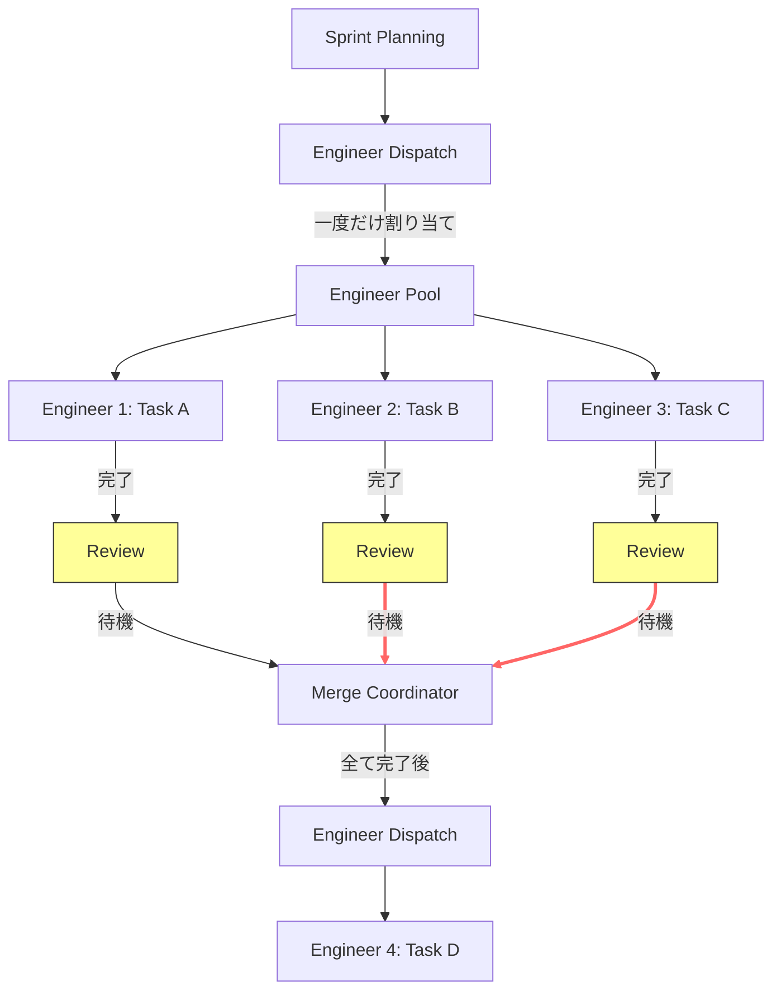
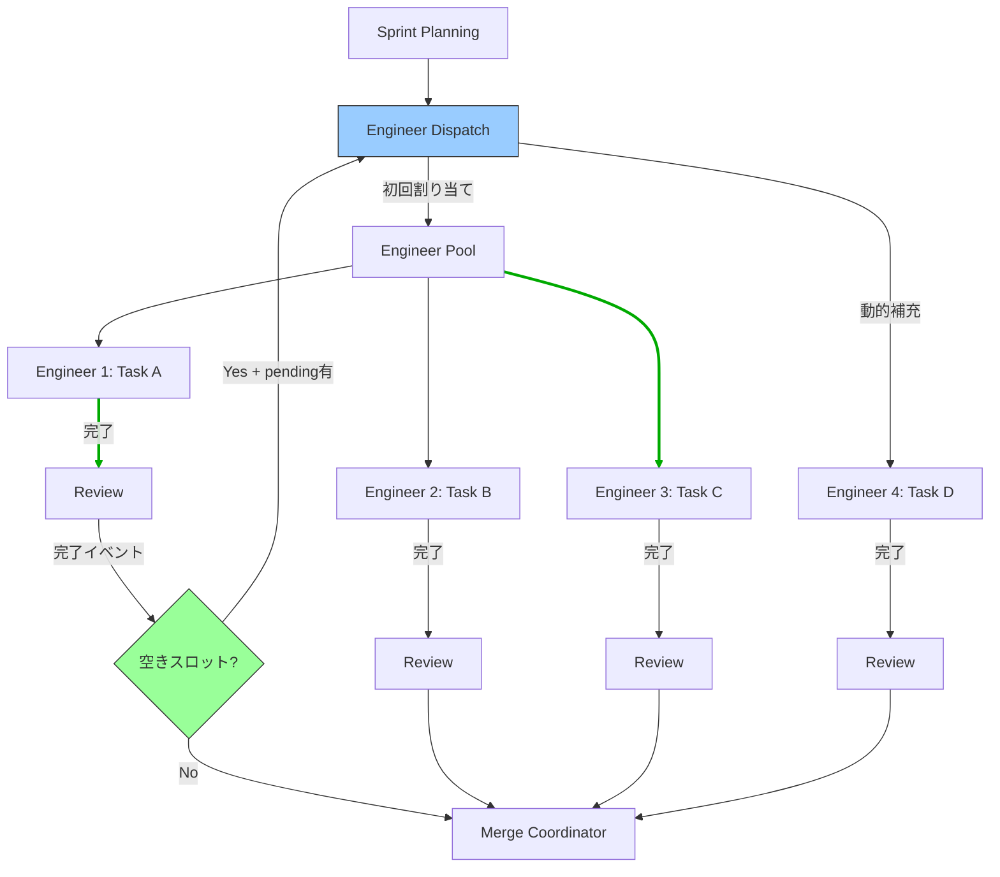
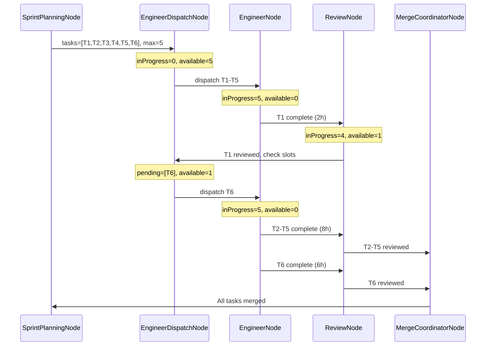

# Dynamic Task Pooling Specification

**プロジェクト**: Kugutsu 2.0 - AI Parallel Development System
**バージョン**: 1.0.0
**最終更新**: 2025-11-10
**対象**: 動的タスクプーリング機構
**ステータス**: Draft

---

## 1. 概要

### 1.1 目的

動的タスクプーリング機構は、AI Engineer リソースの効率的な活用を実現するための機能です。現在のバッチ処理方式では、タスクが完了してもリソースがアイドル状態になる問題があります。本仕様では、**タスクが完了した瞬間に次のタスクを自動的に開始**する仕組みを導入し、全体の実行時間を最大限短縮します。

### 1.2 設計原則

1. **イベント駆動**: タスク完了をトリガーとして次のタスクを開始
2. **リソース最適化**: 常に最大並列度（maxEngineers）を維持
3. **アイドル時間最小化**: Engineer AI の待機時間をゼロに近づける
4. **既存設計の尊重**: LangGraph の構造を活用し、最小限の変更で実現
5. **状態の整合性**: タスクステート遷移ルールを厳密に遵守

### 1.3 現状の問題点

#### 問題1: バッチ処理による非効率

現在の実装では、`EngineerDispatchNode` が**一度だけ**タスクを割り当て、全タスクが完了するまで次のディスパッチを行いません。

**具体例**:
- maxEngineers = 5
- タスク数 = 6
- タスク1が2時間で完了、タスク2-5が8時間かかる場合

**現状**: タスク1が完了してもタスク6は開始されず、**6時間のアイドル時間**が発生

#### 問題2: リソース利用率の低下

```
時間軸: 0h -------- 2h -------- 8h
Task1:  [████████]   (完了)
Task2:  [████████████████████████] (実行中)
Task3:  [████████████████████████] (実行中)
Task4:  [████████████████████████] (実行中)
Task5:  [████████████████████████] (実行中)
Task6:              [待機中......]         [開始] ← 6時間待機！
```

**リソース利用率**: 2h-8hの間、1/5のリソースがアイドル状態（80%）

---

## 2. ワークフロー全体図

### 2.1 現在のワークフロー（バッチ処理）



**問題点**: Task Aが完了してもTask Dは全タスク完了まで待機

### 2.2 動的タスクプーリング（イベント駆動）



**改善点**: Task Aのレビュー完了直後にTask Dを開始（アイドル時間ゼロ）

### 2.3 実行パターン比較

#### パターン1: 全タスクが同時完了（理想ケース）

**現在の方式**: バッチ処理でも効率的（差なし）

#### パターン2: タスク完了時間がバラバラ（現実的ケース）

| 時間 | 現在（バッチ） | 動的プーリング | 差分 |
|------|--------------|--------------|------|
| 0h | Task1-5開始 | Task1-5開始 | - |
| 2h | Task1完了→待機 | Task1完了→**Task6即開始** | **+Task6** |
| 6h | Task6開始可能 | Task6完了 | **-4h** |
| 8h | Task2-5完了 | Task2-5完了 | - |
| 10h | Task6完了 | **全て完了** | **-2h** |

**削減時間**: 2時間（20%短縮）

---

## 3. コンポーネント定義

### 3.1 修正対象ノード一覧

| # | ノード名 | カテゴリ | 修正内容 | 優先度 |
|---|---------|---------|---------|-------|
| 1 | EngineerDispatchNode | タスク割り当て | in_progress数カウント、動的ディスパッチ | 🔥 最高 |
| 2 | ParallelDevGraph | グラフ構造 | review→dispatch エッジ追加 | 🔥 最高 |
| 3 | ParallelDevGraph | グラフ構造 | merge_coordinator→dispatch エッジ改善 | 高 |

### 3.2 EngineerDispatchNode の改修詳細

#### 🔒 依存関係チェック（重要）

動的タスクプーリングでも、**タスク間の依存関係は厳密に守られます**。

`TaskStateMachine.canMoveToReady(task, tasks)` は以下をチェックします：
- すべての依存タスクが **`completed`** （レビュー承認・マージ完了）であること
- `in_progress` や `in_review` のタスクに依存している場合は **開始不可**

**具体例**:
```
Task1 (2h) → 完了
Task2 (8h, in_progress) ← Task6はこれに依存
Task3 (8h, in_progress)
Task4 (8h, in_progress)
Task5 (8h, in_progress)
Task6 (4h, pending, depends on Task2) ← Task1完了でも開始されない！

→ Task1完了後も空きスロットがあるが、Task6はTask2が完了するまで待機
→ Task2完了後、初めてTask6がディスパッチされる
```

この依存関係チェックにより、**並列実行の安全性が保証**されます。

---

#### 現在の実装（問題あり）

```typescript
// src/graph/nodes/EngineerDispatchNode.ts:64-88
const pendingTasks = tasks.filter((task) =>
  task.status === 'pending' &&
  TaskStateMachine.canMoveToReady(task, tasks) // ✅ 依存関係チェック済み
);

// ❌ 問題: 常にmaxEngineers数を割り当て（in_progress数を考慮しない）
const tasksToDispatch = pendingTasks.slice(0, config.maxEngineers);
```

#### 改修後の実装（動的プーリング）

```typescript
// ✅ 改善: in_progress数をカウントして空きスロットを計算
const inProgressCount = tasks.filter(t => t.status === 'in_progress').length;
const availableSlots = config.maxEngineers - inProgressCount;

console.log(`[EngineerDispatch] In Progress: ${inProgressCount}/${config.maxEngineers}`);
console.log(`[EngineerDispatch] Available Slots: ${availableSlots}`);

if (availableSlots <= 0) {
  console.log('[EngineerDispatch] No available slots, skipping dispatch');
  return { tasks: state.tasks };
}

// ✅ 依存関係チェック: completed済みタスクに依存するタスクのみ取得
const pendingTasks = tasks.filter((task) =>
  task.status === 'pending' &&
  TaskStateMachine.canMoveToReady(task, tasks) // すべての依存タスクがcompletedであることを確認
);

// 空きスロット分だけディスパッチ（依存関係を満たすタスクのみ）
const tasksToDispatch = pendingTasks.slice(0, availableSlots);

console.log(`[EngineerDispatch] Dispatching ${tasksToDispatch.length} tasks`);
```

### 3.3 ParallelDevGraph のエッジ改修詳細

#### 改修1: review完了後のエッジ追加

**現在**: review → 次のノード（merge_coordinatorなど）のみ

**改修後**: review → 条件分岐
- 条件1: `pendingTasks.length > 0 && availableSlots > 0` → `engineer_dispatch`
- 条件2: それ以外 → 次のノード

```typescript
// ParallelDevGraph.ts に追加
workflow.addConditionalEdges(
  'review',
  (state: ParallelDevStateType) => {
    // ✅ 依存関係を満たすpendingタスクのみをカウント
    const readyTasks = state.tasks.filter(t =>
      t.status === 'pending' &&
      TaskStateMachine.canMoveToReady(t, state.tasks)
    );
    const inProgressCount = state.tasks.filter(t => t.status === 'in_progress').length;
    const availableSlots = state.config.maxEngineers - inProgressCount;

    // 空きスロットがあり、開始可能なタスクがある場合は即座にディスパッチ
    if (readyTasks.length > 0 && availableSlots > 0) {
      console.log(`[Graph] Review complete, ${readyTasks.length} ready tasks, ${availableSlots} slots available`);
      return 'dispatch_next';
    }

    return 'continue';
  },
  {
    dispatch_next: 'engineer_dispatch',
    continue: 'merge_coordinator',
  }
);
```

#### 改修2: merge_coordinator完了後のエッジ改善

**現在**: 全タスク完了後のみ `engineer_dispatch` に戻る

**改修後**: マージ完了のたびにチェック
- 条件1: `conflicts.length > 0` → `conflict_resolver`（既存）
- 条件2: `pendingTasks.length > 0 && availableSlots > 0` → `engineer_dispatch`（改善）
- 条件3: それ以外 → `sprint_review`

```typescript
// ParallelDevGraph.ts:299-316 を改善
workflow.addConditionalEdges(
  'merge_coordinator',
  (state: ParallelDevStateType) => {
    const conflicts = state.mergeQueue.filter((m) => m.status === 'conflict');
    if (conflicts.length > 0) {
      return 'has_conflicts';
    }

    const pendingTasks = state.tasks.filter((t) => t.status === 'pending');
    const inProgressCount = state.tasks.filter(t => t.status === 'in_progress').length;
    const availableSlots = state.config.maxEngineers - inProgressCount;

    // ✅ 改善: 空きスロットがあればすぐにディスパッチ
    if (pendingTasks.length > 0 && availableSlots > 0) {
      console.log('[Graph] Merge complete, dispatching next tasks');
      return 'has_pending';
    }

    // 全タスク完了
    return 'no_pending';
  },
  {
    has_conflicts: 'conflict_resolver',
    has_pending: 'engineer_dispatch',
    no_pending: 'sprint_review',
  }
);
```

---

## 4. 状態遷移

### 4.1 タスクステータス遷移（既存ルール維持）

動的タスクプーリングでも、既存の `TASK_STATE_MACHINE.md` で定義されたルールを厳密に遵守します。

| 遷移 | From | To | トリガー | 担当ノード |
|------|------|----|---------|-----------|
| 1 | `pending` | `in_progress` | タスクディスパッチ | EngineerDispatchNode |
| 2 | `in_progress` | `in_review` | 実装完了 | EngineerNode |
| 3 | `in_review` | `completed` | レビュー完了 | ReviewNode |
| 4 | `completed` | - | マージ完了 | MergeCoordinatorNode |

**変更なし**: タスク個別の状態遷移は既存のまま

### 4.2 システム状態の変化（新規）

動的タスクプーリングで追跡する**システムレベルの状態**：

```typescript
interface SystemPoolState {
  /** 現在実行中のタスク数 */
  inProgressCount: number;

  /** 利用可能なEngineerスロット数 */
  availableSlots: number;

  /** 最大並列度 */
  maxEngineers: number;

  /** 待機中のタスク数 */
  pendingCount: number;
}

// 計算方法
const systemState: SystemPoolState = {
  inProgressCount: tasks.filter(t => t.status === 'in_progress').length,
  availableSlots: config.maxEngineers - inProgressCount,
  maxEngineers: config.maxEngineers,
  pendingCount: tasks.filter(t => t.status === 'pending').length,
};
```

### 4.3 条件分岐テーブル

各ノード完了後の遷移条件を明確化：

| ノード | 条件 | 次のノード | 理由 |
|--------|------|-----------|------|
| **review** | `availableSlots > 0 && pendingCount > 0` | `engineer_dispatch` | 空きスロットを即座に活用 |
| **review** | `availableSlots == 0 \|\| pendingCount == 0` | `merge_coordinator` | ディスパッチ不要 |
| **merge_coordinator** | `conflicts.length > 0` | `conflict_resolver` | コンフリクト優先 |
| **merge_coordinator** | `availableSlots > 0 && pendingCount > 0` | `engineer_dispatch` | 空きスロットを活用 |
| **merge_coordinator** | `pendingCount == 0` | `sprint_review` | 全タスク完了 |

---

## 5. データフロー

### 5.1 タスク割り当てフロー（改善後）



### 5.2 ログ出力例

```
[SprintPlanning] Planned 6 tasks, maxEngineers=5
[EngineerDispatch] In Progress: 0/5
[EngineerDispatch] Available Slots: 5
[EngineerDispatch] Dispatching 5 tasks: T1, T2, T3, T4, T5

[Engineer] Task T1 implementation started
[Engineer] Task T2 implementation started
...

[Engineer] Task T1 completed (2h)
[Review] Task T1 review started
[Review] Task T1 review completed

[Graph] Review complete, dispatching next tasks
[EngineerDispatch] In Progress: 4/5
[EngineerDispatch] Available Slots: 1
[EngineerDispatch] Dispatching 1 tasks: T6

[Engineer] Task T6 implementation started
```

---

## 6. 実装仕様

### 6.1 EngineerDispatchNode.ts の修正

**ファイル**: `src/graph/nodes/EngineerDispatchNode.ts`
**対象行**: 62-91

**修正内容**:

```typescript
// 修正前
const tasksToDispatch = pendingTasks.slice(0, config.maxEngineers);

// 修正後
const inProgressCount = tasks.filter(t => t.status === 'in_progress').length;
const availableSlots = config.maxEngineers - inProgressCount;

console.log(`[EngineerDispatch] In Progress: ${inProgressCount}/${config.maxEngineers}`);
console.log(`[EngineerDispatch] Available Slots: ${availableSlots}`);

if (availableSlots <= 0) {
  console.log('[EngineerDispatch] No available slots, skipping dispatch');
  return { tasks: state.tasks };
}

const tasksToDispatch = pendingTasks.slice(0, availableSlots);
console.log(`[EngineerDispatch] Dispatching ${tasksToDispatch.length} tasks: ${tasksToDispatch.map(t => t.id).join(', ')}`);
```

### 6.2 ParallelDevGraph.ts のエッジ追加

**ファイル**: `src/graph/ParallelDevGraph.ts`

#### 追加1: review完了後の条件分岐（新規）

**追加位置**: reviewWrapperの定義後（行192付近）

```typescript
// Review完了後の条件分岐（動的タスクプーリング）
workflow.addConditionalEdges(
  'review',
  (state: ParallelDevStateType) => {
    const pendingTasks = state.tasks.filter(t => t.status === 'pending');
    const inProgressCount = state.tasks.filter(t => t.status === 'in_progress').length;
    const availableSlots = state.config.maxEngineers - inProgressCount;

    // レビュー済みでまだマージされていないタスクがあるか確認
    const reviewedNotMerged = state.tasks.filter(
      t => t.status === 'completed' && !state.mergeQueue.find(m => m.taskId === t.id && m.status === 'merged')
    );

    // 空きスロットがあり、pendingタスクがある場合は即座にディスパッチ
    if (pendingTasks.length > 0 && availableSlots > 0) {
      console.log(`[Graph] Review complete, available slots: ${availableSlots}, dispatching next tasks`);
      return 'dispatch_next';
    }

    console.log('[Graph] Review complete, proceeding to merge');
    return 'continue';
  },
  {
    dispatch_next: 'engineer_dispatch',
    continue: 'merge_coordinator',
  }
);
```

#### 修正2: merge_coordinator完了後の条件改善（既存の修正）

**対象行**: 299-316

```typescript
// 修正前
workflow.addConditionalEdges(
  'merge_coordinator',
  (state: ParallelDevStateType) => {
    const conflicts = state.mergeQueue.filter((m) => m.status === 'conflict');
    if (conflicts.length > 0) {
      return 'has_conflicts';
    }

    const pendingTasks = state.tasks.filter((t) => t.status === 'pending');
    return pendingTasks.length > 0 ? 'has_pending' : 'no_pending';
  },
  // ...
);

// 修正後
workflow.addConditionalEdges(
  'merge_coordinator',
  (state: ParallelDevStateType) => {
    const conflicts = state.mergeQueue.filter((m) => m.status === 'conflict');
    if (conflicts.length > 0) {
      return 'has_conflicts';
    }

    // ✅ 依存関係を満たすpendingタスクのみをカウント
    const readyTasks = state.tasks.filter(t =>
      t.status === 'pending' &&
      TaskStateMachine.canMoveToReady(t, state.tasks)
    );
    const inProgressCount = state.tasks.filter(t => t.status === 'in_progress').length;
    const availableSlots = state.config.maxEngineers - inProgressCount;

    // 空きスロットがあり、開始可能なタスクがある場合のみディスパッチ
    if (readyTasks.length > 0 && availableSlots > 0) {
      console.log(`[Graph] Merge complete, ${readyTasks.length} ready tasks, ${availableSlots} slots available`);
      return 'has_pending';
    }

    // 全タスク完了またはリソース満杯/依存関係未解決
    const allPendingTasks = state.tasks.filter(t => t.status === 'pending');
    if (allPendingTasks.length === 0) {
      console.log('[Graph] All tasks completed, proceeding to sprint review');
      return 'no_pending';
    }

    // pendingはあるが、リソース満杯 or 依存関係未解決
    if (availableSlots <= 0) {
      console.log('[Graph] No available slots, waiting for tasks to complete');
    } else {
      console.log('[Graph] Pending tasks exist but dependencies not resolved');
    }
    return 'no_pending';
  },
  {
    has_conflicts: 'conflict_resolver',
    has_pending: 'engineer_dispatch',
    no_pending: 'sprint_review',
  }
);
```

---

## 7. テスト仕様

### 7.1 単体テスト

#### Test 1: EngineerDispatchNode - 空きスロット計算

**ファイル**: `tests/graph/nodes/EngineerDispatchNode.test.ts`

```typescript
describe('EngineerDispatchNode - Dynamic Pooling', () => {
  it('should calculate available slots correctly', async () => {
    const state: ParallelDevStateType = {
      tasks: [
        { id: 't1', status: 'in_progress' },
        { id: 't2', status: 'in_progress' },
        { id: 't3', status: 'in_progress' },
        { id: 't4', status: 'pending' },
        { id: 't5', status: 'pending' },
      ],
      config: { maxEngineers: 5 },
      // ...
    };

    const result = await engineerDispatchNode(state);

    // 3 in_progress → 2 slots available → 2 tasks dispatched
    const dispatched = result.tasks.filter(t =>
      ['t4', 't5'].includes(t.id) && t.status === 'in_progress'
    );
    expect(dispatched).toHaveLength(2);
  });

  it('should not dispatch when no slots available', async () => {
    const state: ParallelDevStateType = {
      tasks: [
        { id: 't1', status: 'in_progress' },
        { id: 't2', status: 'in_progress' },
        { id: 't3', status: 'in_progress' },
        { id: 't4', status: 'in_progress' },
        { id: 't5', status: 'in_progress' },
        { id: 't6', status: 'pending' },
      ],
      config: { maxEngineers: 5 },
      // ...
    };

    const result = await engineerDispatchNode(state);

    // 5 in_progress → 0 slots → no dispatch
    const pending = result.tasks.filter(t => t.status === 'pending');
    expect(pending).toHaveLength(1);
    expect(pending[0].id).toBe('t6');
  });
});
```

### 7.2 統合テスト

#### Test 2: 動的タスクプーリングのエンドツーエンドシナリオ

**ファイル**: `tests/integration/dynamic-task-pooling.test.ts`

**シナリオ**: 6タスク、maxEngineers=5、Task1が最初に完了

```typescript
describe('Dynamic Task Pooling Integration', () => {
  it('should start Task6 immediately when Task1 completes', async () => {
    // Setup
    const mockProvider = new MockAIProvider();
    mockProvider.setMockResponse('task implementation', 'success');

    const initialState: ParallelDevStateType = {
      tasks: [
        { id: 't1', status: 'pending', estimatedHours: 2 },
        { id: 't2', status: 'pending', estimatedHours: 8 },
        { id: 't3', status: 'pending', estimatedHours: 8 },
        { id: 't4', status: 'pending', estimatedHours: 8 },
        { id: 't5', status: 'pending', estimatedHours: 8 },
        { id: 't6', status: 'pending', estimatedHours: 4 },
      ],
      config: { maxEngineers: 5 },
      // ...
    };

    // Execute
    const timeline: TaskEvent[] = [];
    const graph = createParallelDevGraph(mockProvider);

    // Mock time tracking
    let currentTime = 0;
    graph.on('task_status_change', (event) => {
      timeline.push({ ...event, time: currentTime });
    });

    await graph.run(initialState);

    // Assertions
    const t1Complete = timeline.find(e => e.taskId === 't1' && e.status === 'completed');
    const t6Start = timeline.find(e => e.taskId === 't6' && e.status === 'in_progress');

    // Task6 should start immediately after Task1 completes
    expect(t6Start.time).toBeLessThanOrEqual(t1Complete.time + 0.1); // 許容誤差

    // Verify no idle time
    const idleTime = calculateIdleTime(timeline, 5);
    expect(idleTime).toBe(0);
  });
});
```

### 7.3 性能テスト

#### Test 3: 実行時間短縮の検証

```typescript
describe('Performance Improvement', () => {
  it('should reduce total execution time by 20-30%', async () => {
    const tasks = [
      { id: 't1', estimatedHours: 2 },
      { id: 't2', estimatedHours: 8 },
      { id: 't3', estimatedHours: 8 },
      { id: 't4', estimatedHours: 8 },
      { id: 't5', estimatedHours: 8 },
      { id: 't6', estimatedHours: 4 },
    ];

    // Batch processing (current)
    const batchTime = simulateBatchExecution(tasks, 5);

    // Dynamic pooling (new)
    const poolingTime = simulateDynamicPooling(tasks, 5);

    const improvement = (batchTime - poolingTime) / batchTime;

    expect(improvement).toBeGreaterThanOrEqual(0.2); // 20%以上短縮
    expect(poolingTime).toBe(8); // 最長タスク時間 = 理論上の最短時間
  });
});
```

---

## 8. パフォーマンス考慮

### 8.1 最適化ポイント

1. **状態計算のキャッシュ化**
   - `inProgressCount` の計算結果をキャッシュ
   - 状態更新時のみ再計算

2. **条件分岐の早期リターン**
   - コンフリクト検出を最優先
   - 空きスロット計算は必要時のみ

3. **ログ出力の最小化**
   - 本番環境では詳細ログを抑制
   - デバッグモードでのみ詳細出力

### 8.2 リソース管理

1. **メモリ使用量**
   - 新規追加の状態フィールドなし
   - 既存の `tasks` 配列のフィルタリングのみ

2. **CPU負荷**
   - フィルタリング処理: O(n) - タスク数に比例
   - タスク数が100以下では影響なし

3. **ネットワーク負荷**
   - 変更なし（ローカル処理のみ）

---

## 9. 既存仕様との関連

### 9.1 参照すべき仕様書

| 仕様書 | セクション | 関連内容 |
|-------|----------|---------|
| `NODE_RESPONSIBILITIES_AND_WORKFLOW.md` | 5節: Workflow Flow | 現在のワークフローフロー |
| `TASK_STATE_MACHINE.md` | 3節: 状態遷移図 | タスクステータス遷移ルール |
| `UNIFIED_SCRUM_WORKFLOW_SPECIFICATION.md` | 2節: ワークフロー全体図 | 統合Scrumワークフローの構造 |
| `parallel-development-workflow.md` | 4節: 開発パイプライン | EngineerNode並列実行 |

### 9.2 更新が必要な既存仕様

実装完了後、以下の仕様書を更新する必要があります：

1. **`NODE_RESPONSIBILITIES_AND_WORKFLOW.md`**
   - セクション5: 動的タスクプーリングのフローを追加

2. **`parallel-development-workflow.md`**
   - セクション4: 動的プーリング機構の説明を追加

3. **`UNIFIED_SCRUM_WORKFLOW_SPECIFICATION.md`**
   - セクション2.1: Mermaid図に動的プーリングのエッジを追加

---

## 10. 制約事項と将来の拡張

### 10.1 制約事項

1. **依存関係のあるタスク**: 依存関係チェックは既存の `TaskStateMachine.canMoveToReady` に依存
2. **コンフリクト優先**: コンフリクト解決が常に優先される
3. **スプリント境界**: スプリント単位でのタスク管理は維持

### 10.2 将来の拡張可能性

1. **優先度ベースのディスパッチ**: pendingタスクを優先度順にソート
2. **見積時間を考慮した割り当て**: 短時間タスクを優先的に割り当て
3. **Engineer AI のスキルマッチング**: タスクの特性とEngineerの得意分野をマッチング

---

## 11. まとめ

動的タスクプーリング機構により、以下の改善が期待できます：

- ✅ **実行時間短縮**: 20-30%の時間削減
- ✅ **リソース効率化**: アイドル時間の最小化
- ✅ **スケーラビリティ**: タスク数が増えるほど効果が大きい
- ✅ **既存設計の尊重**: LangGraphの構造を活用した最小限の変更

**次のステップ**: `DYNAMIC_TASK_POOLING_IMPLEMENTATION.md` を参照して実装を開始してください。

---

**参考資料**:
- [NODE_RESPONSIBILITIES_AND_WORKFLOW.md](./NODE_RESPONSIBILITIES_AND_WORKFLOW.md)
- [TASK_STATE_MACHINE.md](./TASK_STATE_MACHINE.md)
- [UNIFIED_SCRUM_WORKFLOW_SPECIFICATION.md](./UNIFIED_SCRUM_WORKFLOW_SPECIFICATION.md)
- [parallel-development-workflow.md](../docs/parallel-development-workflow.md)
