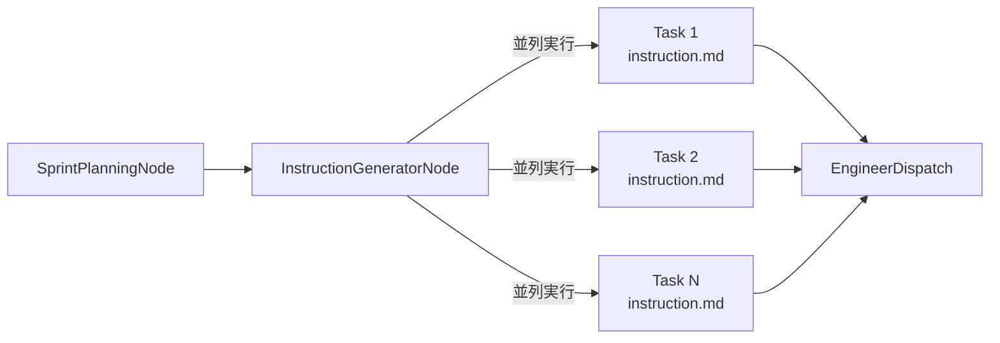

# InstructionGeneratorNode Implementation Specification

**プロジェクト**: Kugutsu 2.0 - AI Parallel Development System
**バージョン**: 1.0.0
**作成日**: 2025-01-10
**対象**: InstructionGeneratorNodeの実装仕様
**ステータス**: Draft

---

## 1. 概要

### 1.1 目的

InstructionGeneratorNodeは、スプリント計画後にスプリントスコープのタスクについて並列でinstruction.mdを生成する新規ノードです。これにより、以下の問題を解決します：

1. **責務の明確化**: instruction.md生成がProductOwnerNode/TaskBreakdownNodeに混在している問題
2. **効率化**: スプリントスコープのタスクのみ処理し、不要な生成を回避
3. **並列処理**: 複数タスクのinstruction.mdを並列生成し、高速化

### 1.2 設計原則

- **Wrapperパターン**: EngineerNodeと同様の並列実行パターンを採用
- **スプリントスコープ**: `activeSprint.taskIds`でフィルタリング
- **パス独立**: 高複雑度（設計書あり）と低複雑度（設計書なし）の両方に対応
- **Promise.allSettled**: エラー耐性のある並列実行

---

## 2. アーキテクチャ

### 2.1 ノード構成

```
InstructionGeneratorNode (Wrapper)
  ├─ generateInstructionForTask (Individual Generator)
  │   ├─ 高複雑度パス: ストーリーマッピング・設計書を参照
  │   └─ 低複雑度パス: ユーザーリクエスト・タスク定義を参照
  └─ 結果の集約とログ生成
```

### 2.2 データフロー



### 2.3 実装パターン

**Wrapperノード**（並列実行制御）:
```typescript
export async function instructionGeneratorNode(
  state: ParallelDevStateType
): Promise<Partial<ParallelDevStateType>> {
  // スプリントスコープのタスクのみフィルタリング
  const sprintTasks = state.globalTasks.filter(
    task => state.activeSprint?.taskIds.includes(task.id)
  );

  if (sprintTasks.length === 0) {
    return {
      logs: [{
        timestamp: new Date(),
        level: 'info',
        source: 'InstructionGeneratorNode',
        message: 'スプリント内のタスクがありません',
      }],
    };
  }

  console.log(`📝 ${sprintTasks.length}個のタスクのinstruction.mdを並列生成中...`);

  // 並列実行（Promise.allSettled）
  const results = await Promise.allSettled(
    sprintTasks.map(task =>
      generateInstructionForTask(state, task, config)
    )
  );

  // 結果を集約
  const logs: LogEntry[] = [];
  let successCount = 0;
  let failureCount = 0;

  for (const [index, settledResult] of results.entries()) {
    const task = sprintTasks[index];

    if (settledResult.status === 'fulfilled') {
      successCount++;
      logs.push({
        timestamp: new Date(),
        level: 'info',
        source: 'InstructionGeneratorNode',
        message: `Task ${task.id} のinstruction.md生成完了`,
      });
    } else {
      failureCount++;
      logs.push({
        timestamp: new Date(),
        level: 'error',
        source: 'InstructionGeneratorNode',
        message: `Task ${task.id} のinstruction.md生成失敗: ${settledResult.reason}`,
        data: { error: settledResult.reason },
      });
    }
  }

  console.log(`✅ ${successCount}個成功、❌ ${failureCount}個失敗`);

  return {
    logs,
  };
}
```

**Individual Generator**（個別タスクのinstruction.md生成）:
```typescript
async function generateInstructionForTask(
  state: ParallelDevStateType,
  task: GlobalTask,
  config: ParallelDevConfig
): Promise<void> {
  const provider = AIProviderFactory.create(config);
  const persistence = new DataPersistence(config.baseRepoPath);

  const sprintId = state.activeSprint?.id;
  if (!sprintId) {
    throw new Error('アクティブなスプリントが設定されていません');
  }

  // コンテキストの構築（高複雑度 vs 低複雑度）
  let context: string;

  if (state.storyMapping && state.designDocs) {
    // 高複雑度パス: 設計書を参照
    context = buildHighComplexityContext(
      state.storyMapping,
      state.designDocs,
      task
    );
  } else {
    // 低複雑度パス: ユーザーリクエストとタスク定義を参照
    context = buildLowComplexityContext(
      state.userRequest,
      task
    );
  }

  const prompt = `
以下のタスクについて、エンジニアが実装するための詳細な指示書（instruction.md）を作成してください。

タスク情報:
${JSON.stringify(task, null, 2)}

コンテキスト:
${context}

指示書に含めるべき項目:
1. タスクの目的・背景
2. 実装すべき機能の詳細
3. 技術的制約・要件
4. 受入基準（Definition of Done）
5. 参考資料・関連ファイル

出力形式: Markdown
  `;

  // AI実行
  let instructionContent = '';
  for await (const chunk of provider.execute({
    messages: [{ role: 'user', content: prompt }],
    maxTurns: config.maxTurns || 10,
  })) {
    if (chunk.type === 'text') {
      instructionContent += chunk.text;
    }
  }

  // instruction.mdを保存
  await persistence.saveTaskInstruction(
    sprintId,
    task.id,
    instructionContent
  );
}

function buildHighComplexityContext(
  storyMapping: StoryMapping,
  designDocs: DesignDocs,
  task: GlobalTask
): string {
  return `
# ストーリーマッピング

${JSON.stringify(storyMapping, null, 2)}

# 設計書

## Design Docs
${designDocs.designDocsContent || 'なし'}

## UI/UX設計
${designDocs.uiuxContent || 'なし'}

## DB設計
${designDocs.databaseContent || 'なし'}

## API仕様
${designDocs.apiContent || 'なし'}
  `;
}

function buildLowComplexityContext(
  userRequest: string,
  task: GlobalTask
): string {
  return `
# ユーザーリクエスト

${userRequest}

# タスクの技術的詳細

${task.description}
  `;
}
```

---

## 3. 実装フェーズ

### Phase 1: InstructionGeneratorNode.ts実装

**ファイル**: `src/graph/nodes/InstructionGeneratorNode.ts`

**実装内容**:
1. Wrapperノード関数（`instructionGeneratorNode`）
2. Individual Generator関数（`generateInstructionForTask`）
3. コンテキスト構築関数（`buildHighComplexityContext`, `buildLowComplexityContext`）
4. エラーハンドリング

**依存関係**:
- `AIProviderFactory`（AI実行）
- `DataPersistence`（instruction.md保存）
- `state.activeSprint.taskIds`（スプリントスコープフィルタリング）
- `state.storyMapping`（高複雑度パスのコンテキスト）
- `state.designDocs`（高複雑度パスのコンテキスト）

### Phase 2: ParallelDevGraph.tsにノード追加

**ファイル**: `src/graph/ParallelDevGraph.ts`

**変更内容**:
```typescript
import { instructionGeneratorNode } from './nodes/InstructionGeneratorNode.js';

// ノード追加
workflow.addNode('instruction_generator', instructionGeneratorNode);

// エッジ変更
workflow.addEdge('sprint_planning', 'instruction_generator');
workflow.addEdge('instruction_generator', 'engineer_dispatch');
```

### Phase 3: ProductOwnerNode/TaskBreakdownNodeからinstruction.md生成削除

**対象ファイル**:
- `src/graph/nodes/ProductOwnerNode.ts`
  - `generateSimpleTaskInstructions`関数を削除
  - instruction.md生成ロジックを削除

- `src/graph/nodes/TaskBreakdownNode.ts`
  - `generateTaskInstructions`関数を削除
  - instruction.md生成ロジックを削除

**理由**: instruction.md生成はInstructionGeneratorNodeの責務に統一

### Phase 4: テスト作成

**ファイル**: `tests/graph/nodes/InstructionGeneratorNode.test.ts`

**テストケース**:
1. スプリントスコープのタスクのみ処理することを確認
2. 並列実行が正しく動作することを確認（Promise.allSettled）
3. 高複雑度パス（設計書あり）でinstruction.mdが生成されることを確認
4. 低複雑度パス（設計書なし）でinstruction.mdが生成されることを確認
5. エラー時にログが記録されることを確認
6. スプリント内にタスクがない場合の処理を確認

**統合テスト**:
- E2Eワークフローテストで、instruction.md生成→Engineer実行の流れを確認

---

## 4. 技術要件

### 4.1 必須チェック項目

- [ ] `state.activeSprint?.id`の存在確認（必須）
- [ ] `activeSprint.taskIds`によるフィルタリング
- [ ] Promise.allSettledによる並列実行
- [ ] 高複雑度/低複雑度パスの分岐
- [ ] DataPersistence.saveTaskInstructionの呼び出し

### 4.2 エラーハンドリング

| エラータイプ | 対応 |
|------------|------|
| `activeSprint`未設定 | エラーログを記録、処理をスキップ |
| AI実行エラー | ログ記録、該当タスクをスキップ（他タスクは継続） |
| ファイル保存エラー | ログ記録、該当タスクをスキップ（他タスクは継続） |

### 4.3 パフォーマンス最適化

- 並列実行数の制限なし（Promise.allSettled）
- 各タスクは独立して処理（エラー耐性）
- 不要なタスク（スプリント外）は事前にフィルタリング

---

## 5. DataPersistence拡張

### 5.1 新規メソッド

**ファイル**: `src/utils/DataPersistence.ts`

```typescript
/**
 * タスクのinstruction.mdを保存
 * @param sprintId スプリントID
 * @param taskId タスクID
 * @param content instruction.mdの内容
 */
async saveTaskInstruction(
  sprintId: string,
  taskId: string,
  content: string
): Promise<void> {
  const filePath = path.join(
    this.baseRepoPath,
    '.kugutsu',
    'sprints',
    sprintId,
    'tasks',
    taskId,
    'instruction.md'
  );

  await fs.mkdir(path.dirname(filePath), { recursive: true });
  await fs.writeFile(filePath, content, 'utf-8');
}
```

---

## 6. テスト戦略

### 6.1 単体テスト

**ファイル**: `tests/graph/nodes/InstructionGeneratorNode.test.ts`

```typescript
describe('InstructionGeneratorNode', () => {
  describe('スプリントスコープフィルタリング', () => {
    test('activeSprint.taskIdsに含まれるタスクのみ処理', async () => {
      const state = {
        activeSprint: {
          id: 'sprint-001',
          taskIds: ['task-001', 'task-002'],
        },
        globalTasks: [
          { id: 'task-001', ... },
          { id: 'task-002', ... },
          { id: 'task-003', ... }, // スプリント外
        ],
        ...
      };

      const result = await instructionGeneratorNode(state);

      // task-001, task-002のみ処理されることを確認
      expect(mockPersistence.saveTaskInstruction).toHaveBeenCalledTimes(2);
    });
  });

  describe('並列実行', () => {
    test('Promise.allSettledで並列実行されること', async () => {
      // spy on Promise.allSettled
      const allSettledSpy = jest.spyOn(Promise, 'allSettled');

      await instructionGeneratorNode(state);

      expect(allSettledSpy).toHaveBeenCalled();
    });
  });

  describe('高複雑度パス', () => {
    test('設計書を参照してinstruction.md生成', async () => {
      const state = {
        storyMapping: { ... },
        designDocs: { ... },
        activeSprint: { id: 'sprint-001', taskIds: ['task-001'] },
        globalTasks: [{ id: 'task-001', ... }],
        ...
      };

      await instructionGeneratorNode(state);

      // buildHighComplexityContextが呼ばれることを確認
      expect(mockProvider.execute).toHaveBeenCalledWith(
        expect.objectContaining({
          messages: expect.arrayContaining([
            expect.objectContaining({
              content: expect.stringContaining('ストーリーマッピング')
            })
          ])
        })
      );
    });
  });

  describe('低複雑度パス', () => {
    test('ユーザーリクエストを参照してinstruction.md生成', async () => {
      const state = {
        storyMapping: null,
        designDocs: null,
        userRequest: 'バグ修正',
        activeSprint: { id: 'sprint-001', taskIds: ['task-001'] },
        globalTasks: [{ id: 'task-001', ... }],
        ...
      };

      await instructionGeneratorNode(state);

      // buildLowComplexityContextが呼ばれることを確認
      expect(mockProvider.execute).toHaveBeenCalledWith(
        expect.objectContaining({
          messages: expect.arrayContaining([
            expect.objectContaining({
              content: expect.stringContaining('バグ修正')
            })
          ])
        })
      );
    });
  });

  describe('エラーハンドリング', () => {
    test('AI実行エラー時、該当タスクをスキップ', async () => {
      mockProvider.execute.mockRejectedValueOnce(new Error('AI error'));

      const result = await instructionGeneratorNode(state);

      // エラーログが記録されること
      expect(result.logs.some(log => log.level === 'error')).toBe(true);
    });

    test('activeSprint未設定時、エラーログを記録', async () => {
      const state = {
        activeSprint: null,
        ...
      };

      const result = await instructionGeneratorNode(state);

      expect(result.logs[0].level).toBe('info');
      expect(result.logs[0].message).toContain('スプリント内のタスクがありません');
    });
  });
});
```

### 6.2 統合テスト

**ファイル**: `tests/integration/instruction-generator-workflow.test.ts`

```typescript
describe('InstructionGenerator統合テスト', () => {
  test('SprintPlanning → InstructionGenerator → EngineerDispatch の流れ', async () => {
    const graph = compileUnifiedScrumWorkflowGraph();

    const result = await graph.invoke({
      userRequest: 'ユーザー登録機能を実装',
      config: { ... },
    });

    // instruction.mdが生成されていることを確認
    const instructionPath = '.kugutsu/sprints/sprint-001/tasks/task-001/instruction.md';
    expect(fs.existsSync(instructionPath)).toBe(true);
  });
});
```

---

## 7. マイルストーン

| フェーズ | 期限 | 担当 | ステータス |
|---------|------|------|----------|
| Phase 1: InstructionGeneratorNode.ts実装 | TBD | - | Pending |
| Phase 2: ParallelDevGraph.ts更新 | TBD | - | Pending |
| Phase 3: 既存ノードから削除 | TBD | - | Pending |
| Phase 4: テスト作成 | TBD | - | Pending |
| E2Eテスト実行 | TBD | - | Pending |

---

## 8. 参考資料

- [spec/NODE_RESPONSIBILITIES_AND_WORKFLOW.md](./NODE_RESPONSIBILITIES_AND_WORKFLOW.md)
- [spec/UNIFIED_SCRUM_WORKFLOW_SPECIFICATION.md](./UNIFIED_SCRUM_WORKFLOW_SPECIFICATION.md)
- [docs/parallel-development-workflow.md](../docs/parallel-development-workflow.md)
- [src/graph/nodes/EngineerNode.ts](../src/graph/nodes/EngineerNode.ts) - Wrapperパターンの参考実装

---

**最終更新**: 2025-01-10
**バージョン**: 1.0.0
**承認**: 待機中
