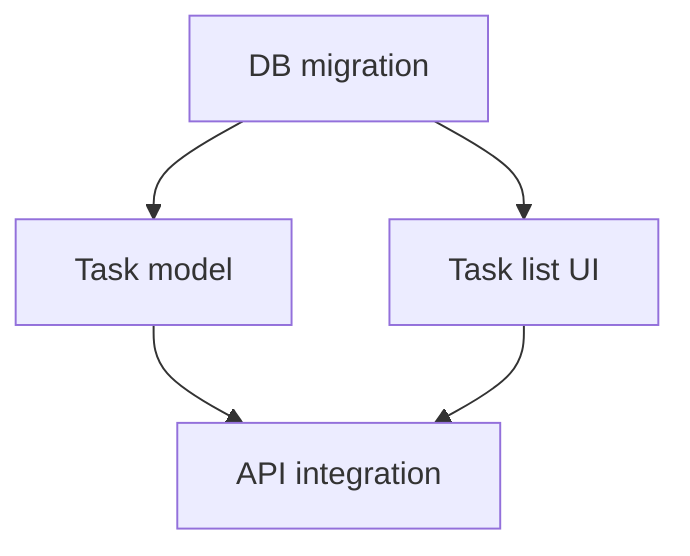

# Scrum Workflow Specification

**プロジェクト**: Kugutsu 2.0 - AI Parallel Development System
**バージョン**: 1.0.0
**最終更新**: 2025-11-06
**対象**: スクラム開発プロセスのAI再現
**ステータス**: Draft

---

## 1. 概要

本仕様書は、Kugutsu 2.0におけるスクラム開発プロセスの完全なAI再現を定義します。アジャイル開発のスクラムフレームワークをAIエージェントで実現し、要件定義から設計、実装、レビューまでの一連の流れを自動化します。

### 1.1 設計原則

1. **必要十分な機能**: ユーザーの要求を満たす最小限の機能のみ実装（過剰な機能は排除）
2. **段階的な合意形成**: 各工程でレビューと改善を繰り返し、全員が納得してから次へ進む
3. **対等な協調**: DirectorAI、ProductOwnerAI、TechLeadAIは対等な立場で議論・合意形成
4. **既存リポジトリの尊重**: 進行中のプロジェクトの現状を踏まえた判断
5. **依存関係の明確化**: タスクの優先度と依存関係を明確にし、並列実行を最大化
6. **AI駆動スプリント実行**: タスク分解後は、AI駆動の自動スプリントループで実行（詳細はセクション5.4参照）

### 1.2 スクラムワークフローとスプリント駆動開発の関係

本スクラムワークフローは、**2層構造**で動作します：

#### 上位レイヤー（本仕様）：スクラム開発プロセス
- ユーザー要求整理 → ストーリーマッピング → 設計書作成 → タスク分解
- DirectorAI、ProductOwnerAI、TechLeadAIによる合意形成
- グローバルタスクキューへのタスク登録

#### 下位レイヤー（スプリント駆動開発）：AI駆動の自動スプリント実行
- タスクを8-16時間単位のスプリントに自動グルーピング（SprintPlanningNode）
- 並列エンジニア実行 → レビュー → マージ
- デプロイ可能性を自動判定し、次スプリントを自動生成（SprintReviewNode）
- 未完了タスクがある限り自動的に次スプリントループを実行

**重要**: このスプリントは**AI駆動・完全自動化**されています。従来のスクラム開発における人間主導のスプリント計画会議、スプリントレビュー会議、スプリントレトロスペクティブ会議とは異なります。AIノードが自動的に判断・実行します。

詳細は `ARCHITECTURE_DESIGN.md` の「5.1 スプリント駆動開発」セクションを参照してください。

### 1.3 主要登場AIノード

#### スクラム開発プロセス（上位レイヤー）

| AIノード | 役割 | 主な責務 |
|---------|------|---------|
| **DirectorAI** | プロダクトディレクター | ユーザーストーリーマッピング作成、設計レビュー、品質保証 |
| **ProductOwnerAI** | プロダクトオーナー | 要求整理、ストーリーマッピングレビュー、受入基準定義 |
| **TechLeadAI** | テックリード | 設計書作成、技術的判断、タスク分解、依存関係分析 |
| **EngineerAI** | エンジニア | 実装、テスト作成、コードレビュー対応 |

#### スプリント駆動開発（下位レイヤー）

| AIノード | 役割 | 主な責務 |
|---------|------|---------|
| **CheckModeNode** | 継続モード判定 | 新規リクエスト vs 継続リクエストをAI判定 |
| **SprintPlanningNode** | AI駆動スプリント計画 | タスクを8-16時間単位のスプリントに自動グルーピング、優先度計算 |
| **SprintReviewNode** | AI駆動スプリントレビュー | デプロイ可能性自動判定、次スプリント自動生成判断 |

---

## 2. 完全ワークフロー

### 2.1 ワークフロー全体図

```mermaid
graph TD
    Start[ユーザー要求受付] --> PO_Analyze[ProductOwnerAI: 要求整理]

    PO_Analyze --> Decision1{新機能/新サービス?}
    Decision1 -->|Yes| Dir_StoryMap[DirectorAI: ユーザーストーリーマッピング作成]
    Decision1 -->|No: Bug Fix等| TL_TaskBreakdown[TechLeadAI: タスク分解]

    Dir_StoryMap --> Review_StoryMap[ProductOwnerAI + DirectorAI: ストーリーマッピングレビュー]
    Review_StoryMap --> Decision2{承認?}
    Decision2 -->|No| Dir_StoryMap
    Decision2 -->|Yes| TL_Design[TechLeadAI: 設計書作成]

    TL_Design --> Review_Design[DirectorAI + ProductOwnerAI + TechLeadAI: 設計レビュー]
    Review_Design --> Decision3{承認?}
    Decision3 -->|No| TL_Design
    Decision3 -->|Yes| TL_TaskBreakdown

    TL_TaskBreakdown --> TL_Dependency[TechLeadAI: 依存関係分析]
    TL_Dependency --> GlobalQueue[グローバルタスクキューに登録]

    GlobalQueue --> SprintDriven[🔄 AI駆動スプリント実行フローへ委譲]

    SprintDriven --> SprintPlanning[SprintPlanningNode: 8-16h単位で自動グルーピング]
    SprintPlanning --> InstructionGen[InstructionGeneratorNode: instruction.md並列生成]
    InstructionGen --> Engineer_Dispatch[EngineerDispatch: 並列タスク割り当て]
    Engineer_Dispatch --> Engineer_Impl[EngineerAI x N: 並列実装]
    Engineer_Impl --> Review_Code[TechLeadAI x N: 並列レビュー]
    Review_Code --> Merge[MergeCoordinator: 順次マージ]
    Merge --> SprintReview[SprintReviewNode: デプロイ可能性AI判定]

    SprintReview --> Decision4{未完了タスクあり?}
    Decision4 -->|Yes: 次スプリント自動生成| SprintPlanning
    Decision4 -->|No: 全完了| End[完了]

    style SprintDriven fill:#fff9c4
    style SprintPlanning fill:#e1f5e1
    style SprintReview fill:#e1f5e1
```



### 2.2 詳細フロー

#### Step 1: ユーザー要求受付
- **入力**: ユーザーからの開発要求
- **処理**: システムが要求を受け取り、ワークフローを開始

#### Step 2: ProductOwnerAI - 要求整理
- **責務**: 要求の内容を整理、分類
- **判断**:
  - 新サービス・新機能開発 → ユーザーストーリーマッピング作成へ
  - バグ修正・小規模改善 → タスク分解へ直行

**プロンプト例**:
```
以下のユーザー要求を分析してください:
{user_request}

現在のリポジトリ状態:
{repository_analysis}

分析観点:
1. 要求の種類（新機能/バグ修正/改善/リファクタリング）
2. 影響範囲（UI/Backend/DB/Infrastructure）
3. 複雑度（高/中/低）
4. ユーザーストーリーマッピングの必要性

出力形式（JSON）:
{
  "requestType": "new_feature" | "bug_fix" | "improvement" | "refactoring",
  "scope": ["ui", "backend", "db", "infra"],
  "complexity": "high" | "medium" | "low",
  "needsStoryMapping": true | false,
  "summary": "要求の要約"
}
```

---

## 3. ユーザーストーリーマッピングプロセス

### 3.1 DirectorAI - ユーザーストーリーマッピング作成

**責務**: ユーザーの目標・行動をストーリーマップとして可視化

**作成内容**:
1. **ユーザーペルソナ**: ターゲットユーザーの定義
2. **ユーザージャーニー**: ユーザーの行動フロー
3. **エピック**: 大きな機能単位
4. **ユーザーストーリー**: エピックを分解した具体的なストーリー
5. **受入基準**: 各ストーリーの完了条件

**プロンプト例**:
```
以下の要求からユーザーストーリーマッピングを作成してください:
{requirement_summary}

既存のシステム構成:
{system_architecture}

作成ガイドライン:
- ユーザーの要求を必要十分満たす（過剰な機能は不要）
- 既存の開発状況を考慮する
- MECE原則に基づいて分解する
- 各ストーリーは独立して価値を提供できる粒度にする

出力形式:
1. Mermaid形式のユーザージャーニーマップ
2. JSON形式の構造化データ（エピック、ストーリー、受入基準）
```

**出力フォーマット**:

Markdown + Mermaid:
```markdown
# ユーザーストーリーマッピング

## ペルソナ
- 名前: 田中太郎
- 役割: プロジェクトマネージャー
- ゴール: チームの生産性を向上させたい

## ユーザージャーニーマップ

\```mermaid
journey
    title ユーザーの開発フロー
    section 要求定義
      要求を入力: 5: 田中
      要求が整理される: 4: ProductOwner
    section 設計
      ストーリーマップ確認: 5: 田中
      設計書確認: 4: 田中
    section 開発
      進捗を確認: 5: 田中
      レビュー結果確認: 4: 田中
\```

## エピック1: タスク管理機能
### ストーリー1.1: タスク一覧表示
- As a プロジェクトマネージャー
- I want to タスクの一覧を見たい
- So that 進捗を把握できる

**受入基準**:
- [ ] タスク一覧が表示される
- [ ] ステータス別にフィルタできる
- [ ] 優先度順にソートできる

### ストーリー1.2: タスク作成
...
```

JSON形式:
```json
{
  "persona": {
    "name": "田中太郎",
    "role": "プロジェクトマネージャー",
    "goal": "チームの生産性を向上させたい"
  },
  "epics": [
    {
      "id": "epic-1",
      "title": "タスク管理機能",
      "description": "タスクのCRUD機能を提供",
      "stories": [
        {
          "id": "story-1-1",
          "title": "タスク一覧表示",
          "asA": "プロジェクトマネージャー",
          "iWantTo": "タスクの一覧を見たい",
          "soThat": "進捗を把握できる",
          "acceptanceCriteria": [
            "タスク一覧が表示される",
            "ステータス別にフィルタできる",
            "優先度順にソートできる"
          ],
          "priority": 90,
          "estimatedPoints": 5
        }
      ]
    }
  ]
}
```

### 3.2 ReviewStoryMappingNode - ストーリーマッピングレビュー

**参加者**: ProductOwnerAI, DirectorAI

**レビュー観点**:
1. **必要十分性**: ユーザーの要求を満たしているか？過剰な機能はないか？
2. **MECE**: 漏れなく、重複なく分解されているか？
3. **価値提供**: 各ストーリーが独立して価値を提供できるか？
4. **受入基準の明確性**: 完了判定が明確か？
5. **既存システムとの整合性**: 既存機能との重複・矛盾はないか？

**協調レビュープロセス**:
```
1. DirectorAI がストーリーマッピングを提示
2. ProductOwnerAI がレビューコメントを提供
3. DirectorAI が改善案を提示
4. ProductOwnerAI が承認 or 再レビュー依頼
5. 承認されるまで 2-4 を繰り返す（最大3回）
```

**プロンプト例（ProductOwnerAI）**:
```
以下のユーザーストーリーマッピングをレビューしてください:
{story_mapping}

元のユーザー要求:
{original_request}

レビュー観点:
1. ユーザーの要求を必要十分満たしているか？
2. 過剰な機能（Nice to Have）が含まれていないか？
3. MECE原則に基づいて分解されているか？
4. 各ストーリーの受入基準は明確か？
5. 既存システムとの整合性は取れているか？

出力形式:
{
  "approved": true | false,
  "comments": [
    {
      "storyId": "story-1-1",
      "severity": "critical" | "major" | "minor",
      "message": "コメント内容"
    }
  ],
  "suggestions": [
    "改善提案1",
    "改善提案2"
  ]
}
```

---

## 4. 設計書作成プロセス

### 4.1 TechLeadAI - 設計書作成

**責務**: ストーリーを技術的に実現するための設計書を作成

**作成する設計書**:
1. **Design Docs**: 全体設計、アーキテクチャ方針
2. **UI/UX設計**: ワイヤーフレーム、画面遷移図
3. **DB設計**: ER図、テーブル定義
4. **I/O設計**: API仕様、データフロー図

**プロンプト例**:
```
以下のユーザーストーリーマッピングから設計書を作成してください:
{story_mapping}

既存のシステム構成:
{current_architecture}

既存のDB schema:
{current_db_schema}

設計書作成ガイドライン:
- 必要最小限の設計（過剰設計を避ける）
- 既存システムとの整合性を保つ
- 各エンジニアが一貫した実装ができるよう明確にする
- Mermaid形式で図を描く
- JSON形式で構造化データも出力する

出力:
1. Design Docs (Markdown)
2. UI/UX設計 (Markdown + Mermaid)
3. DB設計 (Markdown + Mermaid + JSON)
4. I/O設計 (Markdown + JSON)
```

**出力例（DB設計）**:

Markdown + Mermaid:
```markdown
# DB設計

## ER図

\```mermaid
erDiagram
    TASK ||--o{ TASK_DEPENDENCY : has
    TASK {
        string id PK
        string title
        string description
        int priority
        string status
        datetime created_at
        datetime updated_at
    }
    TASK_DEPENDENCY {
        string task_id FK
        string depends_on_task_id FK
    }
\```

## テーブル定義

### tasks テーブル
| カラム名 | 型 | NULL | デフォルト | 説明 |
|---------|---|------|----------|------|
| id | VARCHAR(36) | NO | - | タスクID（UUID） |
| title | VARCHAR(255) | NO | - | タスクタイトル |
| description | TEXT | YES | NULL | タスク詳細 |
| priority | INT | NO | 50 | 優先度（0-100） |
| status | ENUM | NO | 'pending' | ステータス |
| created_at | DATETIME | NO | CURRENT_TIMESTAMP | 作成日時 |
| updated_at | DATETIME | NO | CURRENT_TIMESTAMP | 更新日時 |
```

JSON形式:
```json
{
  "tables": [
    {
      "name": "tasks",
      "columns": [
        {
          "name": "id",
          "type": "VARCHAR(36)",
          "nullable": false,
          "primaryKey": true,
          "comment": "タスクID（UUID）"
        },
        {
          "name": "title",
          "type": "VARCHAR(255)",
          "nullable": false,
          "comment": "タスクタイトル"
        }
      ],
      "indexes": [
        {
          "name": "idx_status",
          "columns": ["status"],
          "unique": false
        }
      ]
    }
  ],
  "relationships": [
    {
      "from": "task_dependency",
      "to": "tasks",
      "fromColumn": "task_id",
      "toColumn": "id",
      "type": "many-to-one"
    }
  ]
}
```

### 4.2 ReviewDesignNode - 設計レビュー

**参加者**: DirectorAI, ProductOwnerAI, TechLeadAI（3者協調）

**レビュー観点**:
1. **完全性**: すべてのストーリーを実現できる設計か？
2. **一貫性**: 各エンジニアが異なる実装をしない明確さか？
3. **技術的妥当性**: アーキテクチャとして適切か？
4. **保守性**: 将来の変更に対応できるか？
5. **パフォーマンス**: スケーラビリティは考慮されているか？

**協調レビュープロセス**:
```
1. TechLeadAI が設計書を提示
2. DirectorAI が全体方針の観点でレビュー
3. ProductOwnerAI がストーリーとの整合性をレビュー
4. TechLeadAI が技術的詳細の観点で自己レビュー
5. 全員が承認するまで改善を繰り返す（最大3回）
```

**プロンプト例（DirectorAI）**:
```
以下の設計書をレビューしてください:
{design_docs}

元のユーザーストーリーマッピング:
{story_mapping}

レビュー観点:
1. すべてのストーリーを実現できる設計になっているか？
2. 過剰設計になっていないか？必要最小限か？
3. 既存システムとの整合性は取れているか？
4. スケーラビリティは考慮されているか？

出力形式:
{
  "approved": true | false,
  "comments": [
    {
      "section": "Design Docs" | "UI/UX" | "DB" | "I/O",
      "severity": "critical" | "major" | "minor",
      "message": "コメント内容"
    }
  ],
  "suggestions": ["改善提案1", "改善提案2"]
}
```

---

## 5. タスク分解と依存関係分析

### 5.1 TechLeadAI - タスク洗い出し

**責務**: 設計書からタスクを洗い出し、優先度と依存関係を明確にする

**プロンプト例**:
```
以下の設計書からタスクを洗い出してください:
{design_docs}

タスク分解ガイドライン:
- 1タスクは1エンジニアが1-3日で完了できる粒度
- テスト駆動開発を前提とする（テスト作成タスクも含める）
- 依存関係を明確にする（例: DB設計完了後にバックエンド実装）
- 優先度を設定する（低レイヤー・依存される側が高優先度）

出力形式（JSON）:
{
  "tasks": [
    {
      "id": "task-1",
      "title": "DB migration スクリプト作成",
      "description": "tasks テーブルの migration を作成",
      "storyId": "story-1-1",
      "priority": 90,
      "estimatedHours": 4,
      "dependencies": [],
      "tags": ["db", "migration"]
    },
    {
      "id": "task-2",
      "title": "Task モデルの実装",
      "description": "Task エンティティと Repository を実装",
      "storyId": "story-1-1",
      "priority": 80,
      "estimatedHours": 8,
      "dependencies": ["task-1"],
      "tags": ["backend", "model"]
    }
  ]
}
```

### 5.2 TechLeadAI - 依存関係分析

**責務**: タスク間の依存関係を分析し、並列実行可能なタスクを特定

**分析内容**:
1. **依存グラフの構築**: タスク間の依存関係を有向非巡回グラフ（DAG）として表現
2. **循環依存の検出**: 循環依存がある場合はエラー
3. **レイヤー分け**: 依存関係に基づいてタスクをレイヤーに分類
4. **並列実行プラン**: 各レイヤーで並列実行可能なタスク群を特定

**出力形式**:

JSON:
```json
{
  "dependencyGraph": {
    "nodes": [
      { "id": "task-1", "layer": 0 },
      { "id": "task-2", "layer": 1 },
      { "id": "task-3", "layer": 1 },
      { "id": "task-4", "layer": 2 }
    ],
    "edges": [
      { "from": "task-1", "to": "task-2" },
      { "from": "task-1", "to": "task-3" },
      { "from": "task-2", "to": "task-4" },
      { "from": "task-3", "to": "task-4" }
    ]
  },
  "executionPlan": [
    {
      "layer": 0,
      "parallelTasks": ["task-1"],
      "description": "DB migration"
    },
    {
      "layer": 1,
      "parallelTasks": ["task-2", "task-3"],
      "description": "Backend model + Frontend component (並列実行可能)"
    },
    {
      "layer": 2,
      "parallelTasks": ["task-4"],
      "description": "Integration"
    }
  ]
}
```

Mermaid形式:


### 5.3 Kanbanボード作成

**責務**: タスク一覧をKanbanボード形式で可視化

**Kanbanボード構成**:
- **Pending**: 待機中のタスク（依存関係により実行不可）
- **Ready**: 実行可能なタスク（依存関係が解決済み）
- **In Progress**: 実装中のタスク
- **In Review**: レビュー中のタスク
- **Completed**: 完了したタスク
- **Failed**: 失敗したタスク

### 5.4 グローバルタスクキューへの登録とスプリント駆動開発への委譲

**責務**: 分解されたタスクをグローバルタスクキューに登録し、AI駆動スプリント実行フローに処理を委譲

#### 5.4.1 グローバルタスクキュー登録

**処理内容**:
1. 分解されたタスクを `.kugutsu/tasks/global-queue.json` に登録
2. 各タスクに以下の情報を付与：
   - `projectId`: プロジェクト識別子
   - `priority`: 基礎優先度（0-100）
   - `dependencies`: 依存タスクIDリスト
   - `estimatedHours`: 見積もり時間
   - `status`: 初期状態は `pending`

**データフォーマット**:
```json
{
  "id": "task-uuid",
  "projectId": "project-uuid",
  "title": "タスクタイトル",
  "description": "詳細説明",
  "priority": 90,
  "dependencies": ["task-uuid-1", "task-uuid-2"],
  "estimatedHours": 4,
  "status": "pending",
  "sprint": null,
  "createdAt": "2025-11-06T12:00:00Z"
}
```

#### 5.4.2 AI駆動スプリント実行への委譲

タスクがグローバルキューに登録された後、**スプリント駆動開発フロー**に処理が委譲されます：

**フェーズ1: CheckModeNode（継続モード判定）**
- 新規リクエスト vs 継続リクエストをAI判定
- 文字列パターンマッチングは使用せず、AI駆動で判断
- 継続モードの場合、既存のアクティブスプリントに統合

**フェーズ2: SprintPlanningNode（AI駆動スプリント計画）**
- グローバルキューから未割り当てタスクを取得
- 以下の基準でタスクを8-16時間のスプリント単位にグルーピング：
  - 合計見積もり時間が8-16時間の範囲内
  - E2Eでテスト・デプロイ可能な機能単位
  - 依存関係を考慮した実行可能性
- 動的優先度計算式を適用：
  ```
  dynamicPriority = basePriority * 0.5 + recencyBonus * 0.3 + dependencyBonus * 0.2
  ```
- スプリントゴール、含まれるタスクリスト、依存関係グラフを生成
- `.kugutsu/sprints/active-sprint.json` に保存

**フェーズ2.5: InstructionGeneratorNode（instruction.md並列生成）**
- スプリントスコープのタスク（`activeSprint.taskIds`）のみ処理
- 各タスクについてAIがinstruction.mdを並列生成：
  - 高複雑度パス: 設計書（storyMapping, designDocs）を参照
  - 低複雑度パス: ユーザーリクエストとタスク定義を参照
- Promise.allSettledで並列実行
- `.kugutsu/sprints/sprint-{N}/tasks/{taskId}/instruction.md` に保存

**フェーズ3: 並列実装・レビュー・マージ**
- EngineerDispatchNode: スプリント内タスクを並列割り当て
- EngineerAI（複数並列）: 各タスクを実装
- TechLeadAI（複数並列）: コードレビュー
- MergeCoordinator: 順次マージ（mutex保護）
- ConflictResolver: コンフリクト発生時、元のEngineerAIコンテキストで解消

**フェーズ4: SprintReviewNode（AI駆動スプリントレビュー）**
- スプリント内の全タスクが完了したかチェック
- E2Eテスト可能性、デプロイ可能性をAI判定
- 判定結果を `.kugutsu/sprints/sprint-history.json` に記録
- 未完了タスクが残っている場合：
  - 自動的に次スプリントを計画（SprintPlanningNodeに戻る）
  - スプリントループを継続
- 全タスク完了の場合：
  - ワークフロー終了

**重要な特徴**:
- 🤖 **完全AI駆動**: 人間の介入なしで自動的にスプリント計画・レビューを実行
- 🔄 **自動ループ**: 未完了タスクがある限り次スプリントを自動生成
- ⚡ **真の並列処理**: 開発・レビュー・マージの3パイプラインが独立動作
- 🎯 **E2E単位**: 各スプリントは必ずデプロイ可能な機能単位

詳細な実装仕様は `ARCHITECTURE_DESIGN.md` のセクション5.1、5.6を参照してください。

---

## 6. AI駆動スプリント実行の詳細

本セクションでは、スプリント駆動開発フローの各フェーズの詳細を説明します。

### 6.1 EngineerDispatchNode - タスク割り当て

**責務**: 依存関係を考慮してタスクを割り当て、worktreeを作成

**処理フロー**:
```
1. 実行可能なタスクを特定（dependencies が全て完了）
2. 優先度順にソート
3. maxEngineers 数までタスクを選択
4. 各タスクに対して worktree を作成
5. タスクを "In Progress" に更新
```

### 6.2 EngineerNode - 並列実装

**責務**: タスクの実装（TDD原則）

**プロンプト例**:
```
以下のタスクを実装してください:
{task}

設計書:
{design_docs}

作業ディレクトリ: {worktree_path}

実装ガイドライン:
- テスト駆動開発で進める（テストを先に書く）
- 設計書に従って実装する
- コミットメッセージは明確に書く
- エラーハンドリングを適切に実装する

受入基準:
{acceptance_criteria}
```

### 6.3 ReviewNode - コードレビュー

**責務**: TechLeadAIがコードレビューを実施

**レビュー観点**:
1. **設計書との整合性**: 設計書通りに実装されているか？
2. **コード品質**: 可読性、保守性は高いか？
3. **テストカバレッジ**: 十分なテストが書かれているか？
4. **セキュリティ**: 脆弱性はないか？
5. **パフォーマンス**: 非効率な実装はないか？

### 6.4 MergeCoordinatorNode - マージ調整

**責務**: 承認されたタスクを順次マージ

**処理フロー**:
```
1. 承認されたタスクをマージキューに追加
2. 順次マージを実行
3. コンフリクト検出時は ConflictResolverNode へ
```

### 6.5 ConflictResolverNode - コンフリクト解消

**責務**: マージコンフリクトを自動解消

**処理フロー**:
```
1. コンフリクトファイルを特定
2. 元のEngineerAIのセッションを再開
3. コンフリクト解消を依頼
4. 再マージを試行
```

---

## 7. LangGraph実装

### 7.1 新規ノード定義

#### DirectorNode

**ファイル**: `src/graph/nodes/DirectorNode.ts`

```typescript
export async function directorNode(
  state: ParallelDevStateType
): Promise<Partial<ParallelDevStateType>> {
  const provider = AIProviderFactory.create(config);

  const prompt = `
    以下のユーザー要求からユーザーストーリーマッピングを作成してください:
    ${state.userRequest}

    既存のシステム構成:
    ${state.systemAnalysis}

    作成ガイドライン:
    - ユーザーの要求を必要十分満たす（過剰な機能は不要）
    - MECE原則に基づいて分解する
    - Mermaid形式とJSON形式の両方で出力する
  `;

  const storyMapping = await generateStoryMapping(provider, prompt);

  return {
    storyMapping,
    logs: [{
      timestamp: new Date(),
      level: 'info',
      source: 'DirectorNode',
      message: 'ユーザーストーリーマッピングを作成しました',
      data: { epicCount: storyMapping.epics.length }
    }]
  };
}
```

#### ReviewStoryMappingNode

**ファイル**: `src/graph/nodes/ReviewStoryMappingNode.ts`

```typescript
export async function reviewStoryMappingNode(
  state: ParallelDevStateType
): Promise<Partial<ParallelDevStateType>> {
  const provider = AIProviderFactory.create(config);

  // ProductOwnerAI によるレビュー
  const poReview = await reviewByProductOwner(provider, state.storyMapping);

  if (poReview.approved) {
    return {
      storyMappingApproved: true,
      logs: [{
        timestamp: new Date(),
        level: 'info',
        source: 'ReviewStoryMappingNode',
        message: 'ストーリーマッピングが承認されました'
      }]
    };
  } else {
    // 改善が必要
    return {
      storyMappingApproved: false,
      storyMappingReviewComments: poReview.comments,
      logs: [{
        timestamp: new Date(),
        level: 'warn',
        source: 'ReviewStoryMappingNode',
        message: 'ストーリーマッピングの改善が必要です',
        data: { commentCount: poReview.comments.length }
      }]
    };
  }
}
```

#### TechLeadDesignNode

**ファイル**: `src/graph/nodes/TechLeadDesignNode.ts`

```typescript
export async function techLeadDesignNode(
  state: ParallelDevStateType
): Promise<Partial<ParallelDevStateType>> {
  const provider = AIProviderFactory.create(config);

  const prompt = `
    以下のユーザーストーリーマッピングから設計書を作成してください:
    ${JSON.stringify(state.storyMapping)}

    作成する設計書:
    1. Design Docs (全体設計)
    2. UI/UX設計 (Mermaid画面遷移図含む)
    3. DB設計 (MermaidER図 + JSON)
    4. I/O設計 (API仕様 + JSON)
  `;

  const designDocs = await generateDesignDocs(provider, prompt);

  return {
    designDocs,
    logs: [{
      timestamp: new Date(),
      level: 'info',
      source: 'TechLeadDesignNode',
      message: '設計書を作成しました',
      data: { sections: Object.keys(designDocs) }
    }]
  };
}
```

#### ReviewDesignNode

**ファイル**: `src/graph/nodes/ReviewDesignNode.ts`

```typescript
export async function reviewDesignNode(
  state: ParallelDevStateType
): Promise<Partial<ParallelDevStateType>> {
  const provider = AIProviderFactory.create(config);

  // 3者協調レビュー
  const [directorReview, poReview, tlReview] = await Promise.all([
    reviewByDirector(provider, state.designDocs),
    reviewByProductOwner(provider, state.designDocs, state.storyMapping),
    reviewByTechLead(provider, state.designDocs)
  ]);

  const allApproved =
    directorReview.approved &&
    poReview.approved &&
    tlReview.approved;

  if (allApproved) {
    return {
      designApproved: true,
      logs: [{
        timestamp: new Date(),
        level: 'info',
        source: 'ReviewDesignNode',
        message: '設計書が全員から承認されました'
      }]
    };
  } else {
    // 統合コメント
    const allComments = [
      ...directorReview.comments,
      ...poReview.comments,
      ...tlReview.comments
    ];

    return {
      designApproved: false,
      designReviewComments: allComments,
      logs: [{
        timestamp: new Date(),
        level: 'warn',
        source: 'ReviewDesignNode',
        message: '設計書の改善が必要です',
        data: { commentCount: allComments.length }
      }]
    };
  }
}
```

#### TaskBreakdownNode

**ファイル**: `src/graph/nodes/TaskBreakdownNode.ts`

```typescript
export async function taskBreakdownNode(
  state: ParallelDevStateType
): Promise<Partial<ParallelDevStateType>> {
  const provider = AIProviderFactory.create(config);

  const prompt = `
    以下の設計書からタスクを洗い出し、依存関係を分析してください:
    ${JSON.stringify(state.designDocs)}

    タスク分解ガイドライン:
    - 1タスクは1-3日で完了できる粒度
    - 依存関係を明確にする
    - 優先度を設定する（低レイヤーが高優先度）
  `;

  const { tasks, dependencyGraph } = await breakdownTasks(provider, prompt);

  // グローバルタスクキューに登録
  await TaskQueueManager.registerTasks(tasks, state.projectId);

  return {
    globalTasks: tasks,
    dependencyGraph,
    logs: [{
      timestamp: new Date(),
      level: 'info',
      source: 'TaskBreakdownNode',
      message: `${tasks.length}個のタスクをグローバルキューに登録しました`,
      data: { taskCount: tasks.length, layers: dependencyGraph.executionPlan.length }
    }]
  };
}
```

### 7.2 State拡張

**ファイル**: `src/graph/state.ts`

```typescript
export const ParallelDevState = Annotation.Root({
  // ... 既存フィールド

  // 新規フィールド
  storyMapping: Annotation<StoryMapping | null>({ default: () => null }),
  storyMappingApproved: Annotation<boolean>({ default: () => false }),
  storyMappingReviewComments: Annotation<ReviewComment[]>({
    reducer: (state, update) => state.concat(update),
    default: () => []
  }),

  designDocs: Annotation<DesignDocs | null>({ default: () => null }),
  designApproved: Annotation<boolean>({ default: () => false }),
  designReviewComments: Annotation<ReviewComment[]>({
    reducer: (state, update) => state.concat(update),
    default: () => []
  }),

  dependencyGraph: Annotation<DependencyGraph | null>({ default: () => null }),

  // ... 既存フィールド
});
```

### 7.3 Graph更新

**ファイル**: `src/graph/ParallelDevGraph.ts`

```typescript
export function createScrumDevGraph() {
  const workflow = new StateGraph(ParallelDevState);

  // ==============================================
  // 上位レイヤー: スクラム開発プロセスノード
  // ==============================================
  workflow.addNode('product_owner', productOwnerNode);
  workflow.addNode('director', directorNode);
  workflow.addNode('review_story_mapping', reviewStoryMappingNode);
  workflow.addNode('tech_lead_design', techLeadDesignNode);
  workflow.addNode('review_design', reviewDesignNode);
  workflow.addNode('task_breakdown', taskBreakdownNode);

  // ==============================================
  // 下位レイヤー: AI駆動スプリント実行ノード
  // ==============================================
  workflow.addNode('check_mode', checkModeNode);
  workflow.addNode('sprint_planning', sprintPlanningNode);
  workflow.addNode('engineer_dispatch', engineerDispatchNode);
  workflow.addNode('engineer', engineerNode);
  workflow.addNode('review', reviewNode);
  workflow.addNode('merge_coordinator', mergeCoordinatorNode);
  workflow.addNode('conflict_resolver', conflictResolverNode);
  workflow.addNode('sprint_review', sprintReviewNode);

  // ==============================================
  // エッジ定義: 上位レイヤー（スクラム開発）
  // ==============================================
  workflow.addEdge(START, 'product_owner');

  // 条件分岐: 新機能ならDirector、バグ修正ならTaskBreakdown
  workflow.addConditionalEdges(
    'product_owner',
    (state) => state.needsStoryMapping ? 'director' : 'task_breakdown',
    {
      director: 'director',
      task_breakdown: 'task_breakdown'
    }
  );

  workflow.addEdge('director', 'review_story_mapping');

  // ストーリーマッピングレビューループ
  workflow.addConditionalEdges(
    'review_story_mapping',
    (state) => state.storyMappingApproved ? 'tech_lead_design' : 'director',
    {
      tech_lead_design: 'tech_lead_design',
      director: 'director'
    }
  );

  workflow.addEdge('tech_lead_design', 'review_design');

  // 設計レビューループ
  workflow.addConditionalEdges(
    'review_design',
    (state) => state.designApproved ? 'task_breakdown' : 'tech_lead_design',
    {
      task_breakdown: 'task_breakdown',
      tech_lead_design: 'tech_lead_design'
    }
  );

  // タスク分解後、スプリント駆動開発フローに委譲
  workflow.addEdge('task_breakdown', 'check_mode');

  // ==============================================
  // エッジ定義: 下位レイヤー（スプリント駆動開発）
  // ==============================================

  // CheckModeNode → SprintPlanningNode
  workflow.addEdge('check_mode', 'sprint_planning');

  // SprintPlanningNode → InstructionGeneratorNode → EngineerDispatchNode
  workflow.addEdge('sprint_planning', 'instruction_generator');
  workflow.addEdge('instruction_generator', 'engineer_dispatch');

  // EngineerDispatchNode → EngineerNode（並列実行）
  workflow.addEdge('engineer_dispatch', 'engineer');

  // EngineerNode → ReviewNode
  workflow.addEdge('engineer', 'review');

  // ReviewNode → MergeCoordinatorNode
  workflow.addEdge('review', 'merge_coordinator');

  // MergeCoordinator → ConflictResolver（コンフリクト時）または SprintReview
  workflow.addConditionalEdges(
    'merge_coordinator',
    (state) => state.mergeConflicts.length > 0 ? 'conflict_resolver' : 'sprint_review',
    {
      conflict_resolver: 'conflict_resolver',
      sprint_review: 'sprint_review'
    }
  );

  // ConflictResolver → MergeCoordinator（再マージ）
  workflow.addEdge('conflict_resolver', 'merge_coordinator');

  // SprintReviewNode: 未完了タスクあり → 次スプリント、全完了 → END
  workflow.addConditionalEdges(
    'sprint_review',
    (state) => {
      const incompleteTasks = state.globalTasks.filter(
        t => t.status !== 'completed' && t.status !== 'failed'
      );
      return incompleteTasks.length > 0 ? 'sprint_planning' : END;
    },
    {
      sprint_planning: 'sprint_planning',
      [END]: END
    }
  );

  return workflow.compile();
}
```

---

## 8. データ永続化

### 8.1 保存場所

```
.kugutsu/
├── tasks/
│   └── global-queue.json          # グローバルタスクキュー（全プロジェクト統合）
├── sprints/
│   ├── active-sprint.json         # 現在実行中のスプリント
│   └── sprint-history.json        # スプリント履歴
└── projects/
    └── {projectId}/
        ├── story-mapping/
        │   ├── story-map.json
        │   ├── story-map.md
        │   └── review-history.json
        ├── design/
        │   ├── design-docs.md
        │   ├── uiux/
        │   ├── database/
        │   ├── interfaces/
        │   └── review-history.json
        ├── tasks/
        │   ├── task-list.json     # プロジェクト個別タスク
        │   ├── dependencies.json
        │   └── kanban-state.json
        └── sprints/
            └── sprint-plan-{sprint-id}.md  # スプリント計画ドキュメント
```

詳細は `DATA_PERSISTENCE_SPECIFICATION.md` を参照。

---

## 9. UI表示

### 9.1 Kanbanボード

**表示内容**:
- タスク一覧（Pending, Ready, In Progress, In Review, Completed, Failed）
- 依存関係の可視化（グラフビュー）
- 進捗率表示

### 9.2 スプリント管理パネル

**表示内容**:
- アクティブスプリント情報（ゴール、タスクリスト、進捗率）
- スプリント履歴タイムライン
- 次スプリント計画プレビュー

### 9.3 グローバルタスクビュー

**表示内容**:
- プロジェクト横断タスク表示
- 動的優先度ソート
- プロジェクトフィルター

**実装詳細**: `UI_DESIGN_SPECIFICATION.md` および `COMPONENT_SPECIFICATION.md` を参照。

---

## 10. まとめ

本仕様書では、スクラム開発プロセスをAIで完全再現し、**AI駆動の自動スプリント実行**と統合した2層構造のワークフローを定義しました。

### 10.1 主要な特徴

#### 上位レイヤー（スクラム開発プロセス）
1. **段階的な合意形成**: 各工程でレビューと改善を繰り返す
2. **必要十分な機能**: 過剰な機能を排除し、ユーザーの要求を満たす
3. **対等な協調**: DirectorAI、ProductOwnerAI、TechLeadAIが対等な立場で議論・合意形成
4. **既存システムの尊重**: 進行中のプロジェクトを考慮
5. **グローバルタスク管理**: 複数プロジェクトのタスクを一元管理

#### 下位レイヤー（AI駆動スプリント実行）
1. **完全AI駆動**: 人間の介入なしで自動的にスプリント計画・レビューを実行
2. **自動ループ**: 未完了タスクがある限り次スプリントを自動生成（8-16時間単位）
3. **真の並列処理**: 開発・レビュー・マージの3パイプラインが独立動作
4. **E2E単位**: 各スプリントは必ずテスト・デプロイ可能な機能単位
5. **動的優先度計算**: 直近リクエストを優先し、プロジェクト横断的に最適化

### 10.2 従来のスクラムとの違い

本システムの「スプリント」は、従来のスクラム開発とは以下の点で異なります：

| 項目 | 従来のスクラム | 本システム（AI駆動スプリント） |
|------|--------------|---------------------------|
| スプリント計画 | チーム全員でスプリント計画会議 | SprintPlanningNode（AI）が自動計画 |
| スプリントレビュー | ステークホルダーにデモ、フィードバック収集 | SprintReviewNode（AI）がデプロイ可能性を自動判定 |
| スプリント期間 | 1-4週間（固定） | 8-16時間（可変、タスク量に応じて） |
| レトロスペクティブ | チームで振り返り会議 | 現状未実装（将来追加予定） |
| 人間の関与 | 必須（会議、レビュー） | 不要（完全自動化） |

### 10.3 次のステップ

- `ARCHITECTURE_DESIGN.md` の「5.1 スプリント駆動開発」で詳細フローを確認
- `DATA_PERSISTENCE_SPECIFICATION.md` でスプリントデータ永続化の詳細を確認
- `DESIGN_DOCUMENT_SPECIFICATION.md` でスプリント計画ドキュメントフォーマットを確認
- `IMPLEMENTATION_TASKS.md` のPhase 7でスプリント駆動開発の実装状況を確認

---

**最終更新**: 2025-11-06
**バージョン**: 2.0.0（AI駆動スプリント統合版）
**承認**: 待機中
