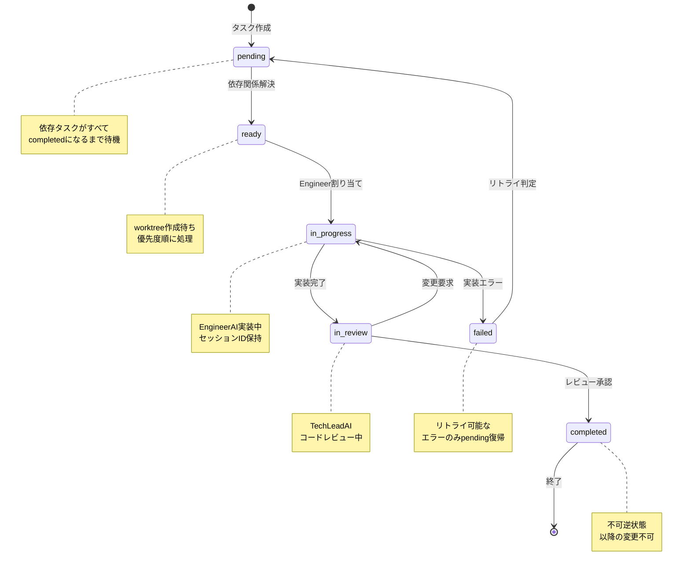

# Task State Machine Specification

**プロジェクト**: Kugutsu 2.0 - AI Parallel Development System
**バージョン**: 1.0.0
**最終更新**: 2025-11-06
**対象**: タスクステータス状態遷移ルール
**ステータス**: Draft

---

## 1. 概要

本仕様書は、Kugutsu 2.0におけるタスクステータスの状態遷移ルール（State Machine）を定義します。6列Kanbanボード(`pending`, `ready`, `in_progress`, `in_review`, `completed`, `failed`)の各ステータス間の遷移条件と制約を明確化し、データ整合性を保証します。

### 1.1 設計原則

1. **明確な遷移ルール**: すべての状態遷移は事前に定義された条件を満たす必要がある
2. **不可逆性の保証**: 完了(`completed`)後の変更は禁止
3. **依存関係の尊重**: 依存関係が解決されるまで実行不可
4. **エラーからのリカバリ**: `failed`状態からの再試行を許可

---

## 2. ステータス定義

### 2.1 6列Kanbanステータス

| Status | 日本語 | 説明 |
|--------|--------|------|
| `pending` | 待機中 | 依存関係未解決。実行待ち状態 |
| `ready` | 準備完了 | 依存関係解決済み。すぐに実行可能 |
| `in_progress` | 実装中 | EngineerAIが実装作業中 |
| `in_review` | レビュー中 | TechLeadAIによるコードレビュー中 |
| `completed` | 完了 | レビュー承認済み。完了状態（終端） |
| `failed` | 失敗 | 実装失敗または致命的エラー |

---

## 3. 状態遷移図

### 3.1 Mermaid状態図



---

## 4. 状態遷移ルール

### 4.1 遷移テーブル

| From State | To State | Condition | Trigger Node | Notes |
|------------|----------|-----------|--------------|-------|
| `pending` | `ready` | すべての依存タスクが`completed` | EngineerDispatchNode | 自動遷移 |
| `ready` | `in_progress` | worktree作成完了 AND Engineer割り当て成功 | EngineerDispatchNode | worktreePath設定 |
| `in_progress` | `in_review` | EngineerAI実装完了 | EngineerNode | sessionId保持 |
| `in_progress` | `failed` | 実装エラー（リトライ回数超過） | EngineerNode | エラーログ記録 |
| `in_review` | `in_progress` | レビュー不合格（変更要求） | ReviewNode | コメント付与 |
| `in_review` | `completed` | レビュー承認 | ReviewNode | completedTasks追加 |
| `failed` | `pending` | リトライ可能エラー AND 手動承認 | Manual/ConflictResolverNode | 依存関係リセット |

### 4.2 禁止される遷移

以下の遷移は**厳密に禁止**されます:

| From | To | Reason |
|------|----|----|
| `completed` | 任意 | 完了後の変更は不可（不可逆性） |
| `ready` | `pending` | 依存関係解決は不可逆 |
| `in_review` | `failed` | レビュー不合格は`in_progress`に戻す |
| `failed` | `ready` | `pending`経由で依存関係再チェック必須 |
| `failed` | `in_review` | 実装が必要 |
| 任意 | `ready` | `pending`からのみ遷移可能 |

---

## 5. 遷移条件の詳細

### 5.1 pending → ready

**条件**:
```typescript
function canTransitionToReady(task: Task, allTasks: Task[]): boolean {
  // すべての依存タスクがcompletedであること
  return task.dependencies.every(depId => {
    const depTask = allTasks.find(t => t.id === depId);
    return depTask && depTask.status === 'completed';
  });
}
```

**実行タイミング**: EngineerDispatchNode実行時に自動チェック

**State更新**:
```typescript
{
  ...task,
  status: 'ready',
  updatedAt: new Date().toISOString()
}
```

---

### 5.2 ready → in_progress

**条件**:
```typescript
function canTransitionToInProgress(task: Task): boolean {
  // readyステータスであること
  // worktreeが作成可能であること
  return task.status === 'ready' && task.worktreePath === null;
}
```

**実行タイミング**: EngineerDispatchNodeでworktree作成後

**State更新**:
```typescript
{
  ...task,
  status: 'in_progress',
  worktreePath: '/path/to/worktree',
  branchName: `task/${task.id}`,
  assignedEngineer: 'EngineerAI-1',
  updatedAt: new Date().toISOString()
}
```

---

### 5.3 in_progress → in_review

**条件**:
```typescript
function canTransitionToInReview(task: Task): boolean {
  // in_progressステータスであること
  // EngineerAIが実装を完了したこと
  return task.status === 'in_progress' && task.sessionId !== null;
}
```

**実行タイミング**: EngineerNode実装完了時

**State更新**:
```typescript
{
  ...task,
  status: 'in_review',
  updatedAt: new Date().toISOString()
}
```

---

### 5.4 in_review → in_progress (変更要求)

**条件**:
```typescript
function canRequestChanges(task: Task, review: Review): boolean {
  // in_reviewステータスであること
  // レビューで問題が発見されたこと
  return task.status === 'in_review' && review.status === 'changes_requested';
}
```

**実行タイミング**: ReviewNode実行時

**State更新**:
```typescript
{
  ...task,
  status: 'in_progress', // 実装に戻る
  updatedAt: new Date().toISOString()
}
```

---

### 5.5 in_review → completed (承認)

**条件**:
```typescript
function canComplete(task: Task, review: Review): boolean {
  // in_reviewステータスであること
  // レビューが承認されたこと
  return task.status === 'in_review' && review.status === 'approved';
}
```

**実行タイミング**: ReviewNode実行時

**State更新**:
```typescript
{
  ...task,
  status: 'completed',
  updatedAt: new Date().toISOString()
}

// completedTasks配列に追加
state.completedTasks.push(task);
```

---

### 5.6 in_progress → failed

**条件**:
```typescript
function canFail(task: Task, error: Error): boolean {
  // in_progressステータスであること
  // リトライ回数を超過したこと
  return task.status === 'in_progress' && isUnrecoverableError(error);
}
```

**実行タイミング**: EngineerNode実装エラー時

**State更新**:
```typescript
{
  ...task,
  status: 'failed',
  updatedAt: new Date().toISOString()
}

// failedTasks配列に追加
state.failedTasks.push(task);
```

---

### 5.7 failed → pending (リトライ)

**条件**:
```typescript
function canRetry(task: Task): boolean {
  // failedステータスであること
  // リトライ可能なエラーであること
  // 手動承認またはConflictResolver判定
  return task.status === 'failed' && isRetryableError(task);
}
```

**実行タイミング**: 手動操作またはConflictResolverNode

**State更新**:
```typescript
{
  ...task,
  status: 'pending',
  worktreePath: null,
  branchName: null,
  sessionId: null,
  assignedEngineer: null,
  updatedAt: new Date().toISOString()
}

// failedTasks配列から削除
state.failedTasks = state.failedTasks.filter(t => t.id !== task.id);
```

---

## 6. TaskStateMachine実装仕様

### 6.1 クラス定義

**ファイル**: `src/utils/TaskStateMachine.ts`

```typescript
export type TaskStatus =
  | 'pending'
  | 'ready'
  | 'in_progress'
  | 'in_review'
  | 'completed'
  | 'failed';

export interface Task {
  id: string;
  status: TaskStatus;
  dependencies: string[];
  worktreePath?: string;
  branchName?: string;
  sessionId?: string;
  assignedEngineer?: string;
  // ... other fields
}

export interface StateTransitionRule {
  from: TaskStatus;
  to: TaskStatus;
  validate: (task: Task, context?: any) => boolean;
  description: string;
}

/**
 * タスクステータス状態マシン
 * 状態遷移のバリデーションと実行を管理
 */
export class TaskStateMachine {
  /**
   * 許可された状態遷移のマップ
   */
  private static readonly transitions: Map<TaskStatus, TaskStatus[]> = new Map([
    ['pending', ['ready']],
    ['ready', ['in_progress']],
    ['in_progress', ['in_review', 'failed']],
    ['in_review', ['in_progress', 'completed']],
    ['failed', ['pending']],
    ['completed', []] // 終端状態: 遷移不可
  ]);

  /**
   * 状態遷移が可能かチェック
   */
  static canTransition(from: TaskStatus, to: TaskStatus): boolean {
    const allowedTransitions = this.transitions.get(from);
    return allowedTransitions?.includes(to) || false;
  }

  /**
   * 状態遷移をバリデーション（例外スロー）
   */
  static validateTransition(task: Task, newStatus: TaskStatus): void {
    if (!this.canTransition(task.status, newStatus)) {
      throw new InvalidStateTransitionError(
        `Invalid status transition: ${task.status} → ${newStatus} for task ${task.id}`
      );
    }
  }

  /**
   * 安全な状態遷移実行
   */
  static transition(task: Task, newStatus: TaskStatus, context?: any): Task {
    this.validateTransition(task, newStatus);

    // 遷移ごとの追加処理
    const updatedTask = { ...task, status: newStatus, updatedAt: new Date().toISOString() };

    switch (`${task.status}->${newStatus}`) {
      case 'ready->in_progress':
        // worktreePath, branchNameは呼び出し元で設定済みと仮定
        if (!updatedTask.worktreePath || !updatedTask.branchName) {
          throw new Error('worktreePath and branchName must be set before transitioning to in_progress');
        }
        break;

      case 'failed->pending':
        // リセット処理
        updatedTask.worktreePath = null;
        updatedTask.branchName = null;
        updatedTask.sessionId = null;
        updatedTask.assignedEngineer = null;
        break;

      case 'in_review->completed':
        // 完了処理（特になし、呼び出し元でcompletedTasksに追加）
        break;

      default:
        // その他の遷移は追加処理なし
        break;
    }

    return updatedTask;
  }

  /**
   * pending → ready への遷移条件チェック
   */
  static canMoveToReady(task: Task, allTasks: Task[]): boolean {
    if (task.status !== 'pending') return false;

    // すべての依存タスクがcompletedであること
    return task.dependencies.every(depId => {
      const depTask = allTasks.find(t => t.id === depId);
      return depTask && depTask.status === 'completed';
    });
  }

  /**
   * 許可された次のステータス一覧を取得
   */
  static getNextStates(currentStatus: TaskStatus): TaskStatus[] {
    return this.transitions.get(currentStatus) || [];
  }

  /**
   * 状態マシンのグラフ表現を取得（デバッグ用）
   */
  static getStateMachineGraph(): string {
    let graph = 'digraph TaskStateMachine {\n';

    this.transitions.forEach((toStates, fromState) => {
      toStates.forEach(toState => {
        graph += `  ${fromState} -> ${toState};\n`;
      });
    });

    graph += '}';
    return graph;
  }
}

/**
 * 無効な状態遷移エラー
 */
export class InvalidStateTransitionError extends Error {
  constructor(message: string) {
    super(message);
    this.name = 'InvalidStateTransitionError';
  }
}
```

---

## 7. ノードでの使用例

### 7.1 EngineerDispatchNode

```typescript
import { TaskStateMachine } from '../../utils/TaskStateMachine';

export async function engineerDispatchNode(
  state: ParallelDevStateType
): Promise<Partial<ParallelDevStateType>> {
  const { tasks, completedTasks, config } = state;

  // 1. pending → ready への遷移チェック
  const tasksToMarkReady = tasks.filter(task =>
    TaskStateMachine.canMoveToReady(task, tasks)
  );

  const readyTasks: Task[] = tasksToMarkReady.map(task =>
    TaskStateMachine.transition(task, 'ready')
  );

  // 2. ready → in_progress への遷移
  const allReadyTasks = tasks.filter(t => t.status === 'ready').concat(readyTasks);
  allReadyTasks.sort((a, b) => b.priority - a.priority);

  const tasksToExecute = allReadyTasks.slice(0, config.maxEngineers);
  const updatedTasks: Task[] = [];

  for (const task of tasksToExecute) {
    // Worktree作成
    const branchName = `task/${task.id}`;
    const worktreePath = await gitWorktreeManager.createWorktree(/*...*/);

    // 状態遷移（worktreePathとbranchNameを設定してから）
    const taskWithWorktree = { ...task, worktreePath, branchName };
    const transitionedTask = TaskStateMachine.transition(taskWithWorktree, 'in_progress');

    updatedTasks.push(transitionedTask);
  }

  return {
    tasks: [...readyTasks, ...updatedTasks],
    // ...
  };
}
```

### 7.2 EngineerNode

```typescript
export async function engineerNode(
  state: ParallelDevStateType,
  taskId: string
): Promise<Partial<ParallelDevStateType>> {
  const task = state.tasks.find(t => t.id === taskId);

  try {
    // 実装処理
    // ...

    // in_progress → in_review への遷移
    const updatedTask = TaskStateMachine.transition(task, 'in_review');

    return {
      tasks: [updatedTask],
      logs: [/*...*/]
    };

  } catch (error) {
    // in_progress → failed への遷移
    const failedTask = TaskStateMachine.transition(task, 'failed');

    return {
      tasks: [failedTask],
      failedTasks: [failedTask],
      logs: [/*...*/]
    };
  }
}
```

### 7.3 ReviewNode

```typescript
export async function reviewNode(
  state: ParallelDevStateType,
  taskId: string
): Promise<Partial<ParallelDevStateType>> {
  const task = state.tasks.find(t => t.id === taskId);

  // レビュー実行
  const review = await performReview(task);

  if (review.status === 'approved') {
    // in_review → completed への遷移
    const completedTask = TaskStateMachine.transition(task, 'completed');

    return {
      tasks: [completedTask],
      completedTasks: [completedTask],
      reviews: [review],
      logs: [/*...*/]
    };
  } else {
    // in_review → in_progress への遷移（変更要求）
    const taskBackToProgress = TaskStateMachine.transition(task, 'in_progress');

    return {
      tasks: [taskBackToProgress],
      reviews: [review],
      logs: [/*...*/]
    };
  }
}
```

---

## 8. テスト仕様

### 8.1 単体テスト

**ファイル**: `tests/utils/TaskStateMachine.test.ts`

```typescript
describe('TaskStateMachine', () => {
  describe('canTransition', () => {
    it('should allow pending -> ready', () => {
      expect(TaskStateMachine.canTransition('pending', 'ready')).toBe(true);
    });

    it('should disallow completed -> pending', () => {
      expect(TaskStateMachine.canTransition('completed', 'pending')).toBe(false);
    });

    it('should disallow ready -> pending', () => {
      expect(TaskStateMachine.canTransition('ready', 'pending')).toBe(false);
    });
  });

  describe('validateTransition', () => {
    it('should throw on invalid transition', () => {
      const task: Task = { id: 'task-1', status: 'completed', dependencies: [] };

      expect(() => {
        TaskStateMachine.validateTransition(task, 'pending');
      }).toThrow(InvalidStateTransitionError);
    });
  });

  describe('canMoveToReady', () => {
    it('should return true when all dependencies are completed', () => {
      const allTasks: Task[] = [
        { id: 'task-1', status: 'completed', dependencies: [] },
        { id: 'task-2', status: 'completed', dependencies: [] },
        { id: 'task-3', status: 'pending', dependencies: ['task-1', 'task-2'] }
      ];

      expect(TaskStateMachine.canMoveToReady(allTasks[2], allTasks)).toBe(true);
    });

    it('should return false when some dependencies are not completed', () => {
      const allTasks: Task[] = [
        { id: 'task-1', status: 'completed', dependencies: [] },
        { id: 'task-2', status: 'in_progress', dependencies: [] },
        { id: 'task-3', status: 'pending', dependencies: ['task-1', 'task-2'] }
      ];

      expect(TaskStateMachine.canMoveToReady(allTasks[2], allTasks)).toBe(false);
    });
  });
});
```

---

## 9. エラーハンドリング

### 9.1 無効な遷移の検出

```typescript
try {
  const updatedTask = TaskStateMachine.transition(task, newStatus);
  // 成功
} catch (error) {
  if (error instanceof InvalidStateTransitionError) {
    // 無効な遷移をログに記録
    logger.error(`Invalid state transition attempt: ${error.message}`, {
      taskId: task.id,
      currentStatus: task.status,
      attemptedStatus: newStatus
    });

    // Rollback or alert
  }
}
```

### 9.2 データ整合性チェック

```typescript
// 定期的な整合性チェック
function validateTaskConsistency(tasks: Task[]): void {
  tasks.forEach(task => {
    // 禁止された状態の検出
    if (task.status === 'completed' && task.dependencies.some(depId => {
      const dep = tasks.find(t => t.id === depId);
      return dep && dep.status !== 'completed';
    })) {
      throw new Error(`Inconsistent state: task ${task.id} is completed but has uncompleted dependencies`);
    }
  });
}
```

### 9.3 スプリント関連状態遷移

#### スプリント割り当て

```typescript
// タスクをスプリントに割り当て
static assignToSprint(task: GlobalTask, sprintId: string): GlobalTask {
  if (task.status === 'completed' || task.status === 'failed') {
    throw new InvalidStateTransitionError(
      `完了済み/失敗タスクはスプリントに割り当てできません: ${task.id}`
    );
  }
  return { ...task, sprint: sprintId };
}
```

#### スプリント完了検証

```typescript
// スプリント内の全タスクが完了しているか確認
static validateSprintCompletion(tasks: GlobalTask[], sprintId: string): boolean {
  const sprintTasks = tasks.filter(t => t.sprint === sprintId);
  return sprintTasks.every(t => t.status === 'completed' || t.status === 'failed');
}
```

---

## 10. まとめ

本仕様書により、タスクステータスの状態遷移が明確に定義され、以下が保証されます:

1. **予測可能性**: すべての状態遷移が事前定義済み
2. **データ整合性**: 不正な遷移を防ぐバリデーション
3. **デバッグ容易性**: 状態マシンの可視化とテスト
4. **拡張性**: 新しいステータスや遷移の追加が容易

---

**最終更新**: 2025-11-05
**バージョン**: 1.0.0
**承認**: 待機中
