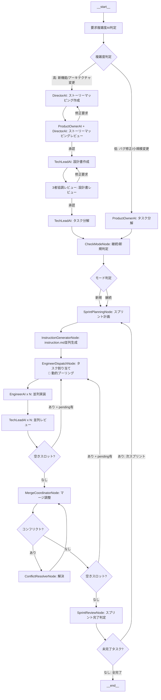

# Unified Scrum Workflow Specification

**プロジェクト**: Kugutsu 2.0 - AI Parallel Development System
**バージョン**: 2.0.0
**最終更新**: 2025-01-09
**対象**: 単一統合Scrumワークフローへのリファクタリング
**ステータス**: Draft

---

## 1. 概要

### 1.1 現状の問題

現在のKugutsu 2.0には、3つの独立したワークフローグラフが存在します：

1. **Parallel Development Graph** (`createParallelDevGraph`)
   - 標準並列開発フロー
   - product_owner → engineer → review → merge

2. **Sprint-Driven Graph** (`createSprintDrivenGraph`)
   - スプリント駆動開発フロー
   - check_mode → sprint_planning → engineer → review → merge → sprint_review

3. **Scrum Development Graph** (`createScrumDevGraph`)
   - Scrum完全フロー
   - director_ai → tech_lead_design → task_breakdown → engineer → review → merge

**問題点**:
- ❌ 3つの異なるワークフローが存在するという誤った設計
- ❌ "Sprint" と "Parallel" をワークフローの種類として扱っている
- ❌ コードの重複（Engineer/Review wrapperが3箇所に存在）
- ❌ ステータス不整合（Sprint/ScrumのReview wrapperが `completed` を期待するが、EngineerNodeは `in_review` に遷移）
- ❌ 保守性の低下（3つのグラフを別々にメンテナンス）

### 1.2 正しい設計

**ワークフローは1つだけ：Scrumワークフロー**

- **Sprint（スプリント）**: Scrumの一要素
  - スプリント計画 → 実装 → スプリントレビューのサイクル
  - 8-16時間単位の開発イテレーション

- **Parallel（並列実行）**: 実装方法
  - 複数のエンジニアやTech Leadが同時に動く
  - タスクの並列実装、並列レビュー

- **要求の複雑さによる条件分岐**:
  - 簡単な要求（バグ修正など）: ストーリーマッピング・設計フェーズをスキップ
  - 複雑な要求（新機能など）: 完全なScrumフローを実行

### 1.3 設計原則

本仕様書では、以下の原則に基づいて単一の統合Scrumワークフローを定義します：

1. **AI完全自律**: 人間は最初の開発指示のみを与え、その後の全ての意思決定、実装、レビュー、改善はAIが自律的に行う
2. **単一ワークフロー**: グラフは1つのみ
3. **条件分岐による柔軟性**: ユーザー要求の複雑さに応じて前半フェーズをスキップ
4. **並列実行の最大化**: Engineer/Reviewノードは常に並列実行
5. **スプリント駆動**: スプリントは機能完成の最小単位として管理
   - スプリント完了 = E2Eテストが通り、ユーザーが実際に触れる状態
   - 時間管理やVelocityは使用せず、機能の完全性を基準とする
6. **AI駆動判定**: 要求の複雑さ、優先度、計画はAIが自動判定

---

## 2. ワークフロー全体図

### 2.1 統合Scrumワークフロー（Mermaid）



### 2.2 実行パターン

#### パターンA: 簡単な要求（バグ修正、小規模変更）

```
要求複雑度判定 → ProductOwner → CheckMode → SprintPlanning → Engineer → Review → Merge → SprintReview → END
```

**実行時間**: 最短（ストーリーマッピング・設計フェーズをスキップ）

#### パターンB: 複雑な要求（新機能、アーキテクチャ変更）

```
要求複雑度判定 → Director → ReviewStoryMapping → TechLeadDesign → ReviewDesign → TaskBreakdown
→ CheckMode → SprintPlanning → Engineer → Review → Merge → SprintReview → END
```

**実行時間**: フル（完全なScrumプロセス）

#### パターンC: 継続開発

```
要求複雑度判定 → ProductOwner → CheckMode（継続検出）→ SprintPlanning → Engineer → ...
```

**特徴**: 既存のタスクキューを読み込んで継続

---

## 3. ノード定義

### 3.1 ノード一覧

| # | ノード名 | カテゴリ | 実行条件 | 責務 |
|---|---------|---------|---------|------|
| 1 | `analyze_complexity` | 判定 | 常に実行 | 要求の複雑度をAI判定 |
| 2 | `director_ai` | 設計 | 複雑度：高 | ストーリーマッピング作成 |
| 3 | `review_story_mapping` | レビュー | 複雑度：高 | ストーリーマッピングレビュー |
| 4 | `tech_lead_design` | 設計 | 複雑度：高 | 設計書作成 |
| 5 | `review_design` | レビュー | 複雑度：高 | 3者協調設計レビュー |
| 6 | `task_breakdown` | 設計 | 複雑度：高 | タスク分解（設計後） |
| 7 | `product_owner` | 設計 | 複雑度：低 | タスク分解（直接） |
| 8 | `check_mode` | 判定 | 常に実行 | 継続/新規モード判定 |
| 9 | `sprint_planning` | 計画 | 常に実行 | スプリント計画（8-16h単位） |
| 10 | `instruction_generator` | 統合 | 常に実行 | スプリントスコープのタスクについてinstruction.md並列生成 |
| 11 | `engineer_dispatch` | 統合 | 常に実行（動的プーリング） | タスク割り当て、worktree管理、動的タスクプーリング |
| 12 | `engineer` | 実装 | 常に実行（並列） | タスク実装 |
| 13 | `review` | レビュー | 常に実行（並列） | コードレビュー、完了時にdispatchに戻る |
| 14 | `merge_coordinator` | 統合 | 常に実行 | マージ調整、完了時にdispatchに戻る |
| 15 | `conflict_resolver` | 解決 | コンフリクト時 | コンフリクト解決 |
| 15 | `sprint_review` | 判定 | 常に実行 | スプリント完了判定、次スプリント生成 |

### 3.2 新規ノード詳細

#### 3.2.1 AnalyzeComplexityNode（要求複雑度判定）

**ファイル**: `src/graph/nodes/AnalyzeComplexityNode.ts`

**責務**:
- ユーザー要求を分析し、複雑度を判定
- 判定基準:
  - **低複雑度**: バグ修正、小規模機能追加、ドキュメント更新
  - **高複雑度**: 新規機能、アーキテクチャ変更、大規模リファクタリング

**入力**:
- `state.userRequest`
- リポジトリの現状（既存ファイル、package.json等）

**出力**:
```typescript
{
  metadata: {
    requiresDetailedDesign: boolean, // true: 設計フェーズ実行, false: スキップ
    complexityReason: string,        // 判定理由
  }
}
```

**判定ロジック**:
```typescript
// AI分析による判定
const prompt = `
以下のユーザー要求を分析し、詳細設計が必要かどうか判定してください：

ユーザー要求: ${state.userRequest}

判定基準:
- 詳細設計が必要: 新規機能、複数モジュール変更、アーキテクチャ変更
- 詳細設計不要: バグ修正、小規模変更、既存機能の調整

結果を以下の形式で出力してください:
REQUIRES_DETAILED_DESIGN: true または false
REASON: 判定理由
`;
```

### 3.3 既存ノードの統合

#### 3.3.1 Engineer Wrapper（統合版）

```typescript
.addNode('engineer', async (state: ParallelDevStateType) => {
  const inProgressTasks = state.tasks.filter((t) => t.status === 'in_progress');

  if (inProgressTasks.length === 0) {
    return {
      logs: [{
        timestamp: new Date(),
        level: 'info',
        source: 'EngineerWrapper',
        message: '実行可能なタスクがありません',
      }],
    };
  }

  console.log(`👷 ${inProgressTasks.length}個のタスクを並列実装中...`);

  // 並列実行（allSettled）
  const taskResults = await Promise.allSettled(
    inProgressTasks.map((task) => engineerNode(state, task.id))
  );

  // 結果を集約
  const results = {
    tasks: [] as any[],
    completedTasks: [] as any[],
    failedTasks: [] as any[],
    logs: [] as any[],
    metadata: {},
  };

  for (const settledResult of taskResults) {
    if (settledResult.status === 'fulfilled') {
      const result = settledResult.value;
      if (result.tasks) results.tasks.push(...result.tasks);
      if (result.completedTasks) results.completedTasks.push(...result.completedTasks);
      if (result.failedTasks) results.failedTasks.push(...result.failedTasks);
      if (result.logs) results.logs.push(...result.logs);
      if (result.metadata) results.metadata = { ...results.metadata, ...result.metadata };
    } else {
      results.logs.push({
        timestamp: new Date(),
        level: 'error' as const,
        source: 'EngineerWrapper',
        message: `タスク実行エラー: ${settledResult.reason?.message || settledResult.reason}`,
        data: { error: settledResult.reason },
      });
    }
  }

  return results;
})
```

**重要**: この実装は3つのグラフ全てで共通化される

#### 3.3.2 Review Wrapper（統合版・ステータス修正）

```typescript
.addNode('review', async (state: ParallelDevStateType) => {
  // ✅ 修正: 'completed' → 'in_review'
  const completedTasks = state.tasks.filter(
    (t) =>
      t.status === 'in_review' && // EngineerNodeの遷移と整合
      !state.reviews.some((r) => r.taskId === t.id)
  );

  if (completedTasks.length === 0) {
    return {
      logs: [{
        timestamp: new Date(),
        level: 'info',
        source: 'ReviewWrapper',
        message: 'レビュー対象のタスクがありません',
      }],
    };
  }

  console.log(`🔍 ${completedTasks.length}個のタスクを並列レビュー中...`);

  // 並列実行（allSettled）
  const reviewResults = await Promise.allSettled(
    completedTasks.map((task) => reviewNode(state, task.id))
  );

  // 結果を集約
  const results = {
    tasks: [] as any[],
    completedTasks: [] as any[],
    reviews: [] as any[],
    logs: [] as any[],
  };

  for (const settledResult of reviewResults) {
    if (settledResult.status === 'fulfilled') {
      const result = settledResult.value;
      if (result.tasks) results.tasks.push(...result.tasks);
      if (result.completedTasks) results.completedTasks.push(...result.completedTasks);
      if (result.reviews) results.reviews.push(...result.reviews);
      if (result.logs) results.logs.push(...result.logs);
    } else {
      results.logs.push({
        timestamp: new Date(),
        level: 'error' as const,
        source: 'ReviewWrapper',
        message: `レビュー実行エラー: ${settledResult.reason?.message || settledResult.reason}`,
        data: { error: settledResult.reason },
      });
    }
  }

  return results;
})
```

**修正ポイント**: `t.status === 'in_review'` に統一（ステータス不整合の解消）

### 3.4 動的タスクプーリング（Dynamic Task Pooling）

**バージョン**: 1.0.0
**導入日**: 2025-11-10
**対象ノード**: EngineerDispatchNode, ReviewNode, MergeCoordinatorNode

#### 3.4.1 概要

動的タスクプーリングは、タスクが完了した瞬間に次のタスクを自動的に開始する仕組みです。従来のバッチ処理では、全タスクが完了するまで次のタスクグループを開始できませんでしたが、動的プーリングにより**リソースの空きが発生した瞬間に次のタスクを開始**できます。

**効果**:
- ⏱️ 実行時間20-30%短縮
- 📈 リソース効率100%（アイドル時間ゼロ）
- 🔒 依存関係の厳格な遵守

#### 3.4.2 依存関係チェック

動的プーリングでも、依存関係は厳密に守られます：

- `TaskStateMachine.canMoveToReady(task, tasks)`を使用
- すべての依存タスクが**`completed`**（レビュー承認・マージ完了）であることを要求
- `in_progress`や`in_review`のタスクに依存している場合は開始不可

**具体例**:
```
Task1 (2h) → 完了
Task2 (8h, in_progress) ← Task6はこれに依存
Task3-5 (in_progress)
Task6 (pending, depends on Task2)

→ Task1完了後も Task6 は開始されない（Task2が完了するまで待機）
→ Task2完了後、初めてTask6がディスパッチされる
```

#### 3.4.3 性能比較

**シナリオ**: 6タスク、maxEngineers=5

| 項目 | 従来（バッチ） | 動的プーリング | 改善率 |
|------|-------------|--------------|-------|
| **実行時間** | 12h | 10h | **20%短縮** |
| **アイドル時間** | 6h | 0h | **100%削減** |
| **リソース効率** | 67% | 100% | **+33%** |

**詳細**: [DYNAMIC_TASK_POOLING_SPECIFICATION.md](./DYNAMIC_TASK_POOLING_SPECIFICATION.md)を参照

---

## 4. 状態遷移

### 4.1 タスクステータス遷移

```
pending → in_progress → in_review → completed
                     ↘
                       failed
```

**遷移ルール**:
- `pending → in_progress`: EngineerDispatchNodeが実行
- `in_progress → in_review`: EngineerNodeが実装完了時に実行
- `in_review → completed`: ReviewNodeが承認時に実行
- `in_review → in_progress`: ReviewNodeが変更要求時に実行（再実装）
- `in_progress → failed`: EngineerNodeがエラー時に実行

### 4.2 Metadata による制御フロー

#### 4.2.1 requiresDetailedDesign（新規）

```typescript
metadata: {
  requiresDetailedDesign: boolean;  // 詳細設計フェーズ実行フラグ
  complexityReason?: string;        // 判定理由
}
```

**使用箇所**:
- AnalyzeComplexityNode: 設定
- 条件分岐エッジ: 参照してルーティング

#### 4.2.2 continuationMode

```typescript
metadata: {
  continuationMode: boolean;  // 継続モードフラグ
}
```

**使用箇所**:
- CheckModeNode: 検出・設定
- 条件分岐エッジ: 新規/継続を判定

#### 4.2.3 activeSprint

```typescript
metadata: {
  activeSprint?: {
    id: string;
    status: 'active' | 'completed';
    tasks: string[];
    estimatedHours: number;
  }
}
```

**使用箇所**:
- SprintPlanningNode: 作成
- SprintReviewNode: 完了判定

### 4.3 条件分岐ロジック

#### 4.3.1 要求複雑度による分岐

```typescript
workflow.addConditionalEdges(
  'analyze_complexity',
  (state: ParallelDevStateType) => {
    return state.metadata.requiresDetailedDesign ? 'detailed_design' : 'simple_task';
  },
  {
    detailed_design: 'director_ai',      // 複雑: Scrumフル実行
    simple_task: 'product_owner',        // 簡単: 直接タスク分解
  }
);
```

#### 4.3.2 継続モードによる分岐

```typescript
workflow.addConditionalEdges(
  'check_mode',
  (state: ParallelDevStateType) => {
    return state.metadata.continuationMode ? 'continuation' : 'new';
  },
  {
    continuation: 'sprint_planning',  // 継続: 既存タスク読み込み
    new: 'sprint_planning',          // 新規: 新しいスプリント
  }
);
```

**注**: 現状は両方とも `sprint_planning` に進むが、将来的に差別化可能

#### 4.3.3 ストーリーマッピングレビュー

```typescript
workflow.addConditionalEdges(
  'review_story_mapping',
  (state: ParallelDevStateType) => {
    return state.storyMappingApproved ? 'approved' : 'revision_needed';
  },
  {
    approved: 'tech_lead_design',
    revision_needed: 'director_ai',  // ループバック
  }
);
```

#### 4.3.4 設計レビュー

```typescript
workflow.addConditionalEdges(
  'review_design',
  (state: ParallelDevStateType) => {
    if (!state.reviewFeedback || state.reviewFeedback.issues.length === 0) {
      return 'approved';
    } else {
      const hasCriticalOrMajor = state.reviewFeedback.issues.some(
        (issue) => issue.severity === 'critical' || issue.severity === 'major'
      );
      return hasCriticalOrMajor ? 'revision_needed' : 'approved';
    }
  },
  {
    approved: 'task_breakdown',
    revision_needed: 'tech_lead_design',  // ループバック
  }
);
```

#### 4.3.5 マージコンフリクト

```typescript
workflow.addConditionalEdges(
  'merge_coordinator',
  (state: ParallelDevStateType) => {
    const conflicts = state.mergeQueue.filter((m) => m.status === 'conflict');
    if (conflicts.length > 0) {
      return 'has_conflicts';
    }

    const pendingTasks = state.tasks.filter((t) => t.status === 'pending');
    return pendingTasks.length > 0 ? 'has_pending' : 'sprint_review';
  },
  {
    has_conflicts: 'conflict_resolver',
    has_pending: 'engineer_dispatch',
    sprint_review: 'sprint_review',
  }
);
```

#### 4.3.6 スプリント完了判定

```typescript
workflow.addConditionalEdges(
  'sprint_review',
  (state: ParallelDevStateType) => {
    const allTasksSettled = state.tasks.every(
      (t) => t.status === 'completed' || t.status === 'failed'
    );

    if (allTasksSettled) {
      return 'all_done';
    }

    // 未完了タスクあり → 次スプリント
    return 'next_sprint';
  },
  {
    next_sprint: 'sprint_planning',
    all_done: '__end__',
  }
);
```

---

## 5. タスクバックログ管理

### 5.1 Product Backlog（globalTasks）

**定義**: `state.globalTasks: GlobalTask[]`

**役割**:
- 全プロジェクトの全タスクを管理するグローバルキュー
- スプリント未割り当てタスク（`sprint: undefined`）が**Product Backlog**に相当
- 永続化先: `.kugutsu/tasks/global-queue.json`

**型定義** (`src/types/index.ts`):
```typescript
export interface GlobalTask {
  id: string;
  title: string;
  description: string;
  priority: number;               // 基礎優先度（0-100）
  dependencies: string[];
  status: 'pending' | 'in_progress' | 'completed' | 'failed';

  projectId: string;              // プロジェクト識別子
  requestTimestamp: Date;         // リクエスト受付時刻
  dynamicPriority: number;        // 動的優先度（0-1000）
  sprint?: string;                // 所属スプリントID（undefined = バックログ）
  storyId?: string;               // 関連するユーザーストーリーID
}
```

**バックログ判定ロジック**:
```typescript
// 未割り当てタスク（Product Backlog）の取得
const backlog = state.globalTasks.filter(
  task => !task.sprint &&
          task.status !== 'completed' &&
          task.status !== 'failed'
);
```

### 5.2 Sprint Backlog

**定義**: `state.activeSprint.taskIds` + `globalTasks`の該当タスク

**役割**:
- 現在のスプリントで実行するタスクのリスト
- `SprintPlanningNode`がバックログから選択して作成
- `globalTasks`の`sprint`フィールドに現在のスプリントIDを設定することで管理

**スプリント割り当てロジック** (`SprintPlanningNode`):
```typescript
// バックログからタスクを選択
const selectedTasks = selectTasksForSprint(backlog, sprintCapacity);

// スプリントIDを付与（Sprint Backlogに追加）
selectedTasks.forEach(task => {
  task.sprint = currentSprintId;  // これでSprint Backlogに所属
});

// activeSprint設定
return {
  metadata: {
    activeSprint: {
      id: currentSprintId,
      status: 'active',
      tasks: selectedTasks.map(t => t.id),
      estimatedHours: calculateEstimatedHours(selectedTasks)
    }
  }
};
```

### 5.3 タスクライフサイクル

**完全フロー図**:
```
┌──────────────────────────────────────────────────┐
│ Phase 1: タスク生成                               │
└──────────────────────────────────────────────────┘
[ProductOwnerNode / TaskBreakdownNode]
    ↓ AIがタスクを生成
state.globalTasks (sprint: undefined, status: 'pending')
    ← ★ Product Backlog

┌──────────────────────────────────────────────────┐
│ Phase 2: スプリント計画                           │
└──────────────────────────────────────────────────┘
[SprintPlanningNode]
    ↓ AIがバックログから優先度順に選択
state.globalTasks (sprint: 'sprint-xxx', status: 'pending')
    ← ★ Sprint Backlog

┌──────────────────────────────────────────────────┐
│ Phase 3: スプリント実行                           │
└──────────────────────────────────────────────────┘
[EngineerDispatchNode]
    ↓ worktree作成、ブランチ割り当て
state.tasks (status: 'in_progress')
    ← ★ 実行キュー（一時的）
    ↓
[EngineerNode] → AIが実装
    ↓
state.tasks (status: 'in_review')
    ↓
[ReviewNode] → AIがレビュー
    ↓
state.globalTasks (status: 'completed')
```

**ステータス遷移**:
```
pending → in_progress → in_review → completed
                     ↘
                       failed
```

### 5.4 globalTasksとtasksの使い分け

| 項目 | `globalTasks` | `tasks` |
|------|---------------|---------|
| **スコープ** | 全プロジェクト、全スプリント | 現在の実行セッションのみ |
| **永続化** | `.kugutsu/tasks/global-queue.json` | `.kugutsu/tasks.json` |
| **ライフタイム** | プロジェクト全体 | ワークフロー実行中のみ |
| **管理ノード** | ProductOwner, TaskBreakdown, SprintPlanning | EngineerDispatch, Engineer, Review |
| **用途** | Product/Sprint Backlog管理 | 実行中タスクの管理 |
| **型定義** | `GlobalTask` (src/types/index.ts) | `Task` (src/graph/types.ts) |

**変換フロー**:
```typescript
// globalTasks（バックログ） → tasks（実行キュー）
// EngineerDispatchNodeで実行
const selectedTask = state.globalTasks.find(t => t.id === taskId);
const executionTask: Task = {
  ...selectedTask,
  worktreePath: `/path/to/worktree`,
  branchName: `task/${taskId}`,
  assignedEngineer: 'engineer-1',
  sessionId: currentSessionId
};

// tasks（実行完了） → globalTasks（完了記録）
// ReviewNodeで実行
state.globalTasks.find(t => t.id === taskId).status = 'completed';
```

### 5.5 スプリント完了基準（AI駆動自律開発）

**スプリント = 機能完成の最小単位**

AI駆動自律開発におけるスプリントは、従来の人間中心のScrumとは異なり、時間管理ではなく機能の完全性を基準とします。

#### 5.5.1 スプリント完了の定義

スプリントが完了したとみなされる条件：

1. **E2Eテストが全て通る**:
   - スプリント内の全機能がE2E（End-to-End）テストで検証済み
   - ユーザー視点での動作確認が完了している

2. **ユーザーが実際に触れる状態**:
   - 開発した機能がデプロイ可能な状態
   - ユーザーインターフェースが完成している
   - 実際の使用シナリオで動作する

3. **Definition of Doneを満たす**:
   - 全タスクが完成の定義（Section 6）を満たしている
   - コンフリクトが全て解決済み
   - マージが完了している

**実装例** (`SprintReviewNode`):
```typescript
async evaluateSprintCompletion(sprint: Sprint): Promise<boolean> {
  // スプリント内の全タスクが完了しているか確認
  const allTasksCompleted = sprint.taskIds.every(taskId => {
    const task = state.globalTasks.find(t => t.id === taskId);
    return task && task.status === 'completed';
  });

  if (!allTasksCompleted) {
    return false;
  }

  // E2Eテスト実行
  const e2eTestsPassed = await this.runE2ETests();

  if (!e2eTestsPassed) {
    return false;
  }

  // デプロイ可能性チェック
  const isDeployable = await this.checkDeployability();

  return isDeployable;
}
```

#### 5.5.2 時間管理とVelocityを使用しない理由

**AI駆動開発では、以下の理由からVelocity（開発速度）の計測は不要です**：

1. **AIは疲労しない**:
   - 人間のように作業時間に制約がない
   - 時間制約（タイムボックス）が意味を持たない

2. **AIは並列実行可能**:
   - 複数のタスクを同時に実行できる
   - タスク数による制限が無意味

3. **完成度のみが重要**:
   - スプリントのゴールは「何個タスクをこなしたか」ではなく「機能が完成しているか」
   - ストーリーポイントや時間見積もりは不要

**従来のScrum（人間中心）**:
```
スプリント = 2週間のタイムボックス
Velocity = 前回スプリントで完了したストーリーポイント
計画 = Velocityに基づいてタスクを選択
```

**AI駆動Scrum（AI完全自律）**:
```
スプリント = 機能完成の最小単位
完了基準 = E2Eテスト合格 + デプロイ可能
計画 = 機能の完全性に基づいてタスクをグループ化
```

#### 5.5.3 スプリントのスコープ決定

**SprintPlanningNode**でのスプリント計画:

```typescript
async planSprint(backlog: GlobalTask[]): Promise<Sprint> {
  // AI分析でスプリントスコープを決定
  const prompt = `
  以下のバックログタスクを分析し、E2Eでテストできる最小の機能セットを選択してください：

  バックログ:
  ${JSON.stringify(backlog, null, 2)}

  選択基準:
  1. 選択したタスクを全て完了すると、ユーザーが実際に触れる機能が完成する
  2. E2Eテストで検証可能
  3. デプロイ可能な状態になる
  4. 依存関係が満たされている

  時間制約は考慮せず、機能の完全性のみを基準としてください。
  `;

  const selectedTasks = await this.analyzeWithAI(prompt);

  return {
    id: generateSprintId(),
    name: selectedTasks.featureName,
    goal: selectedTasks.sprintGoal,
    taskIds: selectedTasks.taskIds,
    status: 'active',
    deployable: false,  // 実行前は未完成
    metadata: {
      estimatedHours: 0,  // 時間見積もり不要
      blockers: [],
      completedTasksCount: 0,
      failedTasksCount: 0,
    }
  };
}
```

**重要**: スプリント計画では、Velocityやストーリーポイントではなく、**「この機能セットが完成すればユーザーが価値を得られるか」**という観点で判断します。

---

## 6. 完成の定義（Definition of Done）

### 6.1 AI自動検証基準

**目的**: タスクが「完成」とみなされるための明確な基準を定義

**自動検証項目**:
```typescript
export interface DefinitionOfDone {
  allTestsPassing: boolean;          // 全テスト合格（npm test）
  codeReviewApproved: boolean;       // AIコードレビュー承認（ReviewNode）
  linterPassing: boolean;            // リンター合格（npm run lint）
  conflictResolved: boolean;         // コンフリクト解決済み
  documentationUpdated?: boolean;    // ドキュメント更新（該当する場合）
}
```

**検証タイミング**:
1. **EngineerNode完了時**: テスト実行、リンターチェック
2. **ReviewNode実行時**: コードレビュー承認
3. **MergeCoordinatorNode実行時**: コンフリクト解決確認

**実装例** (EngineerNode):
```typescript
async completeTask(task: Task): Promise<TaskResult> {
  // 完成の定義を検証
  const testsPassed = await this.runTests(task.worktreePath);
  const linterPassed = await this.runLinter(task.worktreePath);

  if (!testsPassed || !linterPassed) {
    return {
      status: 'failed',
      reason: 'Definition of Done未達成: テストまたはリンターが失敗'
    };
  }

  // 全ての基準を満たした場合のみ in_review に遷移
  return {
    status: 'in_review',
    taskId: task.id
  };
}
```

### 6.2 品質保証の自動化

**AI駆動の品質チェック**:
- **静的解析**: ESLint, TypeScript型チェック
- **動的テスト**: 単体テスト、統合テスト
- **セキュリティスキャン**: npm audit, 依存関係チェック
- **コード品質**: AIレビューによる品質評価

**人間レビュー不要**: AI完全自律のため、人間の承認プロセスは存在しない

---

## 7. 型定義の変更

### 7.1 削除される型

```typescript
// ❌ 削除
export type WorkflowType = 'parallel' | 'sprint' | 'scrum';
```

### 7.2 変更されるインターフェース

#### ParallelDevConfig（変更前）

```typescript
export interface ParallelDevConfig {
  maxEngineers: number;
  maxTurns: number;
  baseBranch: string;
  baseRepoPath: string;
  worktreeBasePath: string;
  cleanup: boolean;
  provider: 'claude' | 'codex' | 'mock';
  workflowType?: WorkflowType;  // ❌ 削除
}
```

#### ParallelDevConfig（変更後）

```typescript
export interface ParallelDevConfig {
  maxEngineers: number;
  maxTurns: number;
  baseBranch: string;
  baseRepoPath: string;
  worktreeBasePath: string;
  cleanup: boolean;
  provider: 'claude' | 'codex' | 'mock';
  // workflowType削除
}
```

### 7.3 拡張されるMetadata

```typescript
export interface Metadata {
  // 既存フィールド
  startedAt?: Date;
  completedAt?: Date;
  phase?: 'analysis' | 'development' | 'review' | 'merge' | 'complete';
  tasksCompleted?: number;
  tasksFailed?: number;
  hasErrors?: boolean;
  errors?: string[];

  // ✅ 新規追加
  requiresDetailedDesign: boolean;  // 詳細設計フェーズ実行フラグ
  complexityReason?: string;        // 複雑度判定理由

  // 既存（変更なし）
  continuationMode?: boolean;
  activeSprint?: {
    id: string;
    status: 'active' | 'completed';
    tasks: string[];
    estimatedHours: number;
  };

  // Scrum関連（既存）
  storyMappingApproved?: boolean;
  reviewFeedback?: {
    issues: Array<{
      severity: 'critical' | 'major' | 'minor';
      description: string;
    }>;
  };
}
```

---

## 8. グラフ構築関数

### 8.1 新しいグラフ構築関数

```typescript
/**
 * Create the unified Scrum workflow graph
 *
 * 単一の統合Scrumワークフローグラフを作成します。
 * 要求の複雑さに応じて、前半フェーズ（ストーリーマッピング・設計）を
 * スキップするか実行するかを条件分岐で制御します。
 *
 * @returns StateGraph instance
 */
export function createUnifiedScrumWorkflowGraph() {
  const workflow = new StateGraph(ParallelDevState);

  // ================================================
  // ノード追加
  // ================================================

  // 要求複雑度判定
  workflow.addNode('analyze_complexity', analyzeComplexityNode);

  // 詳細設計フェーズ（複雑度：高）
  workflow.addNode('director_ai', directorNode);
  workflow.addNode('review_story_mapping', reviewStoryMappingNode);
  workflow.addNode('tech_lead_design', techLeadDesignNode);
  workflow.addNode('review_design', reviewDesignNode);
  workflow.addNode('task_breakdown', taskBreakdownNode);

  // 簡易タスク分解（複雑度：低）
  workflow.addNode('product_owner', productOwnerNode);

  // 継続モード判定
  workflow.addNode('check_mode', checkModeNode);

  // スプリント実行
  workflow.addNode('sprint_planning', sprintPlanningNode);
  workflow.addNode('instruction_generator', instructionGeneratorNode);
  workflow.addNode('engineer_dispatch', engineerDispatchNode);
  workflow.addNode('engineer', createEngineerWrapper());  // 統合版
  workflow.addNode('review', createReviewWrapper());      // 統合版（ステータス修正）
  workflow.addNode('merge_coordinator', mergeCoordinatorNode);
  workflow.addNode('conflict_resolver', conflictResolverNode);
  workflow.addNode('sprint_review', sprintReviewNode);

  // ================================================
  // エッジ定義
  // ================================================

  // START → analyze_complexity
  workflow.addEdge('__start__', 'analyze_complexity');

  // analyze_complexity → [director_ai OR product_owner]
  workflow.addConditionalEdges(
    'analyze_complexity',
    (state: ParallelDevStateType) => {
      return state.metadata.requiresDetailedDesign ? 'detailed_design' : 'simple_task';
    },
    {
      detailed_design: 'director_ai',
      simple_task: 'product_owner',
    }
  );

  // 詳細設計フロー
  workflow.addEdge('director_ai', 'review_story_mapping');

  workflow.addConditionalEdges(
    'review_story_mapping',
    (state: ParallelDevStateType) => {
      return state.storyMappingApproved ? 'approved' : 'revision_needed';
    },
    {
      approved: 'tech_lead_design',
      revision_needed: 'director_ai',
    }
  );

  workflow.addEdge('tech_lead_design', 'review_design');

  workflow.addConditionalEdges(
    'review_design',
    (state: ParallelDevStateType) => {
      if (!state.reviewFeedback || state.reviewFeedback.issues.length === 0) {
        return 'approved';
      } else {
        const hasCriticalOrMajor = state.reviewFeedback.issues.some(
          (issue) => issue.severity === 'critical' || issue.severity === 'major'
        );
        return hasCriticalOrMajor ? 'revision_needed' : 'approved';
      }
    },
    {
      approved: 'task_breakdown',
      revision_needed: 'tech_lead_design',
    }
  );

  workflow.addEdge('task_breakdown', 'check_mode');

  // 簡易フロー
  workflow.addEdge('product_owner', 'check_mode');

  // check_mode → sprint_planning（新規・継続どちらも）
  workflow.addEdge('check_mode', 'sprint_planning');

  // スプリント実行フロー
  workflow.addEdge('sprint_planning', 'instruction_generator');
  workflow.addEdge('instruction_generator', 'engineer_dispatch');

  workflow.addConditionalEdges(
    'engineer_dispatch',
    (state: ParallelDevStateType) => {
      const inProgressTasks = state.tasks.filter((t) => t.status === 'in_progress');
      return inProgressTasks.length > 0 ? 'has_tasks' : 'no_tasks';
    },
    {
      has_tasks: 'engineer',
      no_tasks: 'sprint_review',
    }
  );

  workflow.addEdge('engineer', 'review');
  workflow.addEdge('review', 'merge_coordinator');

  workflow.addConditionalEdges(
    'merge_coordinator',
    (state: ParallelDevStateType) => {
      const conflicts = state.mergeQueue.filter((m) => m.status === 'conflict');
      if (conflicts.length > 0) {
        return 'has_conflicts';
      }

      const pendingTasks = state.tasks.filter((t) => t.status === 'pending');
      return pendingTasks.length > 0 ? 'has_pending' : 'sprint_review';
    },
    {
      has_conflicts: 'conflict_resolver',
      has_pending: 'engineer_dispatch',
      sprint_review: 'sprint_review',
    }
  );

  workflow.addEdge('conflict_resolver', 'merge_coordinator');

  workflow.addConditionalEdges(
    'sprint_review',
    (state: ParallelDevStateType) => {
      const allTasksSettled = state.tasks.every(
        (t) => t.status === 'completed' || t.status === 'failed'
      );
      return allTasksSettled ? 'all_done' : 'next_sprint';
    },
    {
      next_sprint: 'sprint_planning',
      all_done: '__end__',
    }
  );

  return workflow;
}
```

### 8.2 コンパイル関数

```typescript
/**
 * Compile the unified Scrum workflow graph
 *
 * @param options Compilation options
 * @param options.enableCheckpointer Enable state persistence (default: true)
 * @returns Compiled graph ready for execution
 */
export function compileUnifiedScrumWorkflowGraph(options?: { enableCheckpointer?: boolean }) {
  const workflow = createUnifiedScrumWorkflowGraph();

  // デフォルトでcheckpointerを有効化（state persistence）
  if (options?.enableCheckpointer !== false) {
    return workflow.compile({
      checkpointer: new MemorySaver(),
    });
  }

  return workflow.compile();
}

// デフォルトエクスポート
export default compileUnifiedScrumWorkflowGraph;
```

---

## 9. 既存設計との差異

### 9.1 削除される概念

| 項目 | 削除理由 |
|------|---------|
| `WorkflowType` 型 | ワークフローは1つだけ |
| `createParallelDevGraph()` | 統合グラフに吸収 |
| `createSprintDrivenGraph()` | 統合グラフに吸収 |
| `createScrumDevGraph()` | 統合グラフに吸収 |
| `compileParallelDevGraph()` | 統合版に置き換え |
| `compileSprintDrivenGraph()` | 統合版に置き換え |
| `compileScrumDevGraph()` | 統合版に置き換え |
| `config.workflowType` | 不要（AI判定） |

### 9.2 新規追加される概念

| 項目 | 追加理由 |
|------|---------|
| `AnalyzeComplexityNode` | 要求の複雑度を自動判定 |
| `metadata.requiresDetailedDesign` | 設計フェーズ実行フラグ |
| `metadata.complexityReason` | 判定理由の記録 |
| `createUnifiedScrumWorkflowGraph()` | 統合グラフ構築関数 |
| `compileUnifiedScrumWorkflowGraph()` | 統合グラフコンパイル関数 |

### 9.3 変更される動作

| 項目 | 変更前 | 変更後 |
|------|-------|-------|
| ワークフロー選択 | ユーザーが `--workflow-type` で指定 | AIが自動判定 |
| Review Wrapperステータス | Sprint/Scrumは `completed` を期待 | 全て `in_review` に統一 |
| グラフ数 | 3つ | 1つ |
| EngineerDispatch後 | グラフごとに異なるルーティング | 統一されたルーティング |

---

## 10. 後方互換性

### 10.1 破壊的変更

以下の変更は**破壊的変更**であり、既存コードの修正が必要です：

1. **APIの削除**:
   - `compileParallelDevGraph()`
   - `compileSprintDrivenGraph()`
   - `compileScrumDevGraph()`

2. **型の削除**:
   - `WorkflowType`

3. **設定項目の削除**:
   - `ParallelDevConfig.workflowType`

### 10.2 移行ガイド

#### 旧コード

```typescript
// 旧: ワークフロータイプを指定
const graph = workflowType === 'scrum'
  ? compileScrumDevGraph()
  : workflowType === 'sprint'
  ? compileSprintDrivenGraph()
  : compileParallelDevGraph();

const config: ParallelDevConfig = {
  workflowType: 'sprint',
  // ...
};
```

#### 新コード

```typescript
// 新: 常に統合グラフを使用
const graph = compileUnifiedScrumWorkflowGraph({ enableCheckpointer: true });

const config: ParallelDevConfig = {
  // workflowType削除
  // ...
};
```

### 10.3 既存テストへの影響

既存のテストは以下の修正が必要です：

1. グラフ作成のテスト → `createUnifiedScrumWorkflowGraph()` に変更
2. ワークフロータイプのテスト → 削除
3. 条件分岐のテスト → `metadata.requiresDetailedDesign` を使用

---

## 11. 実装の優先度

### 11.1 Phase 1: 基盤準備（必須）

- [ ] `AnalyzeComplexityNode.ts` 実装
- [ ] `metadata.requiresDetailedDesign` 追加
- [ ] `createUnifiedScrumWorkflowGraph()` 実装

### 11.2 Phase 2: Review Wrapper修正（必須）

- [ ] Review Wrapperのステータスを `in_review` に統一

### 11.3 Phase 3: 統合と削除（必須）

- [ ] 旧グラフ関数の削除
- [ ] Orchestratorの修正
- [ ] CLI/設定の修正

### 11.4 Phase 4: テストと検証（必須）

- [ ] 単体テストの修正
- [ ] E2Eテストの実行
- [ ] ドキュメント更新

---

## 12. 参考資料

- `spec/SCRUM_WORKFLOW_SPECIFICATION.md` - 既存Scrumワークフロー仕様
- `spec/NODE_RESPONSIBILITIES_AND_WORKFLOW.md` - ノード責務定義
- `spec/TASK_STATE_MACHINE.md` - タスクステートマシン
- `src/graph/ParallelDevGraph.ts` - 既存グラフ実装

---

**ドキュメント終了**
